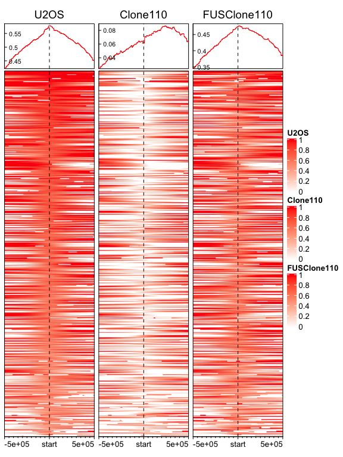
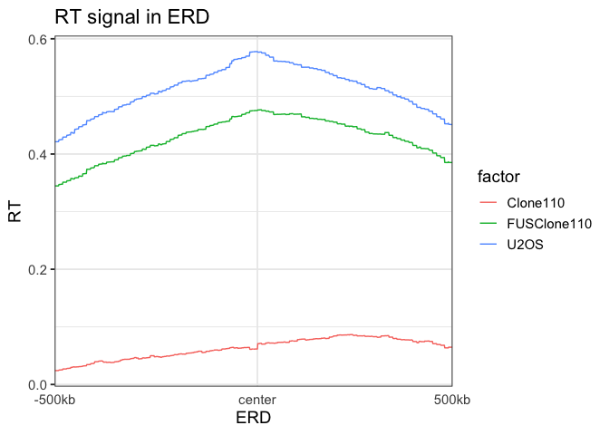
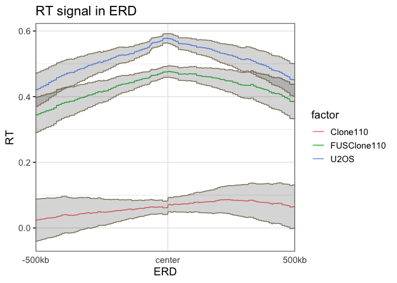
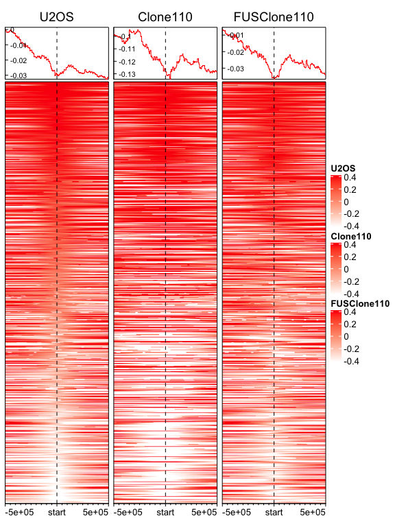
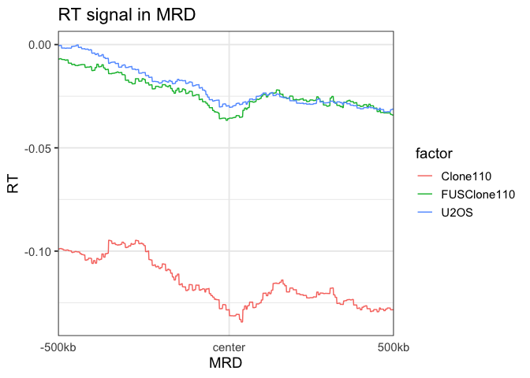
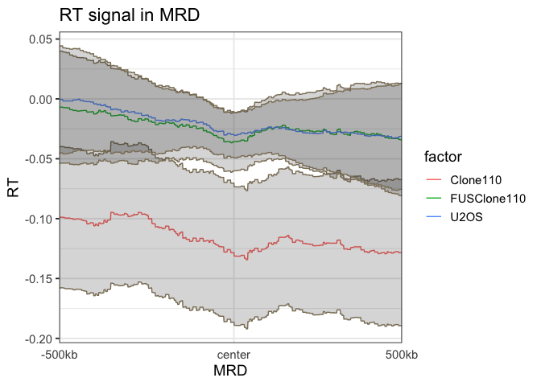
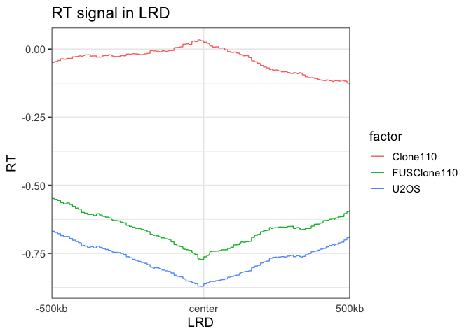
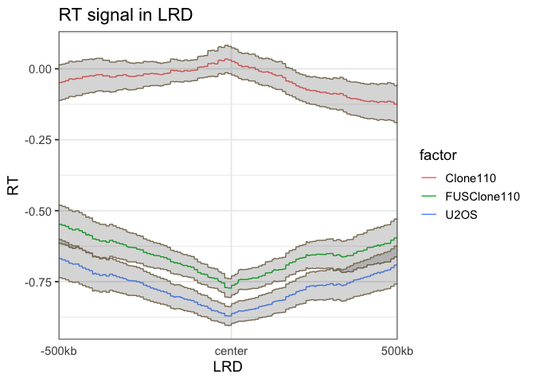

RT Signal Enrichment
================
Weiyan
5/27/2020

``` r
library(EnrichedHeatmap) # for making heatmap
library(rtracklayer)  # for reading bigwig and bed files
library(GenomicRanges)
library(circlize)
library(png)
library(Hmisc)
library(tidyverse)
```

# Read in bigwig files to GRanges object

``` r
# read in bigwig files to GRanges object, it can be slow. bigwig is several hundred MB
# you can use which argument to restrict the data in certain regions.
U2OS.bg<- import("data/U2OS_RT_R2-X_Loess_smoothing.bedGraph", format = "BedGraph")
Clone110.bg<- import("data/Clone110_RT_R2-X_Loess_smoothing.bedGraph", format = "BedGraph")
FUSClone110.bg<- import("data/FUSClone110_RT_R2-X_Loess_smoothing.bedGraph", format = "BedGraph")
```

# 1\. ERD

## 1.1 load data

``` r
# read in the bed peak files to GRanges object
ERD.bed<- import("data/ERD_lost.bed", format = "BED")
```

## 1.2 take only the center of the peaks

``` r
ERD.1MB<- resize(ERD.bed, width = 1000000, fix = "center")
ERD.1MB.center<- resize(ERD.1MB, width =1, fix = "center")
```

## 1.3 prepare matrix

``` r
U2OS.mat<- normalizeToMatrix(U2OS.bg, ERD.1MB.center, value_column = "score",
                             mean_mode="w0", w=1000, extend = 500000)

Clone110.mat<- normalizeToMatrix(Clone110.bg, ERD.1MB.center, value_column = "score",
                                 mean_mode="w0", w=1000, extend = 500000)

FUSClone110.mat<- normalizeToMatrix(FUSClone110.bg, ERD.1MB.center, value_column = "score",
                                    mean_mode="w0", w=1000, extend = 500000)
```

### 1.3.1 check data range for “keep” argument in normalizeToMatrix

``` r
quantile(U2OS.mat, probs = c(0, 0.25, 0.5, 0.75, 0.99, 1))
```

    ##         0%        25%        50%        75%        99%       100%
    ## -1.0826350  0.2814650  0.5360284  0.7721672  1.2908734  1.6029614

``` r
quantile(Clone110.mat, probs = c(0, 0.25, 0.5, 0.75, 0.99, 1))
```

    ##         0%        25%        50%        75%        99%       100%
    ## -2.1397611 -0.2060193  0.1042594  0.3924092  1.0530831  1.3931012

``` r
quantile(FUSClone110.mat, probs = c(0, 0.25, 0.5, 0.75, 0.99, 1))
```

    ##         0%        25%        50%        75%        99%       100%
    ## -1.2227876  0.1507516  0.4376604  0.7143433  1.2825024  1.5346588

## 1.4 mapping colors and enrich plot

**from the quantile, I choose the color mapping range**

``` r
col_fun_U2OS<- circlize::colorRamp2(c(0, 1), c("white", "red"))
col_fun_Clone110<- circlize::colorRamp2(c(0, 1), c("white", "red"))
col_fun_FUSClone110<- circlize::colorRamp2(c(0, 1), c("white", "red"))

 EnrichedHeatmap(U2OS.mat, axis_name_rot = 0, name = "U2OS",
                column_title = "U2OS", use_raster = TRUE, col = col_fun_U2OS,
                top_annotation = HeatmapAnnotation(lines = anno_enriched(axis_param = list(facing ="inside",
     side ="left"                                                                                       ))))+

  EnrichedHeatmap(Clone110.mat, axis_name_rot = 0, name = "Clone110",
                  column_title = "Clone110", use_raster = TRUE, col = col_fun_Clone110,
                  top_annotation = HeatmapAnnotation(lines = anno_enriched(axis_param = list(facing ="inside",
       side ="left"                                                                                       ))))+

  EnrichedHeatmap(FUSClone110.mat, axis_name_rot = 0, name = "FUSClone110",
                  column_title = "FUSClone110", use_raster = TRUE, col = col_fun_FUSClone110,
                  top_annotation = HeatmapAnnotation(lines = anno_enriched(axis_param = list(facing ="inside",
       side ="left"                                                                                       ))))
```

<!-- -->

## 1.5 meta profile plot

``` r
U2OS_mean<- data.frame(avg = colMeans(U2OS.mat),
                       CI_lower = apply(U2OS.mat, 2, Hmisc::smean.cl.normal)[2,],
                       CI_upper = apply(U2OS.mat, 2, Hmisc::smean.cl.normal)[3,]) %>%
  mutate(factor = "U2OS", pos = colnames(U2OS.mat))

Clone110_mean<- data.frame(avg = colMeans(Clone110.mat),
                           CI_lower = apply(Clone110.mat, 2, Hmisc::smean.cl.normal)[2,],
                           CI_upper = apply(Clone110.mat, 2, Hmisc::smean.cl.normal)[3,]) %>%
  mutate(factor = "Clone110", pos = colnames(Clone110.mat))

FUSClone110_mean<- data.frame(avg = colMeans(FUSClone110.mat),
                              CI_lower = apply(FUSClone110.mat, 2, Hmisc::smean.cl.normal)[2,],
                              CI_upper = apply(FUSClone110.mat, 2, Hmisc::smean.cl.normal)[3,]) %>%
  mutate(factor = "FUSClone110", pos = colnames(FUSClone110.mat))

combine_all<- bind_rows(U2OS_mean, Clone110_mean, FUSClone110_mean)

## change position to factor and order it
combine_all$pos<- factor(combine_all$pos, levels= U2OS_mean$pos)
```

### 1.5.1 plot meta profile (without confidence interval)

``` r
ggplot(combine_all, aes(x = pos,y = avg, group = factor)) + geom_line(aes(color = factor)) +
  theme_bw(base_size = 14) +
  theme(axis.ticks.x = element_blank()) +
  scale_x_discrete(breaks = c("u1", "d10", "d500"), labels =c ("-500kb", "center", "500kb")) +
  xlab("ERD") +
  ylab("RT")+
  ggtitle("RT signal in ERD")
```

<!-- -->

### 1.5.2 plot meta profile (with confidence interval)

``` r
ggplot(combine_all, aes(x = pos,y = avg, group = factor)) + geom_line(aes(color = factor)) +
  geom_ribbon(aes(ymin= CI_lower, ymax=CI_upper), alpha=0.2, col = "#8B7E66") +
  theme_bw(base_size = 14) +
  theme(axis.ticks.x = element_blank()) +
  scale_x_discrete(breaks = c("u1", "d10", "d500"), labels =c ("-500kb", "center", "500kb")) +
  xlab("ERD") +
  ylab("RT")+
  ggtitle("RT signal in ERD")
```

<!-- -->

# 2\. MRD

## 2.1 load data

``` r
# read in the bed peak files to GRanges object
MRD.bed<- import("data/MRD_lost.bed", format = "BED")
```

## 2.2 take only the center of the peaks

``` r
MRD.1MB<- resize(MRD.bed, width = 1000000, fix = "center")
MRD.1MB.center<- resize(MRD.1MB, width =1, fix = "center")
```

## 2.3 prepare matrix

``` r
U2OS.mat<- normalizeToMatrix(U2OS.bg, MRD.1MB.center, value_column = "score",
                             mean_mode="w0", w=1000, extend = 500000)

Clone110.mat<- normalizeToMatrix(Clone110.bg, MRD.1MB.center, value_column = "score",
                                 mean_mode="w0", w=1000, extend = 500000)

FUSClone110.mat<- normalizeToMatrix(FUSClone110.bg, MRD.1MB.center, value_column = "score",
                                    mean_mode="w0", w=1000, extend = 500000)
```

### 2.3.1 check data range for “keep” argument in normalizeToMatrix

``` r
quantile(U2OS.mat, probs = c(0, 0.25, 0.5, 0.75, 0.99, 1))
```

    ##         0%        25%        50%        75%        99%       100%
    ## -1.5314824 -0.3214650  0.0000000  0.2970133  0.9654874  1.3648367

``` r
quantile(Clone110.mat, probs = c(0, 0.25, 0.5, 0.75, 0.99, 1))
```

    ##         0%        25%        50%        75%        99%       100%
    ## -2.7286799 -0.7397492  0.0000000  0.5404356  1.5558021  5.0810673

``` r
quantile(FUSClone110.mat, probs = c(0, 0.25, 0.5, 0.75, 0.99, 1))
```

    ##         0%        25%        50%        75%        99%       100%
    ## -1.7383996 -0.3558269  0.0000000  0.3127202  1.0968536  1.4277610

## 2.4 mapping colors and enrich plot

**from the quantile, I choose the color mapping range**

``` r
col_fun_U2OS<- circlize::colorRamp2(c(-0.4, 0.4), c("white", "red"))
col_fun_Clone110<- circlize::colorRamp2(c(-0.4, 0.4), c("white", "red"))
col_fun_FUSClone110<- circlize::colorRamp2(c(-0.4, 0.4), c("white", "red"))

 EnrichedHeatmap(U2OS.mat, axis_name_rot = 0, name = "U2OS",
                column_title = "U2OS", use_raster = TRUE, col = col_fun_U2OS,
                top_annotation = HeatmapAnnotation(lines = anno_enriched(axis_param = list(facing ="inside",
     side ="left"                                                                                       ))))+

  EnrichedHeatmap(Clone110.mat, axis_name_rot = 0, name = "Clone110",
                  column_title = "Clone110", use_raster = TRUE, col = col_fun_Clone110,
                  top_annotation = HeatmapAnnotation(lines = anno_enriched(axis_param = list(facing ="inside",
       side ="left"                                                                                       ))))+

  EnrichedHeatmap(FUSClone110.mat, axis_name_rot = 0, name = "FUSClone110",
                  column_title = "FUSClone110", use_raster = TRUE, col = col_fun_FUSClone110,
                  top_annotation = HeatmapAnnotation(lines = anno_enriched(axis_param = list(facing ="inside",
       side ="left"                                                                                       ))))
```

<!-- -->

## 2.5 meta profile plot

``` r
U2OS_mean<- data.frame(avg = colMeans(U2OS.mat),
                       CI_lower = apply(U2OS.mat, 2, Hmisc::smean.cl.normal)[2,],
                       CI_upper = apply(U2OS.mat, 2, Hmisc::smean.cl.normal)[3,]) %>%
  mutate(factor = "U2OS", pos = colnames(U2OS.mat))

Clone110_mean<- data.frame(avg = colMeans(Clone110.mat),
                           CI_lower = apply(Clone110.mat, 2, Hmisc::smean.cl.normal)[2,],
                           CI_upper = apply(Clone110.mat, 2, Hmisc::smean.cl.normal)[3,]) %>%
  mutate(factor = "Clone110", pos = colnames(Clone110.mat))

FUSClone110_mean<- data.frame(avg = colMeans(FUSClone110.mat),
                              CI_lower = apply(FUSClone110.mat, 2, Hmisc::smean.cl.normal)[2,],
                              CI_upper = apply(FUSClone110.mat, 2, Hmisc::smean.cl.normal)[3,]) %>%
  mutate(factor = "FUSClone110", pos = colnames(FUSClone110.mat))

combine_all<- bind_rows(U2OS_mean, Clone110_mean, FUSClone110_mean)

## change position to factor and order it
combine_all$pos<- factor(combine_all$pos, levels= U2OS_mean$pos)
```

### 2.5.1 plot meta profile (without confidence interval)

``` r
ggplot(combine_all, aes(x = pos,y = avg, group = factor)) + geom_line(aes(color = factor)) +
  theme_bw(base_size = 14) +
  theme(axis.ticks.x = element_blank()) +
  scale_x_discrete(breaks = c("u1", "d10", "d500"), labels =c ("-500kb", "center", "500kb")) +
  xlab("MRD") +
  ylab("RT")+
  ggtitle("RT signal in MRD")
```

<!-- -->

### 2.5.2 plot meta profile (with confidence interval)

``` r
ggplot(combine_all, aes(x = pos,y = avg, group = factor)) + geom_line(aes(color = factor)) +
  geom_ribbon(aes(ymin= CI_lower, ymax=CI_upper), alpha=0.2, col = "#8B7E66") +
  theme_bw(base_size = 14) +
  theme(axis.ticks.x = element_blank()) +
  scale_x_discrete(breaks = c("u1", "d10", "d500"), labels =c ("-500kb", "center", "500kb")) +
  xlab("MRD") +
  ylab("RT")+
  ggtitle("RT signal in MRD")
```

<!-- --> \#
3. LRD \#\# 3.1 load data

``` r
# read in the bed peak files to GRanges object
LRD.bed<- import("data/LRD_lost.bed", format = "BED")
```

## 3.2 take only the center of the peaks

``` r
LRD.1MB<- resize(LRD.bed, width = 1000000, fix = "center")
LRD.1MB.center<- resize(LRD.1MB, width =1, fix = "center")
```

## 3.3 prepare matrix

``` r
U2OS.mat<- normalizeToMatrix(U2OS.bg, LRD.1MB.center, value_column = "score",
                             mean_mode="w0", w=1000, extend = 500000)

Clone110.mat<- normalizeToMatrix(Clone110.bg, LRD.1MB.center, value_column = "score",
                                 mean_mode="w0", w=1000, extend = 500000)

FUSClone110.mat<- normalizeToMatrix(FUSClone110.bg, LRD.1MB.center, value_column = "score",
                                    mean_mode="w0", w=1000, extend = 500000)
```

### 3.3.1 check data range for “keep” argument in normalizeToMatrix

``` r
quantile(U2OS.mat, probs = c(0, 0.25, 0.5, 0.75, 0.99, 1))
```

    ##         0%        25%        50%        75%        99%       100%
    ## -2.2844496 -1.1489819 -0.7817162 -0.4183601  0.3740731  0.9420712

``` r
quantile(Clone110.mat, probs = c(0, 0.25, 0.5, 0.75, 0.99, 1))
```

    ##          0%         25%         50%         75%         99%        100%
    ## -1.97256024 -0.36255867 -0.02583069  0.25615469  1.35626471  5.08106726

``` r
quantile(FUSClone110.mat, probs = c(0, 0.25, 0.5, 0.75, 0.99, 1))
```

    ##         0%        25%        50%        75%        99%       100%
    ## -2.2474068 -1.0350088 -0.6494413 -0.3009976  0.4758645  1.0406724

## 3.4 mapping colors and enrich plot

**from the quantile, I choose the color mapping range**

``` r
col_fun_U2OS<- circlize::colorRamp2(c(-1, 0), c("white", "red"))
col_fun_Clone110<- circlize::colorRamp2(c(-1, 0), c("white", "red"))
col_fun_FUSClone110<- circlize::colorRamp2(c(-1, 0), c("white", "red"))

 EnrichedHeatmap(U2OS.mat, axis_name_rot = 0, name = "U2OS",
                column_title = "U2OS", use_raster = TRUE, col = col_fun_U2OS,
                top_annotation = HeatmapAnnotation(lines = anno_enriched(axis_param = list(facing ="inside",
     side ="left"                                                                                       ))))+

  EnrichedHeatmap(Clone110.mat, axis_name_rot = 0, name = "Clone110",
                  column_title = "Clone110", use_raster = TRUE, col = col_fun_Clone110,
                  top_annotation = HeatmapAnnotation(lines = anno_enriched(axis_param = list(facing ="inside",
       side ="left"                                                                                       ))))+

  EnrichedHeatmap(FUSClone110.mat, axis_name_rot = 0, name = "FUSClone110",
                  column_title = "FUSClone110", use_raster = TRUE, col = col_fun_FUSClone110,
                  top_annotation = HeatmapAnnotation(lines = anno_enriched(axis_param = list(facing ="inside",
       side ="left"                                                                                       ))))
```

<!-- -->

## 3.5 meta profile plot

``` r
U2OS_mean<- data.frame(avg = colMeans(U2OS.mat),
                       CI_lower = apply(U2OS.mat, 2, Hmisc::smean.cl.normal)[2,],
                       CI_upper = apply(U2OS.mat, 2, Hmisc::smean.cl.normal)[3,]) %>%
  mutate(factor = "U2OS", pos = colnames(U2OS.mat))

Clone110_mean<- data.frame(avg = colMeans(Clone110.mat),
                           CI_lower = apply(Clone110.mat, 2, Hmisc::smean.cl.normal)[2,],
                           CI_upper = apply(Clone110.mat, 2, Hmisc::smean.cl.normal)[3,]) %>%
  mutate(factor = "Clone110", pos = colnames(Clone110.mat))

FUSClone110_mean<- data.frame(avg = colMeans(FUSClone110.mat),
                              CI_lower = apply(FUSClone110.mat, 2, Hmisc::smean.cl.normal)[2,],
                              CI_upper = apply(FUSClone110.mat, 2, Hmisc::smean.cl.normal)[3,]) %>%
  mutate(factor = "FUSClone110", pos = colnames(FUSClone110.mat))

combine_all<- bind_rows(U2OS_mean, Clone110_mean, FUSClone110_mean)

## change position to factor and order it
combine_all$pos<- factor(combine_all$pos, levels= U2OS_mean$pos)
```

### 3.5.1 plot meta profile (without confidence interval)

``` r
ggplot(combine_all, aes(x = pos,y = avg, group = factor)) + geom_line(aes(color = factor)) +
  theme_bw(base_size = 14) +
  theme(axis.ticks.x = element_blank()) +
  scale_x_discrete(breaks = c("u1", "d10", "d500"), labels =c ("-500kb", "center", "500kb")) +
  xlab("LRD") +
  ylab("RT")+
  ggtitle("RT signal in LRD")
```

<!-- -->

### 3.5.2 plot meta profile (without confidence interval)

``` r
ggplot(combine_all, aes(x = pos,y = avg, group = factor)) + geom_line(aes(color = factor)) +
  geom_ribbon(aes(ymin= CI_lower, ymax=CI_upper), alpha=0.2, col = "#8B7E66") +
  theme_bw(base_size = 14) +
  theme(axis.ticks.x = element_blank()) +
  scale_x_discrete(breaks = c("u1", "d10", "d500"), labels =c ("-500kb", "center", "500kb")) +
  xlab("LRD") +
  ylab("RT")+
  ggtitle("RT signal in LRD")
```

<!-- -->

``` r
sessionInfo()
```

    ## R version 3.6.3 (2020-02-29)
    ## Platform: x86_64-apple-darwin15.6.0 (64-bit)
    ## Running under: macOS Catalina 10.15.5
    ##
    ## Matrix products: default
    ## BLAS:   /Library/Frameworks/R.framework/Versions/3.6/Resources/lib/libRblas.0.dylib
    ## LAPACK: /Library/Frameworks/R.framework/Versions/3.6/Resources/lib/libRlapack.dylib
    ##
    ## locale:
    ## [1] en_US.UTF-8/en_US.UTF-8/en_US.UTF-8/C/en_US.UTF-8/en_US.UTF-8
    ##
    ## attached base packages:
    ##  [1] parallel  stats4    grid      stats     graphics  grDevices utils
    ##  [8] datasets  methods   base
    ##
    ## other attached packages:
    ##  [1] forcats_0.5.0          stringr_1.4.0          purrr_0.3.4
    ##  [4] readr_1.3.1            tidyr_1.1.0            tibble_3.0.1
    ##  [7] tidyverse_1.3.0        Hmisc_4.4-0            ggplot2_3.3.0
    ## [10] Formula_1.2-3          survival_3.1-12        lattice_0.20-41
    ## [13] dplyr_0.8.5            png_0.1-7              circlize_0.4.9
    ## [16] rtracklayer_1.44.4     EnrichedHeatmap_1.14.0 GenomicRanges_1.36.1
    ## [19] GenomeInfoDb_1.20.0    IRanges_2.18.3         S4Vectors_0.22.1
    ## [22] BiocGenerics_0.30.0    ComplexHeatmap_2.0.0
    ##
    ## loaded via a namespace (and not attached):
    ##  [1] nlme_3.1-148                fs_1.4.1
    ##  [3] bitops_1.0-6                matrixStats_0.56.0
    ##  [5] lubridate_1.7.8             httr_1.4.1
    ##  [7] RColorBrewer_1.1-2          tools_3.6.3
    ##  [9] backports_1.1.7             R6_2.4.1
    ## [11] rpart_4.1-15                DBI_1.1.0
    ## [13] colorspace_1.4-1            nnet_7.3-14
    ## [15] GetoptLong_0.1.8            withr_2.2.0
    ## [17] tidyselect_1.1.0            gridExtra_2.3
    ## [19] compiler_3.6.3              cli_2.0.2
    ## [21] rvest_0.3.5                 Biobase_2.44.0
    ## [23] htmlTable_1.13.3            xml2_1.3.2
    ## [25] DelayedArray_0.10.0         labeling_0.3
    ## [27] scales_1.1.1                checkmate_2.0.0
    ## [29] digest_0.6.25               Rsamtools_2.0.3
    ## [31] foreign_0.8-75              rmarkdown_2.1
    ## [33] XVector_0.24.0              base64enc_0.1-3
    ## [35] jpeg_0.1-8.1                pkgconfig_2.0.3
    ## [37] htmltools_0.4.0             dbplyr_1.4.4
    ## [39] readxl_1.3.1                htmlwidgets_1.5.1
    ## [41] rlang_0.4.6                 GlobalOptions_0.1.1
    ## [43] rstudioapi_0.11             farver_2.0.3
    ## [45] shape_1.4.4                 generics_0.0.2
    ## [47] jsonlite_1.6.1              BiocParallel_1.18.1
    ## [49] acepack_1.4.1               RCurl_1.98-1.2
    ## [51] magrittr_1.5                GenomeInfoDbData_1.2.1
    ## [53] Matrix_1.2-18               fansi_0.4.1
    ## [55] Rcpp_1.0.4.6                munsell_0.5.0
    ## [57] lifecycle_0.2.0             stringi_1.4.6
    ## [59] yaml_2.2.1                  SummarizedExperiment_1.14.1
    ## [61] zlibbioc_1.30.0             blob_1.2.1
    ## [63] crayon_1.3.4                haven_2.3.0
    ## [65] Biostrings_2.52.0           splines_3.6.3
    ## [67] hms_0.5.3                   locfit_1.5-9.4
    ## [69] knitr_1.28                  pillar_1.4.4
    ## [71] rjson_0.2.20                reprex_0.3.0
    ## [73] XML_3.99-0.3                glue_1.4.1
    ## [75] evaluate_0.14               latticeExtra_0.6-29
    ## [77] modelr_0.1.8                data.table_1.12.8
    ## [79] vctrs_0.3.0                 cellranger_1.1.0
    ## [81] gtable_0.3.0                clue_0.3-57
    ## [83] assertthat_0.2.1            xfun_0.14
    ## [85] broom_0.5.6                 GenomicAlignments_1.20.1
    ## [87] cluster_2.1.0               ellipsis_0.3.1
