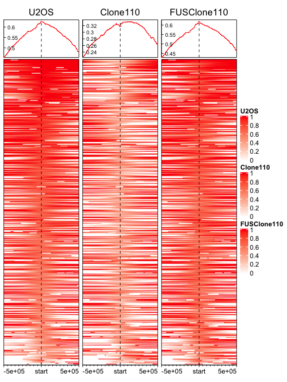
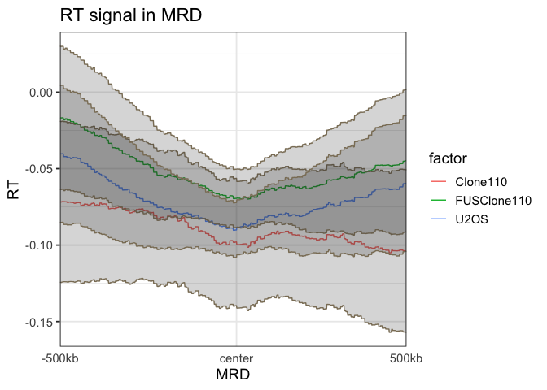
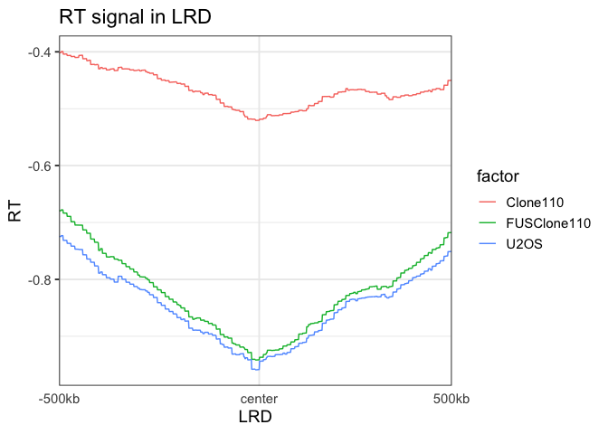

RT Signal Enrichment
================
Weiyan
5/27/2020

``` r
library(EnrichedHeatmap) # for making heatmap
```

    ## Loading required package: grid

    ## Loading required package: ComplexHeatmap

    ## ========================================
    ## ComplexHeatmap version 2.0.0
    ## Bioconductor page: http://bioconductor.org/packages/ComplexHeatmap/
    ## Github page: https://github.com/jokergoo/ComplexHeatmap
    ## Documentation: http://jokergoo.github.io/ComplexHeatmap-reference
    ## 
    ## If you use it in published research, please cite:
    ## Gu, Z. Complex heatmaps reveal patterns and correlations in multidimensional 
    ##   genomic data. Bioinformatics 2016.
    ## ========================================

    ## Loading required package: GenomicRanges

    ## Loading required package: stats4

    ## Loading required package: BiocGenerics

    ## Loading required package: parallel

    ## 
    ## Attaching package: 'BiocGenerics'

    ## The following objects are masked from 'package:parallel':
    ## 
    ##     clusterApply, clusterApplyLB, clusterCall, clusterEvalQ,
    ##     clusterExport, clusterMap, parApply, parCapply, parLapply,
    ##     parLapplyLB, parRapply, parSapply, parSapplyLB

    ## The following objects are masked from 'package:stats':
    ## 
    ##     IQR, mad, sd, var, xtabs

    ## The following objects are masked from 'package:base':
    ## 
    ##     anyDuplicated, append, as.data.frame, basename, cbind, colnames,
    ##     dirname, do.call, duplicated, eval, evalq, Filter, Find, get, grep,
    ##     grepl, intersect, is.unsorted, lapply, Map, mapply, match, mget,
    ##     order, paste, pmax, pmax.int, pmin, pmin.int, Position, rank,
    ##     rbind, Reduce, rownames, sapply, setdiff, sort, table, tapply,
    ##     union, unique, unsplit, which, which.max, which.min

    ## Loading required package: S4Vectors

    ## 
    ## Attaching package: 'S4Vectors'

    ## The following object is masked from 'package:base':
    ## 
    ##     expand.grid

    ## Loading required package: IRanges

    ## Loading required package: GenomeInfoDb

    ## ========================================
    ## EnrichedHeatmap version 1.14.0
    ## Bioconductor page: http://bioconductor.org/packages/EnrichedHeatmap/
    ## Github page: https://github.com/jokergoo/EnrichedHeatmap
    ## Documentation: http://bioconductor.org/packages/EnrichedHeatmap/
    ## 
    ## If you use it in published research, please cite:
    ## Gu, Z. EnrichedHeatmap: an R/Bioconductor package for comprehensive 
    ## visualization of genomic signal associations. BMC Genomics 2018.
    ## ========================================

``` r
library(rtracklayer)  # for reading bigwig and bed files
library(GenomicRanges)
library(circlize)
```

    ## ========================================
    ## circlize version 0.4.9
    ## CRAN page: https://cran.r-project.org/package=circlize
    ## Github page: https://github.com/jokergoo/circlize
    ## Documentation: https://jokergoo.github.io/circlize_book/book/
    ## 
    ## If you use it in published research, please cite:
    ## Gu, Z. circlize implements and enhances circular visualization
    ##   in R. Bioinformatics 2014.
    ## 
    ## This message can be suppressed by:
    ##   suppressPackageStartupMessages(library(circlize))
    ## ========================================

``` r
library(png)
library(dplyr)
```

    ## 
    ## Attaching package: 'dplyr'

    ## The following objects are masked from 'package:GenomicRanges':
    ## 
    ##     intersect, setdiff, union

    ## The following object is masked from 'package:GenomeInfoDb':
    ## 
    ##     intersect

    ## The following objects are masked from 'package:IRanges':
    ## 
    ##     collapse, desc, intersect, setdiff, slice, union

    ## The following objects are masked from 'package:S4Vectors':
    ## 
    ##     first, intersect, rename, setdiff, setequal, union

    ## The following objects are masked from 'package:BiocGenerics':
    ## 
    ##     combine, intersect, setdiff, union

    ## The following objects are masked from 'package:stats':
    ## 
    ##     filter, lag

    ## The following objects are masked from 'package:base':
    ## 
    ##     intersect, setdiff, setequal, union

``` r
library(Hmisc)
```

    ## Loading required package: lattice

    ## Loading required package: survival

    ## Loading required package: Formula

    ## Loading required package: ggplot2

    ## 
    ## Attaching package: 'Hmisc'

    ## The following objects are masked from 'package:dplyr':
    ## 
    ##     src, summarize

    ## The following objects are masked from 'package:base':
    ## 
    ##     format.pval, units

``` r
library(tidyverse)
```

    ## ── Attaching packages ─────────────────────────────────────────────────────────────────── tidyverse 1.3.0 ──

    ## ✓ tibble  3.0.1     ✓ purrr   0.3.4
    ## ✓ tidyr   1.1.0     ✓ stringr 1.4.0
    ## ✓ readr   1.3.1     ✓ forcats 0.5.0

    ## ── Conflicts ────────────────────────────────────────────────────────────────────── tidyverse_conflicts() ──
    ## x dplyr::collapse()   masks IRanges::collapse()
    ## x dplyr::combine()    masks BiocGenerics::combine()
    ## x dplyr::desc()       masks IRanges::desc()
    ## x tidyr::expand()     masks S4Vectors::expand()
    ## x dplyr::filter()     masks stats::filter()
    ## x dplyr::first()      masks S4Vectors::first()
    ## x dplyr::lag()        masks stats::lag()
    ## x ggplot2::Position() masks BiocGenerics::Position(), base::Position()
    ## x purrr::reduce()     masks GenomicRanges::reduce(), IRanges::reduce()
    ## x dplyr::rename()     masks S4Vectors::rename()
    ## x dplyr::slice()      masks IRanges::slice()
    ## x Hmisc::src()        masks dplyr::src()
    ## x Hmisc::summarize()  masks dplyr::summarize()

# Read in bigwig files to GRanges object

``` r
# read in bigwig files to GRanges object, it can be slow. bigwig is several hundred MB
# you can use which argument to restrict the data in certain regions.
U2OS.bg<- import("data/U2OS_RT_R1-X_Loess_smoothing.bedGraph", format = "BedGraph")
Clone110.bg<- import("data/Clone110_RT_R1-X_Loess_smoothing.bedGraph", format = "BedGraph")
FUSClone110.bg<- import("data/FUSClone110_RT_R1-X_Loess_smoothing.bedGraph", format = "BedGraph")
```

# 1\. ERD

## 1.1 load data

``` r
# read in the bed peak files to GRanges object
ERD.bed<- import("data/ERD_lost.bed", format = "BED")
```

## 1.2 take only the center of the peaks

``` r
ERD.1MB<- resize(ERD.bed, width = 1000000, fix = "center")
ERD.1MB.center<- resize(ERD.1MB, width =1, fix = "center")
```

## 1.3 prepare matrix

``` r
U2OS.mat<- normalizeToMatrix(U2OS.bg, ERD.1MB.center, value_column = "score",
                             mean_mode="w0", w=1000, extend = 500000)

Clone110.mat<- normalizeToMatrix(Clone110.bg, ERD.1MB.center, value_column = "score",
                                 mean_mode="w0", w=1000, extend = 500000)

FUSClone110.mat<- normalizeToMatrix(FUSClone110.bg, ERD.1MB.center, value_column = "score",
                                    mean_mode="w0", w=1000, extend = 500000)
```

### 1.3.1 check data range for “keep” argument in normalizeToMatrix

``` r
quantile(U2OS.mat, probs = c(0, 0.25, 0.5, 0.75, 0.99, 1))
```

    ##         0%        25%        50%        75%        99%       100% 
    ## -1.1706541  0.2833825  0.5893427  0.8485765  1.4178227  1.6977521

``` r
quantile(Clone110.mat, probs = c(0, 0.25, 0.5, 0.75, 0.99, 1))
```

    ##         0%        25%        50%        75%        99%       100% 
    ## -1.5526874  0.0000000  0.3464791  0.6147370  1.2182808  1.5926787

``` r
quantile(FUSClone110.mat, probs = c(0, 0.25, 0.5, 0.75, 0.99, 1))
```

    ##         0%        25%        50%        75%        99%       100% 
    ## -1.0781119  0.2733961  0.5826697  0.8408736  1.2897961  1.5753723

## 1.4 mapping colors and enrich plot

**from the quantile, I choose the color mapping range**

``` r
col_fun_U2OS<- circlize::colorRamp2(c(0, 1), c("white", "red"))
col_fun_Clone110<- circlize::colorRamp2(c(0, 1), c("white", "red"))
col_fun_FUSClone110<- circlize::colorRamp2(c(0, 1), c("white", "red"))

 EnrichedHeatmap(U2OS.mat, axis_name_rot = 0, name = "U2OS",
                column_title = "U2OS", use_raster = TRUE, col = col_fun_U2OS,
                top_annotation = HeatmapAnnotation(lines = anno_enriched(axis_param = list(facing ="inside",
     side ="left"                                                                                       ))))+
  
  EnrichedHeatmap(Clone110.mat, axis_name_rot = 0, name = "Clone110", 
                  column_title = "Clone110", use_raster = TRUE, col = col_fun_Clone110,
                  top_annotation = HeatmapAnnotation(lines = anno_enriched(axis_param = list(facing ="inside",
       side ="left"                                                                                       ))))+
  
  EnrichedHeatmap(FUSClone110.mat, axis_name_rot = 0, name = "FUSClone110", 
                  column_title = "FUSClone110", use_raster = TRUE, col = col_fun_FUSClone110,
                  top_annotation = HeatmapAnnotation(lines = anno_enriched(axis_param = list(facing ="inside",
       side ="left"                                                                                       ))))
```

<!-- -->

## 1.5 meta profile plot

``` r
U2OS_mean<- data.frame(avg = colMeans(U2OS.mat), 
                       CI_lower = apply(U2OS.mat, 2, Hmisc::smean.cl.normal)[2,],
                       CI_upper = apply(U2OS.mat, 2, Hmisc::smean.cl.normal)[3,]) %>% 
  mutate(factor = "U2OS", pos = colnames(U2OS.mat)) 

Clone110_mean<- data.frame(avg = colMeans(Clone110.mat), 
                           CI_lower = apply(Clone110.mat, 2, Hmisc::smean.cl.normal)[2,],
                           CI_upper = apply(Clone110.mat, 2, Hmisc::smean.cl.normal)[3,]) %>%
  mutate(factor = "Clone110", pos = colnames(Clone110.mat))

FUSClone110_mean<- data.frame(avg = colMeans(FUSClone110.mat), 
                              CI_lower = apply(FUSClone110.mat, 2, Hmisc::smean.cl.normal)[2,],
                              CI_upper = apply(FUSClone110.mat, 2, Hmisc::smean.cl.normal)[3,]) %>%
  mutate(factor = "FUSClone110", pos = colnames(FUSClone110.mat))

combine_all<- bind_rows(U2OS_mean, Clone110_mean, FUSClone110_mean)

## change position to factor and order it 
combine_all$pos<- factor(combine_all$pos, levels= U2OS_mean$pos)
```

### 1.5.1 plot meta profile (without confidence interval)

``` r
ggplot(combine_all, aes(x = pos,y = avg, group = factor)) + geom_line(aes(color = factor)) + 
  theme_bw(base_size = 14) +
  theme(axis.ticks.x = element_blank()) +
  scale_x_discrete(breaks = c("u1", "d10", "d500"), labels =c ("-500kb", "center", "500kb")) +
  xlab("ERD") + 
  ylab("RT")+
  ggtitle("RT signal in ERD")
```

<!-- -->

### 1.5.2 plot meta profile (with confidence interval)

``` r
ggplot(combine_all, aes(x = pos,y = avg, group = factor)) + geom_line(aes(color = factor)) + 
  geom_ribbon(aes(ymin= CI_lower, ymax=CI_upper), alpha=0.2, col = "#8B7E66") +
  theme_bw(base_size = 14) +
  theme(axis.ticks.x = element_blank()) +
  scale_x_discrete(breaks = c("u1", "d10", "d500"), labels =c ("-500kb", "center", "500kb")) +
  xlab("ERD") + 
  ylab("RT")+
  ggtitle("RT signal in ERD")
```

<!-- -->

# 2\. MRD

## 2.1 load data

``` r
# read in the bed peak files to GRanges object
MRD.bed<- import("data/MRD_lost.bed", format = "BED")
```

## 2.2 take only the center of the peaks

``` r
MRD.1MB<- resize(MRD.bed, width = 1000000, fix = "center")
MRD.1MB.center<- resize(MRD.1MB, width =1, fix = "center")
```

## 2.3 prepare matrix

``` r
U2OS.mat<- normalizeToMatrix(U2OS.bg, MRD.1MB.center, value_column = "score",
                             mean_mode="w0", w=1000, extend = 500000)

Clone110.mat<- normalizeToMatrix(Clone110.bg, MRD.1MB.center, value_column = "score",
                                 mean_mode="w0", w=1000, extend = 500000)

FUSClone110.mat<- normalizeToMatrix(FUSClone110.bg, MRD.1MB.center, value_column = "score",
                                    mean_mode="w0", w=1000, extend = 500000)
```

### 2.3.1 check data range for “keep” argument in normalizeToMatrix

``` r
quantile(U2OS.mat, probs = c(0, 0.25, 0.5, 0.75, 0.99, 1))
```

    ##          0%         25%         50%         75%         99%        100% 
    ## -1.54401985 -0.37399070 -0.03053946  0.23278273  0.95021581  1.40273339

``` r
quantile(Clone110.mat, probs = c(0, 0.25, 0.5, 0.75, 0.99, 1))
```

    ##         0%        25%        50%        75%        99%       100% 
    ## -2.2476439 -0.5831916  0.0000000  0.4380097  1.1257165  1.4620432

``` r
quantile(FUSClone110.mat, probs = c(0, 0.25, 0.5, 0.75, 0.99, 1))
```

    ##          0%         25%         50%         75%         99%        100% 
    ## -1.71186243 -0.37970469 -0.01802391  0.28469267  0.99551504  1.38410177

## 2.4 mapping colors and enrich plot

**from the quantile, I choose the color mapping range**

``` r
col_fun_U2OS<- circlize::colorRamp2(c(-0.4, 0.4), c("white", "red"))
col_fun_Clone110<- circlize::colorRamp2(c(-0.4, 0.4), c("white", "red"))
col_fun_FUSClone110<- circlize::colorRamp2(c(-0.4, 0.4), c("white", "red"))

 EnrichedHeatmap(U2OS.mat, axis_name_rot = 0, name = "U2OS",
                column_title = "U2OS", use_raster = TRUE, col = col_fun_U2OS,
                top_annotation = HeatmapAnnotation(lines = anno_enriched(axis_param = list(facing ="inside",
     side ="left"                                                                                       ))))+
  
  EnrichedHeatmap(Clone110.mat, axis_name_rot = 0, name = "Clone110", 
                  column_title = "Clone110", use_raster = TRUE, col = col_fun_Clone110,
                  top_annotation = HeatmapAnnotation(lines = anno_enriched(axis_param = list(facing ="inside",
       side ="left"                                                                                       ))))+
  
  EnrichedHeatmap(FUSClone110.mat, axis_name_rot = 0, name = "FUSClone110", 
                  column_title = "FUSClone110", use_raster = TRUE, col = col_fun_FUSClone110,
                  top_annotation = HeatmapAnnotation(lines = anno_enriched(axis_param = list(facing ="inside",
       side ="left"                                                                                       ))))
```

<!-- -->

## 2.5 meta profile plot

``` r
U2OS_mean<- data.frame(avg = colMeans(U2OS.mat), 
                       CI_lower = apply(U2OS.mat, 2, Hmisc::smean.cl.normal)[2,],
                       CI_upper = apply(U2OS.mat, 2, Hmisc::smean.cl.normal)[3,]) %>% 
  mutate(factor = "U2OS", pos = colnames(U2OS.mat)) 

Clone110_mean<- data.frame(avg = colMeans(Clone110.mat), 
                           CI_lower = apply(Clone110.mat, 2, Hmisc::smean.cl.normal)[2,],
                           CI_upper = apply(Clone110.mat, 2, Hmisc::smean.cl.normal)[3,]) %>%
  mutate(factor = "Clone110", pos = colnames(Clone110.mat))

FUSClone110_mean<- data.frame(avg = colMeans(FUSClone110.mat), 
                              CI_lower = apply(FUSClone110.mat, 2, Hmisc::smean.cl.normal)[2,],
                              CI_upper = apply(FUSClone110.mat, 2, Hmisc::smean.cl.normal)[3,]) %>%
  mutate(factor = "FUSClone110", pos = colnames(FUSClone110.mat))

combine_all<- bind_rows(U2OS_mean, Clone110_mean, FUSClone110_mean)

## change position to factor and order it 
combine_all$pos<- factor(combine_all$pos, levels= U2OS_mean$pos)
```

### 2.5.1 plot meta profile (without confidence interval)

``` r
ggplot(combine_all, aes(x = pos,y = avg, group = factor)) + geom_line(aes(color = factor)) + 
  theme_bw(base_size = 14) +
  theme(axis.ticks.x = element_blank()) +
  scale_x_discrete(breaks = c("u1", "d10", "d500"), labels =c ("-500kb", "center", "500kb")) +
  xlab("MRD") + 
  ylab("RT")+
  ggtitle("RT signal in MRD")
```

<!-- -->

### 2.5.2 plot meta profile (with confidence interval)

``` r
ggplot(combine_all, aes(x = pos,y = avg, group = factor)) + geom_line(aes(color = factor)) + 
  geom_ribbon(aes(ymin= CI_lower, ymax=CI_upper), alpha=0.2, col = "#8B7E66") +
  theme_bw(base_size = 14) +
  theme(axis.ticks.x = element_blank()) +
  scale_x_discrete(breaks = c("u1", "d10", "d500"), labels =c ("-500kb", "center", "500kb")) +
  xlab("MRD") + 
  ylab("RT")+
  ggtitle("RT signal in MRD")
```

<!-- -->
\# 3. LRD \#\# 3.1 load data

``` r
# read in the bed peak files to GRanges object
LRD.bed<- import("data/LRD_lost.bed", format = "BED")
```

## 3.2 take only the center of the peaks

``` r
LRD.1MB<- resize(LRD.bed, width = 1000000, fix = "center")
LRD.1MB.center<- resize(LRD.1MB, width =1, fix = "center")
```

## 3.3 prepare matrix

``` r
U2OS.mat<- normalizeToMatrix(U2OS.bg, LRD.1MB.center, value_column = "score",
                             mean_mode="w0", w=1000, extend = 500000)

Clone110.mat<- normalizeToMatrix(Clone110.bg, LRD.1MB.center, value_column = "score",
                                 mean_mode="w0", w=1000, extend = 500000)

FUSClone110.mat<- normalizeToMatrix(FUSClone110.bg, LRD.1MB.center, value_column = "score",
                                    mean_mode="w0", w=1000, extend = 500000)
```

### 3.3.1 check data range for “keep” argument in normalizeToMatrix

``` r
quantile(U2OS.mat, probs = c(0, 0.25, 0.5, 0.75, 0.99, 1))
```

    ##         0%        25%        50%        75%        99%       100% 
    ## -2.4465115 -1.1927553 -0.8872296 -0.5509691  0.2471658  0.8883222

``` r
quantile(Clone110.mat, probs = c(0, 0.25, 0.5, 0.75, 0.99, 1))
```

    ##         0%        25%        50%        75%        99%       100% 
    ## -2.2011631 -0.7807058 -0.4924025 -0.1375873  0.6374962  1.0344376

``` r
quantile(FUSClone110.mat, probs = c(0, 0.25, 0.5, 0.75, 0.99, 1))
```

    ##         0%        25%        50%        75%        99%       100% 
    ## -1.9728878 -1.1928914 -0.8677898 -0.5042243  0.3605148  0.9340314

## 3.4 mapping colors and enrich plot

**from the quantile, I choose the color mapping range**

``` r
col_fun_U2OS<- circlize::colorRamp2(c(-1, 0), c("white", "red"))
col_fun_Clone110<- circlize::colorRamp2(c(-1, 0), c("white", "red"))
col_fun_FUSClone110<- circlize::colorRamp2(c(-1, 0), c("white", "red"))

 EnrichedHeatmap(U2OS.mat, axis_name_rot = 0, name = "U2OS",
                column_title = "U2OS", use_raster = TRUE, col = col_fun_U2OS,
                top_annotation = HeatmapAnnotation(lines = anno_enriched(axis_param = list(facing ="inside",
     side ="left"                                                                                       ))))+
  
  EnrichedHeatmap(Clone110.mat, axis_name_rot = 0, name = "Clone110", 
                  column_title = "Clone110", use_raster = TRUE, col = col_fun_Clone110,
                  top_annotation = HeatmapAnnotation(lines = anno_enriched(axis_param = list(facing ="inside",
       side ="left"                                                                                       ))))+
  
  EnrichedHeatmap(FUSClone110.mat, axis_name_rot = 0, name = "FUSClone110", 
                  column_title = "FUSClone110", use_raster = TRUE, col = col_fun_FUSClone110,
                  top_annotation = HeatmapAnnotation(lines = anno_enriched(axis_param = list(facing ="inside",
       side ="left"                                                                                       ))))
```

<!-- -->

## 3.5 meta profile plot

``` r
U2OS_mean<- data.frame(avg = colMeans(U2OS.mat), 
                       CI_lower = apply(U2OS.mat, 2, Hmisc::smean.cl.normal)[2,],
                       CI_upper = apply(U2OS.mat, 2, Hmisc::smean.cl.normal)[3,]) %>% 
  mutate(factor = "U2OS", pos = colnames(U2OS.mat)) 

Clone110_mean<- data.frame(avg = colMeans(Clone110.mat), 
                           CI_lower = apply(Clone110.mat, 2, Hmisc::smean.cl.normal)[2,],
                           CI_upper = apply(Clone110.mat, 2, Hmisc::smean.cl.normal)[3,]) %>%
  mutate(factor = "Clone110", pos = colnames(Clone110.mat))

FUSClone110_mean<- data.frame(avg = colMeans(FUSClone110.mat), 
                              CI_lower = apply(FUSClone110.mat, 2, Hmisc::smean.cl.normal)[2,],
                              CI_upper = apply(FUSClone110.mat, 2, Hmisc::smean.cl.normal)[3,]) %>%
  mutate(factor = "FUSClone110", pos = colnames(FUSClone110.mat))

combine_all<- bind_rows(U2OS_mean, Clone110_mean, FUSClone110_mean)

## change position to factor and order it 
combine_all$pos<- factor(combine_all$pos, levels= U2OS_mean$pos)
```

### 3.5.1 plot meta profile (without confidence interval)

``` r
ggplot(combine_all, aes(x = pos,y = avg, group = factor)) + geom_line(aes(color = factor)) + 
  theme_bw(base_size = 14) +
  theme(axis.ticks.x = element_blank()) +
  scale_x_discrete(breaks = c("u1", "d10", "d500"), labels =c ("-500kb", "center", "500kb")) +
  xlab("LRD") + 
  ylab("RT")+
  ggtitle("RT signal in LRD")
```

<!-- -->

### 3.5.2 plot meta profile (without confidence interval)

``` r
ggplot(combine_all, aes(x = pos,y = avg, group = factor)) + geom_line(aes(color = factor)) + 
  geom_ribbon(aes(ymin= CI_lower, ymax=CI_upper), alpha=0.2, col = "#8B7E66") +
  theme_bw(base_size = 14) +
  theme(axis.ticks.x = element_blank()) +
  scale_x_discrete(breaks = c("u1", "d10", "d500"), labels =c ("-500kb", "center", "500kb")) +
  xlab("LRD") + 
  ylab("RT")+
  ggtitle("RT signal in LRD")
```

<!-- -->

``` r
sessionInfo()
```

    ## R version 3.6.3 (2020-02-29)
    ## Platform: x86_64-apple-darwin15.6.0 (64-bit)
    ## Running under: macOS Catalina 10.15.5
    ## 
    ## Matrix products: default
    ## BLAS:   /Library/Frameworks/R.framework/Versions/3.6/Resources/lib/libRblas.0.dylib
    ## LAPACK: /Library/Frameworks/R.framework/Versions/3.6/Resources/lib/libRlapack.dylib
    ## 
    ## locale:
    ## [1] en_US.UTF-8/en_US.UTF-8/en_US.UTF-8/C/en_US.UTF-8/en_US.UTF-8
    ## 
    ## attached base packages:
    ##  [1] parallel  stats4    grid      stats     graphics  grDevices utils    
    ##  [8] datasets  methods   base     
    ## 
    ## other attached packages:
    ##  [1] forcats_0.5.0          stringr_1.4.0          purrr_0.3.4           
    ##  [4] readr_1.3.1            tidyr_1.1.0            tibble_3.0.1          
    ##  [7] tidyverse_1.3.0        Hmisc_4.4-0            ggplot2_3.3.0         
    ## [10] Formula_1.2-3          survival_3.1-12        lattice_0.20-41       
    ## [13] dplyr_0.8.5            png_0.1-7              circlize_0.4.9        
    ## [16] rtracklayer_1.44.4     EnrichedHeatmap_1.14.0 GenomicRanges_1.36.1  
    ## [19] GenomeInfoDb_1.20.0    IRanges_2.18.3         S4Vectors_0.22.1      
    ## [22] BiocGenerics_0.30.0    ComplexHeatmap_2.0.0  
    ## 
    ## loaded via a namespace (and not attached):
    ##  [1] nlme_3.1-148                fs_1.4.1                   
    ##  [3] bitops_1.0-6                matrixStats_0.56.0         
    ##  [5] lubridate_1.7.8             httr_1.4.1                 
    ##  [7] RColorBrewer_1.1-2          tools_3.6.3                
    ##  [9] backports_1.1.7             R6_2.4.1                   
    ## [11] rpart_4.1-15                DBI_1.1.0                  
    ## [13] colorspace_1.4-1            nnet_7.3-14                
    ## [15] GetoptLong_0.1.8            withr_2.2.0                
    ## [17] tidyselect_1.1.0            gridExtra_2.3              
    ## [19] compiler_3.6.3              cli_2.0.2                  
    ## [21] rvest_0.3.5                 Biobase_2.44.0             
    ## [23] htmlTable_1.13.3            xml2_1.3.2                 
    ## [25] DelayedArray_0.10.0         labeling_0.3               
    ## [27] scales_1.1.1                checkmate_2.0.0            
    ## [29] digest_0.6.25               Rsamtools_2.0.3            
    ## [31] foreign_0.8-75              rmarkdown_2.1              
    ## [33] XVector_0.24.0              base64enc_0.1-3            
    ## [35] jpeg_0.1-8.1                pkgconfig_2.0.3            
    ## [37] htmltools_0.4.0             dbplyr_1.4.4               
    ## [39] readxl_1.3.1                htmlwidgets_1.5.1          
    ## [41] rlang_0.4.6                 GlobalOptions_0.1.1        
    ## [43] rstudioapi_0.11             farver_2.0.3               
    ## [45] shape_1.4.4                 generics_0.0.2             
    ## [47] jsonlite_1.6.1              BiocParallel_1.18.1        
    ## [49] acepack_1.4.1               RCurl_1.98-1.2             
    ## [51] magrittr_1.5                GenomeInfoDbData_1.2.1     
    ## [53] Matrix_1.2-18               fansi_0.4.1                
    ## [55] Rcpp_1.0.4.6                munsell_0.5.0              
    ## [57] lifecycle_0.2.0             stringi_1.4.6              
    ## [59] yaml_2.2.1                  SummarizedExperiment_1.14.1
    ## [61] zlibbioc_1.30.0             blob_1.2.1                 
    ## [63] crayon_1.3.4                haven_2.3.0                
    ## [65] Biostrings_2.52.0           splines_3.6.3              
    ## [67] hms_0.5.3                   locfit_1.5-9.4             
    ## [69] knitr_1.28                  pillar_1.4.4               
    ## [71] rjson_0.2.20                reprex_0.3.0               
    ## [73] XML_3.99-0.3                glue_1.4.1                 
    ## [75] evaluate_0.14               latticeExtra_0.6-29        
    ## [77] modelr_0.1.8                data.table_1.12.8          
    ## [79] vctrs_0.3.0                 cellranger_1.1.0           
    ## [81] gtable_0.3.0                clue_0.3-57                
    ## [83] assertthat_0.2.1            xfun_0.14                  
    ## [85] broom_0.5.6                 GenomicAlignments_1.20.1   
    ## [87] cluster_2.1.0               ellipsis_0.3.1
