FUS RNA-Seq Analysis by DESeq2
================
Weiyan
4/13/2020

# 1\. Prepare count matrix

## 1.1 Import metadata

``` r
dir <- "/Users/weiyanjia/Desktop/RNA_Seq/R_Analysis/FeatureCounts/FUS_FeatureCounts/FUS_DESeq2/"
# list.files(dir)
colData <- read.table(file.path(dir, "coldata.txt"), header = TRUE)
colData <- dplyr::select(colData, group, CellLine)
ID <- as.factor(c("W_1","W_2","W_3","KO_1","KO_2","KO_3","RE_1","RE_2","RE_3"))
colData$ID <- ID
colData
```

    ##     group    CellLine   ID
    ## W_1    WT        U2OS  W_1
    ## W_2    WT        U2OS  W_2
    ## W_3    WT        U2OS  W_3
    ## C_1    KO    Clone110 KO_1
    ## C_2    KO    Clone110 KO_2
    ## C_3    KO    Clone110 KO_3
    ## F_1    RE FUSClone110 RE_1
    ## F_2    RE FUSClone110 RE_2
    ## F_3    RE FUSClone110 RE_3

## 1.2 Import featurecounts data

``` r
# getwd()
countData<- read.delim("fus_featurecounts.txt.Rmatrix.txt", header = TRUE, sep="\t",row.names = "Geneid")%>%
  dplyr::select(W_1, W_2, W_3, C_1, C_2, C_3, F_1, F_2, F_3)%>%
  as.matrix()
countData <- countData[rowSums(countData)>=10, ]
head(countData)
```

    ##                 W_1 W_2 W_3 C_1 C_2 C_3 F_1 F_2 F_3
    ## ENSG00000227232 121 110 113  88 111 130  95  84 133
    ## ENSG00000278267  11   9  10  10  19  15   3  10   4
    ## ENSG00000243485   2   2   2   1   0   4   5   1   0
    ## ENSG00000269981   0   1   1   0   3   3   0   0   2
    ## ENSG00000241860   9   8  18   6   6  13   2   4  12
    ## ENSG00000279928  11   6   9   9  17  10   3   6   5

## 1.3 Set up the DESeqDataSet Object

``` r
dds = DESeqDataSetFromMatrix(countData=countData,
                              colData=colData,
                              design=~group)
dds
```

    ## class: DESeqDataSet
    ## dim: 26836 9
    ## metadata(1): version
    ## assays(1): counts
    ## rownames(26836): ENSG00000227232 ENSG00000278267 ... ENSG00000271254
    ##   ENSG00000275405
    ## rowData names(0):
    ## colnames(9): W_1 W_2 ... F_2 F_3
    ## colData names(3): group CellLine ID

``` r
nrow(dds)
```

    ## [1] 26836

``` r
# View(counts(dds))
```

# 2\. Normalization

## 2.1 Estimate size factors

``` r
dds <- estimateSizeFactors(dds)
## Check the size factors
sizeFactors(dds)
```

    ##       W_1       W_2       W_3       C_1       C_2       C_3       F_1       F_2
    ## 1.4793231 1.0124754 0.9584419 0.7468960 1.0481435 0.9097283 0.9996492 1.0384976
    ##       F_3
    ## 1.0251299

Total number of raw counts per
    sample

``` r
colSums(counts(dds))
```

    ##      W_1      W_2      W_3      C_1      C_2      C_3      F_1      F_2
    ## 29384683 20269006 18467693 16406237 20296026 16575832 19350830 20082955
    ##      F_3
    ## 19246284

Total number of normalized counts per
    sample

``` r
colSums(counts(dds, normalized=T))
```

    ##      W_1      W_2      W_3      C_1      C_2      C_3      F_1      F_2
    ## 19863601 20019258 19268454 21965891 19363786 18220641 19357620 19338470
    ##      F_3
    ## 18774483

## 2.2 retrieve the normalized counts matrix from dds

``` r
# getwd()
normalized_counts <- counts(dds, normalized=TRUE)
write.table(normalized_counts, file="results/normalized_counts.txt", sep="\t", quote=F, col.names=NA)
# normalized_counts
```

> **NOTE:** DESeq2 doesn’t actually use normalized counts, rather it
> uses the raw counts and models the normalization inside the
> Generalized Linear Model (GLM). These normalized counts will be useful
> for downstream visualization of results, but cannot be used as input
> to DESeq2 or any other tools that peform differential expression
> analysis which use the negative binomial model.

\#3. Quality Control (Sample-level QC)

\#\#3.1 Transform counts for data
visualization

``` r
rld <- rlog(dds, blind=TRUE)
```

## 3.2 Plot PCA

``` r
plotPCA(rld, intgroup=c("CellLine"))
```

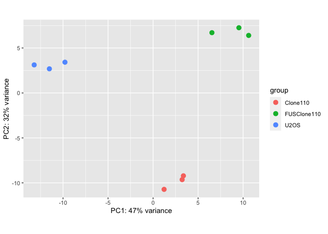<!-- -->

``` r
graph2pdf(file="figures/FUS_RNA_SEQ_PCA1.pdf", width=8, aspectr=sqrt(2),font = "Arial",bg = "transparent")
```

    ## Exported graph as figures/FUS_RNA_SEQ_PCA1.pdf

\*\* custom plot with ggplot2\*\*

``` r
library(ggplot2)
PcaData <- plotPCA(rld, intgroup="group", returnData=TRUE)
percentVar <- 100*round(attr(PcaData, "percentVar"),2)
PcaData
```

    ##            PC1        PC2 group group.1 name
    ## W_1 -13.205212   3.120087    WT      WT  W_1
    ## W_2 -11.517694   2.683788    WT      WT  W_2
    ## W_3  -9.786714   3.420198    WT      WT  W_3
    ## C_1   1.224680 -10.722198    KO      KO  C_1
    ## C_2   3.366885  -9.215607    KO      KO  C_2
    ## C_3   3.230863  -9.640576    KO      KO  C_3
    ## F_1   6.537227   6.703095    RE      RE  F_1
    ## F_2   9.532402   7.253118    RE      RE  F_2
    ## F_3  10.617563   6.398096    RE      RE  F_3

``` r
ggplot(PcaData, aes(x = PC1, y = PC2, color = name, shape = group)) +
  geom_point(size =3) +
  xlab(paste0("PC1: ", percentVar[1], "% variance")) +
  ylab(paste0("PC2: ", percentVar[2], "% variance")) +
  coord_fixed()+
  theme_bw()
```

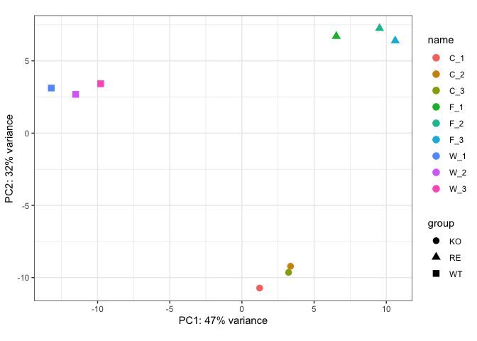<!-- -->

``` r
graph2pdf(file="figures/FUS_RNA_SEQ_PCA.pdf", width=8, aspectr=sqrt(2),font = "Arial",bg = "transparent")
```

    ## Exported graph as figures/FUS_RNA_SEQ_PCA.pdf

# 4.0 Differential expression analysis with DESeq2

## 4.1 Run analysis

``` r
dds <- DESeq(dds)
```

    ## using pre-existing size factors

    ## estimating dispersions

    ## gene-wise dispersion estimates

    ## mean-dispersion relationship

    ## final dispersion estimates

    ## fitting model and testing

## 4.2 exploring the dispersion estimates and assessing model fit

``` r
## Plot dispersion estimates
plotDispEsts(dds)
```

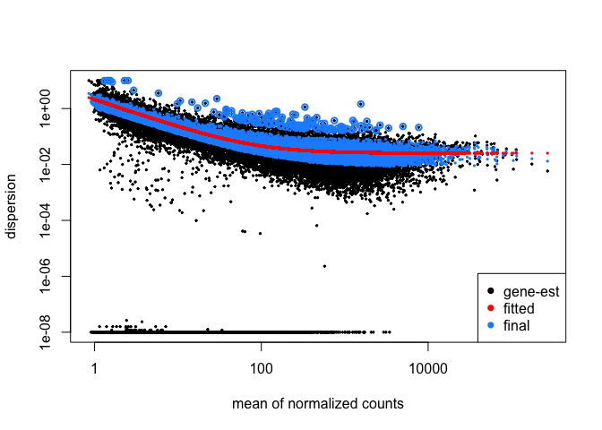<!-- -->

## 4.3 Results table

\#\#\#4.3.1 WT vs
KO

``` r
## Define contrasts, extract results table, and shrink the log2 fold changes
contrast_ko <- c("group", "WT", "KO")

res_WTvsKO_unshrunken <- results(dds, contrast=contrast_ko, alpha = 0.05)

res_WTvsKO_shrunken <- lfcShrink(dds, contrast=contrast_ko, res=res_WTvsKO_unshrunken)
```

    ## using 'normal' for LFC shrinkage, the Normal prior from Love et al (2014).
    ##
    ## Note that type='apeglm' and type='ashr' have shown to have less bias than type='normal'.
    ## See ?lfcShrink for more details on shrinkage type, and the DESeq2 vignette.
    ## Reference: https://doi.org/10.1093/bioinformatics/bty895

``` r
library(apeglm)
resultsNames(dds)
```

    ## [1] "Intercept"      "group_RE_vs_KO" "group_WT_vs_KO"

``` r
res_WTvsKO_shrunken_apeglm <- lfcShrink(dds, coef ="group_WT_vs_KO", type= "apeglm")
```

    ## using 'apeglm' for LFC shrinkage. If used in published research, please cite:
    ##     Zhu, A., Ibrahim, J.G., Love, M.I. (2018) Heavy-tailed prior distributions for
    ##     sequence count data: removing the noise and preserving large differences.
    ##     Bioinformatics. https://doi.org/10.1093/bioinformatics/bty895

``` r
# res_WTvsKO_shrunken_apeglm <- lfcShrink(dds, contrast=contrast_ko, res=res_WTvsKO_unshrunken, type= "apeglm")
```

``` r
res_WTvsKO_shrunken_tb <- res_WTvsKO_shrunken %>%
  data.frame() %>%
  rownames_to_column(var="gene") %>%
  as_tibble()
```

``` r
Glimma_data <- res_WTvsKO_shrunken_tb %>%
               left_join(grch38[, c("ensgene", "symbol")], by=c("gene" = "ensgene"))%>%
               distinct()%>%
               column_to_rownames(var = "gene")

library("Glimma")
status <- as.numeric(Glimma_data$padj < 0.05)
anno <- data.frame(GeneID=rownames(Glimma_data), symbol=Glimma_data$symbol)
glMDPlot(res_WTvsKO_shrunken, status=status, counts=counts(dds,normalized=TRUE),  ##res_WTvsKO_shrunken_apeglm or res_WTvsKO_shrunken
         groups=dds$group, transform=FALSE,
         samples=colnames(dds), anno=anno,
         folder="glimma_shrunken",
         launch=FALSE)

glMDPlot(res_WTvsKO_unshrunken, status=status, counts=counts(dds,normalized=TRUE),  ##res_WTvsKO_shrunken_apeglm or res_WTvsKO_shrunken
         groups=dds$group, transform=FALSE,
         samples=colnames(dds), anno=anno,
         folder="glimma_unshrunken",
         launch=FALSE)
```

**MA Plot** **The unshrunken
results:**

``` r
plotMA(res_WTvsKO_unshrunken, ylim=c(-3,3))
```

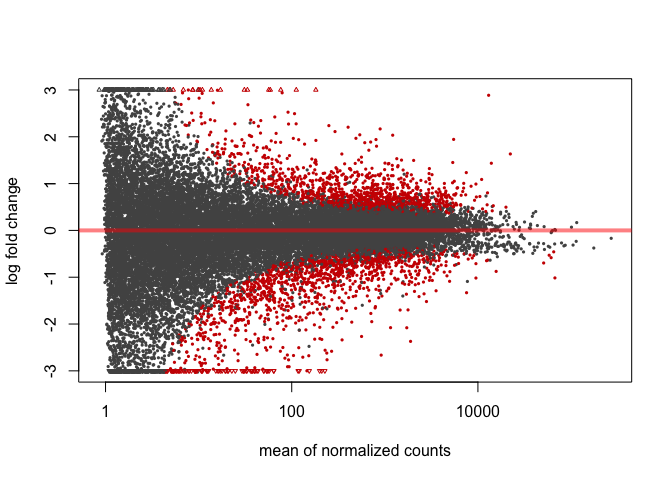<!-- -->

**The shrunken
results:**

``` r
plotMA(res_WTvsKO_shrunken, ylim=c(-3,3))
```

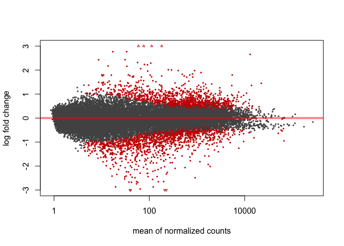<!-- -->

**results exploration**

``` r
class(res_WTvsKO_shrunken)
```

    ## [1] "DESeqResults"
    ## attr(,"package")
    ## [1] "DESeq2"

``` r
mcols(res_WTvsKO_shrunken, use.names=T)
```

    ## DataFrame with 6 rows and 2 columns
    ##                        type                               description
    ##                 <character>                               <character>
    ## baseMean       intermediate mean of normalized counts for all samples
    ## log2FoldChange      results    log2 fold change (MAP): group WT vs KO
    ## lfcSE               results            standard error: group WT vs KO
    ## stat                results            Wald statistic: group WT vs KO
    ## pvalue              results         Wald test p-value: group WT vs KO
    ## padj                results                      BH adjusted p-values

``` r
head(res_WTvsKO_shrunken)
```

    ## log2 fold change (MAP): group WT vs KO
    ## Wald test p-value: group WT vs KO
    ## DataFrame with 6 rows and 6 columns
    ##                         baseMean     log2FoldChange             lfcSE
    ##                        <numeric>          <numeric>         <numeric>
    ## ENSG00000227232 108.957759725414  -0.22755481363814 0.227035040604515
    ## ENSG00000278267 10.1439228320183 -0.547930864449439 0.351787339642105
    ## ENSG00000243485 1.90161359082584 -0.016795390544874 0.285903433979774
    ## ENSG00000269981 1.12687803462427 -0.237430103399403 0.241438679872679
    ## ENSG00000241860 8.70796227057328  0.109161425794176 0.360330734969164
    ## ENSG00000279928  8.4077246233138 -0.488180352901374  0.35527511773769
    ##                                stat            pvalue              padj
    ##                           <numeric>         <numeric>         <numeric>
    ## ENSG00000227232   -1.00271854420104  0.31599667992121 0.612654517741978
    ## ENSG00000278267   -1.51434302257131 0.129938862185353 0.376735109431391
    ## ENSG00000243485 -0.0583391539515132 0.953478480265113                NA
    ## ENSG00000269981  -0.906690818577666 0.364570320054435                NA
    ## ENSG00000241860   0.283186428198626 0.777033931451495 0.911563989998815
    ## ENSG00000279928   -1.33412103281182 0.182164193814911 0.455786765375049

> **NOTE: on p-values set to NA** 1. If within a row, all samples have
> zero counts, the baseMean column will be zero, and the log2 fold
> change estimates, p-value and adjusted p-value will all be set to NA.
> 2. If a row contains a sample with an extreme count outlier then the
> p-value and adjusted p-value will be set to NA. These outlier counts
> are detected by Cook’s distance. 3. If a row is filtered by automatic
> independent filtering, for having a low mean normalized count, then
> only the adjusted p-value will be set to NA.

\#\#\#4.3.2 WT vs
RE

``` r
## Define contrasts, extract results table, and shrink the log2 fold changes
contrast_re <- c("group", "WT", "RE")
res_WTvsRE_unshrunken <- results(dds, contrast=contrast_re, alpha = 0.05)
res_WTvsRE_shrunken <- lfcShrink(dds, contrast=contrast_re, res=res_WTvsRE_unshrunken)
```

    ## using 'normal' for LFC shrinkage, the Normal prior from Love et al (2014).
    ##
    ## Note that type='apeglm' and type='ashr' have shown to have less bias than type='normal'.
    ## See ?lfcShrink for more details on shrinkage type, and the DESeq2 vignette.
    ## Reference: https://doi.org/10.1093/bioinformatics/bty895

``` r
res_WTvsKO_shrunken_apeglm <- lfcShrink(dds, coef ="group_WT_vs_KO", type= "apeglm")
```

    ## using 'apeglm' for LFC shrinkage. If used in published research, please cite:
    ##     Zhu, A., Ibrahim, J.G., Love, M.I. (2018) Heavy-tailed prior distributions for
    ##     sequence count data: removing the noise and preserving large differences.
    ##     Bioinformatics. https://doi.org/10.1093/bioinformatics/bty895

**MA Plot** **The unshrunken
results:**

``` r
plotMA(res_WTvsRE_unshrunken, ylim=c(-3,3))
```

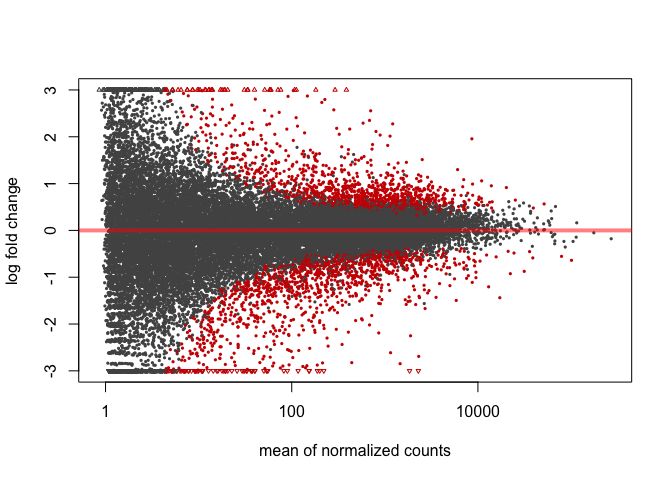<!-- -->

``` r
plotMA(res_WTvsRE_shrunken, ylim=c(-3,3))
```

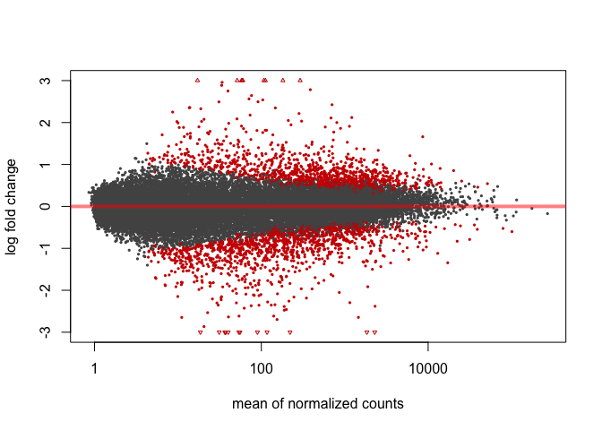<!-- -->
**results exploration**

``` r
class(res_WTvsRE_shrunken)
```

    ## [1] "DESeqResults"
    ## attr(,"package")
    ## [1] "DESeq2"

``` r
mcols(res_WTvsRE_shrunken, use.names=T)
```

    ## DataFrame with 6 rows and 2 columns
    ##                        type                               description
    ##                 <character>                               <character>
    ## baseMean       intermediate mean of normalized counts for all samples
    ## log2FoldChange      results    log2 fold change (MAP): group WT vs RE
    ## lfcSE               results            standard error: group WT vs RE
    ## stat                results            Wald statistic: group WT vs RE
    ## pvalue              results         Wald test p-value: group WT vs RE
    ## padj                results                      BH adjusted p-values

``` r
head(res_WTvsRE_shrunken)
```

    ## log2 fold change (MAP): group WT vs RE
    ## Wald test p-value: group WT vs RE
    ## DataFrame with 6 rows and 6 columns
    ##                         baseMean       log2FoldChange             lfcSE
    ##                        <numeric>            <numeric>         <numeric>
    ## ENSG00000227232 108.957759725414  0.00458925205300681 0.227222635948027
    ## ENSG00000278267 10.1439228320183    0.355149799441453 0.355251500630866
    ## ENSG00000243485 1.90161359082584  -0.0295561040719982 0.288177857388107
    ## ENSG00000269981 1.12687803462427 -0.00337258784869207 0.241015476799932
    ## ENSG00000241860 8.70796227057328    0.416145506015054 0.360270159251398
    ## ENSG00000279928  8.4077246233138     0.36340313562411 0.357840341050166
    ##                                stat            pvalue              padj
    ##                           <numeric>         <numeric>         <numeric>
    ## ENSG00000227232  0.0207174978675628 0.983471010735707 0.995674559697143
    ## ENSG00000278267    1.06713212997563  0.28591217486874 0.602065811216409
    ## ENSG00000243485  -0.103120751868001    0.917867135214                NA
    ## ENSG00000269981 -0.0180779476068586 0.985576670337755                NA
    ## ENSG00000241860     1.1721244559187 0.241147092524008 0.550427337399438
    ## ENSG00000279928    1.08785338531931  0.27665983750532 0.592157023679869

\#\#\#4.3.2 RE vs
KO

``` r
## Define contrasts, extract results table, and shrink the log2 fold changes
contrast_re.ko <- c("group", "RE", "KO")

res_REvsKO_unshrunken <- results(dds, contrast=contrast_re.ko, alpha = 0.05)

res_REvsKO_shrunken <- lfcShrink(dds, contrast=contrast_re.ko, res=res_REvsKO_unshrunken)
```

    ## using 'normal' for LFC shrinkage, the Normal prior from Love et al (2014).
    ##
    ## Note that type='apeglm' and type='ashr' have shown to have less bias than type='normal'.
    ## See ?lfcShrink for more details on shrinkage type, and the DESeq2 vignette.
    ## Reference: https://doi.org/10.1093/bioinformatics/bty895

**MA Plot** **The unshrunken
results:**

``` r
plotMA(res_REvsKO_unshrunken, ylim=c(-3,3))
```

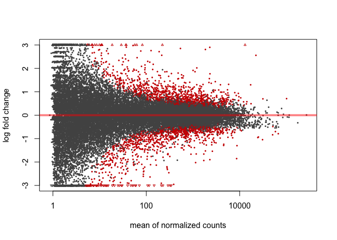<!-- -->

``` r
plotMA(res_REvsKO_shrunken, ylim=c(-3,3))
```

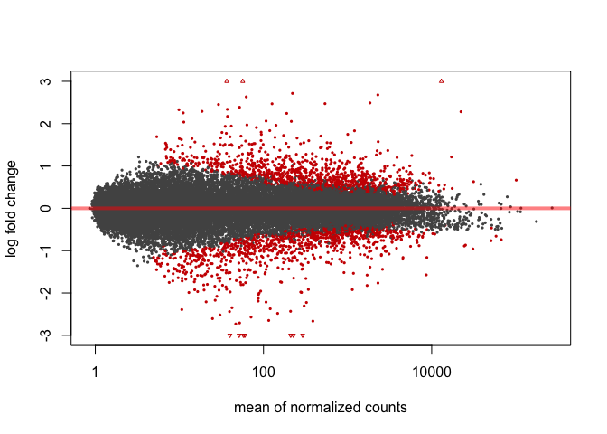<!-- -->
**results exploration**

``` r
class(res_REvsKO_shrunken)
```

    ## [1] "DESeqResults"
    ## attr(,"package")
    ## [1] "DESeq2"

``` r
mcols(res_REvsKO_shrunken, use.names=T)
```

    ## DataFrame with 6 rows and 2 columns
    ##                        type                               description
    ##                 <character>                               <character>
    ## baseMean       intermediate mean of normalized counts for all samples
    ## log2FoldChange      results    log2 fold change (MAP): group RE vs KO
    ## lfcSE               results            standard error: group RE vs KO
    ## stat                results            Wald statistic: group RE vs KO
    ## pvalue              results         Wald test p-value: group RE vs KO
    ## padj                results                      BH adjusted p-values

``` r
head(res_REvsKO_shrunken)
```

    ## log2 fold change (MAP): group RE vs KO
    ## Wald test p-value: group RE vs KO
    ## DataFrame with 6 rows and 6 columns
    ##                         baseMean     log2FoldChange             lfcSE
    ##                        <numeric>          <numeric>         <numeric>
    ## ENSG00000227232 108.957759725414 -0.232144065691147  0.22781355230955
    ## ENSG00000278267 10.1439228320183 -0.903080663890892 0.354381177288185
    ## ENSG00000243485 1.90161359082584 0.0127607135271242 0.284879325889732
    ## ENSG00000269981 1.12687803462427 -0.234057515550711 0.239980000107248
    ## ENSG00000241860 8.70796227057328 -0.306984080220879 0.360067487258778
    ## ENSG00000279928  8.4077246233138 -0.851583488525484 0.357342995846103
    ##                               stat             pvalue               padj
    ##                          <numeric>          <numeric>          <numeric>
    ## ENSG00000227232  -1.01891496391972  0.308243338956703  0.632758465894236
    ## ENSG00000278267  -2.50151013070232 0.0123664904294987 0.0939160786609529
    ## ENSG00000243485 0.0431773178912049  0.965560185923969                 NA
    ## ENSG00000269981 -0.878248755346264  0.379808738625753                 NA
    ## ENSG00000241860 -0.877172391938832  0.380393009168495  0.693987318672063
    ## ENSG00000279928  -2.34030495995176 0.0192679994646415  0.125664038257854

## 4.4 Summarizing results

\#\#\#4.4.1 Summarize results

``` r
## Summarize results
summary(res_WTvsKO_shrunken, alpha = 0.05)
```

    ##
    ## out of 26836 with nonzero total read count
    ## adjusted p-value < 0.05
    ## LFC > 0 (up)       : 1208, 4.5%
    ## LFC < 0 (down)     : 1380, 5.1%
    ## outliers [1]       : 0, 0%
    ## low counts [2]     : 6244, 23%
    ## (mean count < 4)
    ## [1] see 'cooksCutoff' argument of ?results
    ## [2] see 'independentFiltering' argument of ?results

``` r
summary(res_WTvsRE_shrunken, alpha = 0.05)
```

    ##
    ## out of 26836 with nonzero total read count
    ## adjusted p-value < 0.05
    ## LFC > 0 (up)       : 1156, 4.3%
    ## LFC < 0 (down)     : 1354, 5%
    ## outliers [1]       : 0, 0%
    ## low counts [2]     : 6244, 23%
    ## (mean count < 4)
    ## [1] see 'cooksCutoff' argument of ?results
    ## [2] see 'independentFiltering' argument of ?results

``` r
summary(res_REvsKO_shrunken, alpha = 0.05)
```

    ##
    ## out of 26836 with nonzero total read count
    ## adjusted p-value < 0.05
    ## LFC > 0 (up)       : 1019, 3.8%
    ## LFC < 0 (down)     : 1028, 3.8%
    ## outliers [1]       : 0, 0%
    ## low counts [2]     : 6764, 25%
    ## (mean count < 5)
    ## [1] see 'cooksCutoff' argument of ?results
    ## [2] see 'independentFiltering' argument of ?results

\#\#\#4.4.2 Extracting significant differentially expressed genes **WT
vs KO**

``` r
### Set thresholds
padj.cutoff <- 0.05
```

``` r
sigWTvsKO <- res_WTvsKO_shrunken_tb %>%
        dplyr::filter(padj < padj.cutoff)
sigWTvsKO_DESeq2 <- merge(sigWTvsKO, grch38[, c("ensgene", "symbol")], by.x="gene", by.y="ensgene")
head(sigWTvsKO_DESeq2)
```

    ##              gene   baseMean log2FoldChange     lfcSE      stat       pvalue
    ## 1 ENSG00000001617 1344.51334      1.4669087 0.1448193 10.126503 4.214547e-24
    ## 2 ENSG00000002016  237.36990      0.5289474 0.1881318  2.811676 4.928409e-03
    ## 3 ENSG00000002079   36.23050     -2.2452135 0.3493818 -6.217859 5.039838e-10
    ## 4 ENSG00000002746   85.22074     -1.1733977 0.2293617 -5.122345 3.017599e-07
    ## 5 ENSG00000004399 4964.02733     -1.0245439 0.1681428 -6.094445 1.098180e-09
    ## 6 ENSG00000004478 6870.02922      0.7785661 0.1751206  4.443603 8.846460e-06
    ##           padj symbol
    ## 1 4.132665e-21 SEMA3F
    ## 2 4.183971e-02  RAD52
    ## 3 4.941921e-08  MYH16
    ## 4 1.479486e-05  HECW1
    ## 5 9.961996e-08 PLXND1
    ## 6 2.632461e-04  FKBP4

``` r
write.csv(sigWTvsKO_DESeq2, "results/sigWTvsKO_DESeq2.csv")
```

**WT vs RE**

``` r
res_WTvsRE_shrunken_tb <- res_WTvsRE_shrunken %>%
  data.frame() %>%
  rownames_to_column(var="gene") %>%
  as_tibble()
sigWTvsRE <- res_WTvsRE_shrunken_tb %>%
        dplyr::filter(padj < padj.cutoff)
```

``` r
sigWTvsRE_DESeq2 <- merge(sigWTvsRE, grch38[, c("ensgene", "symbol")], by.x="gene", by.y="ensgene")
head(sigWTvsRE_DESeq2)
```

    ##              gene   baseMean log2FoldChange     lfcSE      stat       pvalue
    ## 1 ENSG00000001167 1685.26069      0.4832386 0.1702588  2.838508 4.532500e-03
    ## 2 ENSG00000001617 1344.51334      0.5614232 0.1430923  3.920483 8.837181e-05
    ## 3 ENSG00000002746   85.22074     -1.8838217 0.2231402 -8.359878 6.278314e-17
    ## 4 ENSG00000003147   57.88016      3.4270330 0.3113473  7.060879 1.654530e-12
    ## 5 ENSG00000004399 4964.02733     -0.7490652 0.1681568 -4.457068 8.308831e-06
    ## 6 ENSG00000004478 6870.02922      0.8743334 0.1750979  4.991612 5.987736e-07
    ##           padj symbol
    ## 1 3.993720e-02   NFYA
    ## 2 1.736405e-03 SEMA3F
    ## 3 1.820888e-14  HECW1
    ## 4 2.581066e-10   ICA1
    ## 5 2.318367e-04 PLXND1
    ## 6 2.511191e-05  FKBP4

``` r
write.csv(sigWTvsRE_DESeq2, "results/sigWTvsRE_DESeq2.csv")
```

**RE vs KO**

``` r
res_REvsKO_shrunken_tb <- res_REvsKO_shrunken %>%
  data.frame() %>%
  rownames_to_column(var="gene") %>%
  as_tibble()
sigREvsKO <- res_REvsKO_shrunken_tb %>%
        dplyr::filter(padj < padj.cutoff)
```

``` r
sigREvsKO_DESeq2 <- merge(sigREvsKO, grch38[, c("ensgene", "symbol")], by.x="gene", by.y="ensgene")
head(sigREvsKO_DESeq2)
```

    ##              gene   baseMean log2FoldChange     lfcSE      stat       pvalue
    ## 1 ENSG00000001617 1344.51334      0.9054855 0.1453760  6.232877 4.579460e-10
    ## 2 ENSG00000002079   36.23050     -1.4726508 0.3469102 -3.976915 6.981499e-05
    ## 3 ENSG00000002746   85.22074      0.7104240 0.2123072  3.310574 9.310477e-04
    ## 4 ENSG00000003147   57.88016     -4.0652159 0.3102426 -7.657159 1.900919e-14
    ## 5 ENSG00000005486 1406.26678     -0.5491974 0.1831072 -2.998135 2.716377e-03
    ## 6 ENSG00000005893 2729.75065      0.4687455 0.1264279  3.707552 2.092723e-04
    ##           padj symbol
    ## 1 6.164011e-08 SEMA3F
    ## 2 1.868435e-03  MYH16
    ## 3 1.435875e-02  HECW1
    ## 4 6.154071e-12   ICA1
    ## 5 3.181045e-02 RHBDD2
    ## 6 4.439122e-03  LAMP2

``` r
write.csv(sigREvsKO_DESeq2, "results/sigREvsKO_DESeq2.csv")
```

# 5 Visualizing the results

We will be working with three different data objects we have already
created in earlier lessons:

1.  Metadata for our samples (a dataframe): colData
2.  Normalized expression data for every gene in each of our samples (a
    matrix): normalized\_counts
3.  Tibble versions of the DESeq2 results we generated in the last
    lesson: res\_WTvsKO\_shrunken\_tb, res\_WTvsRE\_shrunken\_tb and
    res\_REvsKO\_shrunken\_tb

## 5.1 create a tibble object from the `normalized_counts` data frame

``` r
# DESeq2 creates a matrix when you use the counts() function
## First convert normalized_counts to a data frame and transfer the row names to a new column called "gene"
normalized_counts <- counts(dds, normalized=T) %>%
  data.frame() %>%
  rownames_to_column(var="gene")

# Next, merge together (ensembl IDs) the normalized counts data frame with
#   a subset of the annotables grch38 data frame (only the columns for ensembl gene IDs and gene symbols)
## This will bring in a column of gene symbols
normalized_counts <- merge(normalized_counts, grch38[, c("ensgene", "symbol")], by.x="gene", by.y="ensgene")

# Now create a tibble for the normalized counts
normalized_counts <- normalized_counts %>%
  as_tibble()

# normalized_counts
write.csv(normalized_counts, "results/normalized_counts.csv",row.names = FALSE)
```

### 5.2 VennDiagram

``` r
library(ggsci)
library(dplyr)
library(VennDiagram)
```

    ## Loading required package: grid

    ## Loading required package: futile.logger

``` r
WTvsKO<-sigWTvsKO_DESeq2$gene
REvsKO<-sigREvsKO_DESeq2$gene
WTvsRE<-sigWTvsRE_DESeq2$gene
vennData <-list(WTvsKO,REvsKO,WTvsRE)
names(vennData)<- c("WTvsKO","REvsKO","WTvsRE")

# length(WTvsRE)

#Make the plot
venn<-venn.diagram(
  vennData,
  category.names = c("WTvsKO (2598)" , "REvsKO (2056)" , "WTvsRE (2529)"),
  filename = NULL,
  # filename = 'figures/venn.tiff',
  # output = TRUE ,
  #         imagetype="tiff" ,
          height = 800 ,
          width = 800 ,
          resolution = 300,
          compression = "lzw",
          lwd = 1,
          col=c("#440154ff", '#21908dff', '#fde725ff'),
          fill = c(alpha("#440154ff",0.3), alpha('#21908dff',0.3), alpha('#fde725ff',0.3)),
          cex = 0.5,
          fontfamily = "sans",
          cat.cex = 0.3,
          cat.default.pos = "outer",
          cat.pos = c(-27, 27, 135),
          cat.dist = c(0.055, 0.055, 0.085),
          cat.fontfamily = "sans",
          cat.col = c("#440154ff", '#21908dff', '#fde725ff'),
          rotation = 1
        )
grid.draw(venn)
```

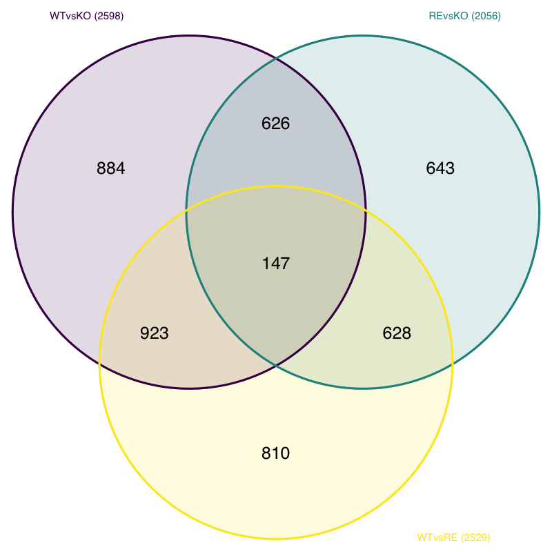<!-- -->

``` r
graph2pdf(file="figures/venn.pdf", width=8, height =8,font = "Arial",bg = "transparent")
```

    ## Exported graph as figures/venn.pdf

### 5.3 heatmap

In addition to plotting subsets, we could also extract the normalized
values of all the significant genes and plot a heatmap of their
expression using
`pheatmap()`.

``` r
### Extract normalized expression for significant genes from the WT and KO samples (2:4 and 8:10)
norm_sigWTvsKO <- normalized_counts[,c(1:10)] %>%  ## subset samples by: normalized_counts[,c(1:4, 5:7)]
              dplyr::filter(gene %in% sigWTvsKO$gene)
head(norm_sigWTvsKO)
```

    ## # A tibble: 6 x 10
    ##   gene               W_1    W_2    W_3    C_1    C_2    C_3    F_1    F_2    F_3
    ##   <chr>            <dbl>  <dbl>  <dbl>  <dbl>  <dbl>  <dbl>  <dbl>  <dbl>  <dbl>
    ## 1 ENSG00000001…  1795.   2.01e3 2.21e3  636.   678.   764.  1236.  1334.  1438.
    ## 2 ENSG00000002…   300.   2.17e2 3.18e2  194.   165.   204.   255.   221.   261.
    ## 3 ENSG00000002…     6.76 4.94e0 7.30e0   40.2   36.3  175.    18.0   13.5   24.4
    ## 4 ENSG00000002…    35.8  2.96e1 3.13e1   76.3   84.9   85.7  117.   156.   150.
    ## 5 ENSG00000004…  2574.   3.39e3 3.23e3 5832.  6521.  7178.  4453.  5208.  6292.
    ## 6 ENSG00000004… 10658.   9.12e3 9.86e3 7020.  4794.  4855.  6046.  4674.  4805.

draw the heatmap using `pheatmap`:

``` r
library(pheatmap)
ann.sample <- dplyr::select(colData,group)
### Set a color palette
heat_colors <- brewer.pal(6, "YlOrRd")

### Run pheatmap using the metadata data frame for the annotation
pheatmap(norm_sigWTvsKO[2:10],
         # color = heat_colors,
         cluster_rows = T,
         show_rownames = F,
         clustering_method = "ward.D2",
         annotation = ann.sample,
         border_color = NA,
         fontsize = 10,
         scale = "row",
         cutree_rows = 4,
         cutree_cols = 3,
         fontsize_row = 10,
         height = 20)
```

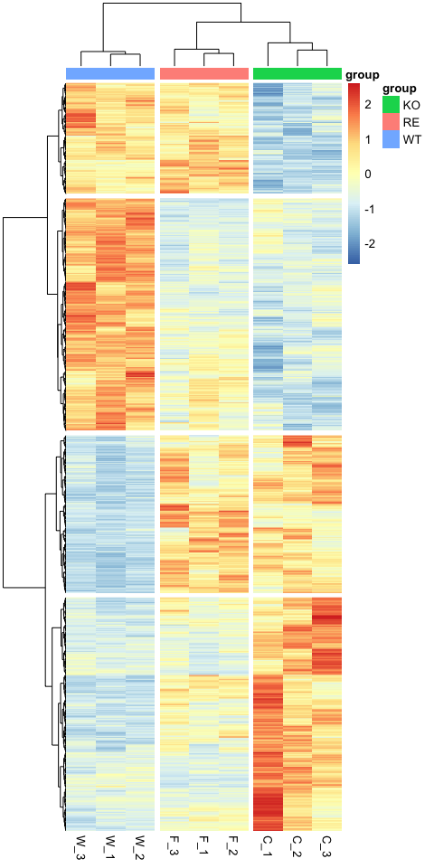<!-- -->

``` r
graph2pdf(file="figures/sigWTvsKO.genes.heatmap.pdf", width=5, aspectr=sqrt(2),font = "Arial",bg = "transparent")
```

    ## Exported graph as figures/sigWTvsKO.genes.heatmap.pdf

\#6 Function analysis of FUS Specific regulated genes

**Overlapping gene list of WTvsKO and RTvsKO**

``` r
## intersect between WTvsKO and REvsKO
WTandRE <- intersect(WTvsKO,REvsKO)
summary(WTandRE)
```

    ##    Length     Class      Mode
    ##       773 character character

``` r
WTandRE_1 <- data.frame(WTandRE, row.names = NULL)

WTandRE_2 <- merge(WTandRE_1, grch38[, c("ensgene", "symbol", "entrez")], by.x="WTandRE", by.y="ensgene")%>%
                       as.tibble()%>%
                       dplyr::rename(ensgene = WTandRE )
```

    ## Warning: `as.tibble()` is deprecated as of tibble 2.0.0.
    ## Please use `as_tibble()` instead.
    ## The signature and semantics have changed, see `?as_tibble`.
    ## This warning is displayed once every 8 hours.
    ## Call `lifecycle::last_warnings()` to see where this warning was generated.

``` r
WTandRE_2<- WTandRE_2[which(duplicated(WTandRE_2$ensgene) == F), ] %>%
                      dplyr::mutate(ensgene=as.character(ensgene))

summary(WTandRE_2)
```

    ##    ensgene             symbol              entrez
    ##  Length:773         Length:773         Min.   :       18
    ##  Class :character   Class :character   1st Qu.:     5979
    ##  Mode  :character   Mode  :character   Median :    23523
    ##                                        Mean   :  2805617
    ##                                        3rd Qu.:    84376
    ##                                        Max.   :107984085
    ##                                        NA's   :68

``` r
WTandRE_DESeq2 <- dplyr::left_join(WTandRE_2,normalized_counts,  by=c("ensgene" = "gene")) %>%
                            dplyr::distinct()
## Prepare foldchange and padj information for tables joint

sigWTvsKO_1 <- sigWTvsKO %>% dplyr::select(gene, log2FoldChange, padj)%>%
                            dplyr::rename(WTvsKOlog2FoldChange=log2FoldChange, WTvsKOpadj=padj )

sigREvsKO_1 <- sigREvsKO %>% dplyr::select(gene, log2FoldChange, padj)%>%
                            dplyr::rename(REvsKOlog2FoldChange=log2FoldChange, REvsKOpadj=padj )
sigWTvsRE_1 <- res_WTvsRE_shrunken_tb %>% dplyr::select(gene, log2FoldChange, padj)%>%
                           dplyr:: rename(WTvsRElog2FoldChange=log2FoldChange, WTvsREpadj=padj )
## joint foldchange and padj information
WTandRE_DESeq2_X <- dplyr::left_join(WTandRE_DESeq2, sigWTvsKO_1,  by=c("ensgene" = "gene")) %>%
                              dplyr::left_join(., sigREvsKO_1,  by=c("ensgene" = "gene"))%>%
                              dplyr::left_join(., sigWTvsRE_1,  by=c("ensgene" = "gene"))%>%
                              dplyr::distinct()%>%
                              dplyr::select(-symbol.y)%>%
                              dplyr::rename(symbol=symbol.x)
## Clean out the genes in RE sample with different changing direction compared with WT.
WTandRE_DESeq2_X2 <-WTandRE_DESeq2_X%>%
                    dplyr::mutate(WT_KO_sign=(sign(WTvsKOlog2FoldChange)))%>%
                    dplyr::mutate(RE_KO_sign=(sign(REvsKOlog2FoldChange)))%>%
                    dplyr::mutate(diff=WT_KO_sign-RE_KO_sign)%>%
                    dplyr::filter(diff==0)
write.csv(WTandRE_DESeq2_X2, "results/FusSpeRegulatedGenes.csv")
length(WTandRE_DESeq2_X$symbol)
```

    ## [1] 773

**Heatmap of gene list of WTvsKO and RTvsKO**

``` r
subset_WTandRE_DESeq2_X2 <- WTandRE_DESeq2_X2 %>%
                   dplyr::select(symbol, c(4:12))%>%
                   column_to_rownames(var ="symbol")

### Run pheatmap using the metadata data frame for the annotation
pheatmap(subset_WTandRE_DESeq2_X2,
         # color = heat_colors,
         clustering_method = "ward.D2",
         cluster_rows = T,
         show_rownames =F ,
         annotation = ann.sample,
         # annotation_row = my_gene_col,
         border_color = NA,
         fontsize = 10,
         scale = "row",
         cutree_rows = 2,
         cutree_cols = 3,
         # kmeans_k = 2,X
         fontsize_row = 5,
         height = 20)
```

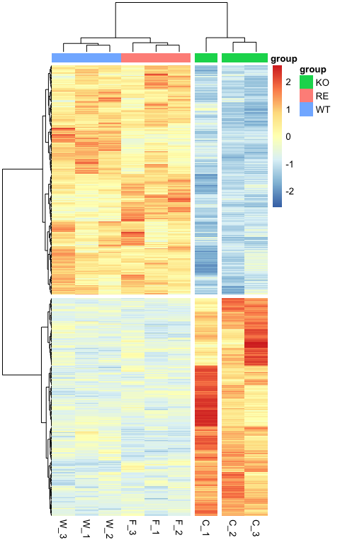<!-- -->

``` r
graph2pdf(file="figures/FusSpeRegulatedGenesHeatmap.pdf", width=5, aspectr=sqrt(2),font = "Arial",bg = "transparent")
```

    ## Exported graph as figures/FusSpeRegulatedGenesHeatmap.pdf

Biological function

``` r
library(clusterProfiler)
library(org.Hs.eg.db)
FUS_regulatedGeneList<-WTandRE_DESeq2_X2$ensgene
FUS_regulated_ego_BP <- enrichGO(gene = FUS_regulatedGeneList,
                # universe = all_WTvsKO_genes,
                keyType = "ENSEMBL",
                OrgDb = org.Hs.eg.db,
                ont = "BP",
                pAdjustMethod = "BH",
                qvalueCutoff = 0.1,
                readable = TRUE)
dotplot(FUS_regulated_ego_BP, showCategory=20)
```

    ## wrong orderBy parameter; set to default `orderBy = "x"`

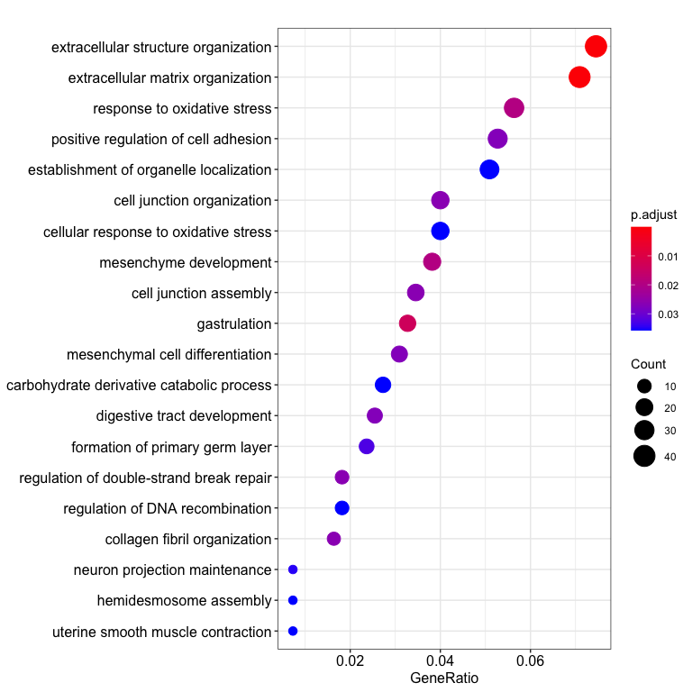<!-- -->

``` r
graph2pdf(file="figures/FUS_regulated_ego_BP.pdf", width=8, aspectr=sqrt(2),font = "Arial",bg = "transparent")
```

    ## Exported graph as figures/FUS_regulated_ego_BP.pdf

``` r
FUS_regulated_ego_BP_summary <- data.frame(FUS_regulated_ego_BP)

write.csv(FUS_regulated_ego_BP_summary, "results/FUS_regulated_ego_BP_summary.csv")
```

``` r
sessionInfo()
```

    ## R version 3.6.3 (2020-02-29)
    ## Platform: x86_64-apple-darwin15.6.0 (64-bit)
    ## Running under: macOS Catalina 10.15.4
    ##
    ## Matrix products: default
    ## BLAS:   /Library/Frameworks/R.framework/Versions/3.6/Resources/lib/libRblas.0.dylib
    ## LAPACK: /Library/Frameworks/R.framework/Versions/3.6/Resources/lib/libRlapack.dylib
    ##
    ## locale:
    ## [1] en_US.UTF-8/en_US.UTF-8/en_US.UTF-8/C/en_US.UTF-8/en_US.UTF-8
    ##
    ## attached base packages:
    ##  [1] grid      parallel  stats4    stats     graphics  grDevices utils
    ##  [8] datasets  methods   base
    ##
    ## other attached packages:
    ##  [1] VennDiagram_1.6.20          futile.logger_1.4.3
    ##  [3] ggsci_2.9                   Glimma_1.12.0
    ##  [5] apeglm_1.6.0                ensembldb_2.8.1
    ##  [7] AnnotationFilter_1.8.0      GenomicFeatures_1.36.4
    ##  [9] AnnotationHub_2.16.1        BiocFileCache_1.8.0
    ## [11] dbplyr_1.4.2                clusterProfiler_3.12.0
    ## [13] pathview_1.24.0             DOSE_3.10.2
    ## [15] org.Hs.eg.db_3.8.2          AnnotationDbi_1.46.1
    ## [17] export_0.2.2.9001           annotables_0.1.91
    ## [19] pheatmap_1.0.12             DESeq2_1.24.0
    ## [21] SummarizedExperiment_1.14.1 DelayedArray_0.10.0
    ## [23] BiocParallel_1.18.1         matrixStats_0.56.0
    ## [25] Biobase_2.44.0              GenomicRanges_1.36.1
    ## [27] GenomeInfoDb_1.20.0         IRanges_2.18.3
    ## [29] S4Vectors_0.22.1            BiocGenerics_0.30.0
    ## [31] RColorBrewer_1.1-2          ggrepel_0.8.2
    ## [33] forcats_0.5.0               stringr_1.4.0
    ## [35] dplyr_0.8.5                 purrr_0.3.3
    ## [37] readr_1.3.1                 tidyr_1.0.2
    ## [39] tibble_3.0.0                ggplot2_3.3.0
    ## [41] tidyverse_1.3.0
    ##
    ## loaded via a namespace (and not attached):
    ##   [1] rappdirs_0.3.1                rtracklayer_1.44.4
    ##   [3] coda_0.19-3                   acepack_1.4.1
    ##   [5] bit64_0.9-7                   knitr_1.28
    ##   [7] data.table_1.12.8             rpart_4.1-15
    ##   [9] KEGGREST_1.24.1               RCurl_1.98-1.1
    ##  [11] generics_0.0.2                lambda.r_1.2.4
    ##  [13] cowplot_1.0.0                 RSQLite_2.2.0
    ##  [15] europepmc_0.3                 bit_1.1-15.2
    ##  [17] enrichplot_1.4.0              webshot_0.5.2
    ##  [19] xml2_1.3.1                    lubridate_1.7.8
    ##  [21] httpuv_1.5.2                  assertthat_0.2.1
    ##  [23] viridis_0.5.1                 xfun_0.13
    ##  [25] hms_0.5.3                     evaluate_0.14
    ##  [27] promises_1.1.0                fansi_0.4.1
    ##  [29] progress_1.2.2                readxl_1.3.1
    ##  [31] Rgraphviz_2.28.0              igraph_1.2.5
    ##  [33] DBI_1.1.0                     geneplotter_1.62.0
    ##  [35] htmlwidgets_1.5.1             ellipsis_0.3.0
    ##  [37] crosstalk_1.1.0.1             backports_1.1.6
    ##  [39] annotate_1.62.0               biomaRt_2.40.5
    ##  [41] vctrs_0.2.4                   withr_2.1.2
    ##  [43] ggforce_0.3.1                 triebeard_0.3.0
    ##  [45] bdsmatrix_1.3-4               checkmate_2.0.0
    ##  [47] GenomicAlignments_1.20.1      prettyunits_1.1.1
    ##  [49] cluster_2.1.0                 lazyeval_0.2.2
    ##  [51] crayon_1.3.4                  genefilter_1.66.0
    ##  [53] edgeR_3.26.8                  pkgconfig_2.0.3
    ##  [55] labeling_0.3                  tweenr_1.0.1
    ##  [57] nlme_3.1-144                  ProtGenerics_1.16.0
    ##  [59] nnet_7.3-12                   rlang_0.4.5
    ##  [61] lifecycle_0.2.0               miniUI_0.1.1.1
    ##  [63] modelr_0.1.6                  cellranger_1.1.0
    ##  [65] polyclip_1.10-0               flextable_0.5.9
    ##  [67] graph_1.62.0                  Matrix_1.2-18
    ##  [69] urltools_1.7.3                reprex_0.3.0
    ##  [71] base64enc_0.1-3               ggridges_0.5.2
    ##  [73] png_0.1-7                     viridisLite_0.3.0
    ##  [75] bitops_1.0-6                  Biostrings_2.52.0
    ##  [77] blob_1.2.1                    rgl_0.100.54
    ##  [79] qvalue_2.16.0                 manipulateWidget_0.10.1
    ##  [81] jpeg_0.1-8.1                  gridGraphics_0.5-0
    ##  [83] scales_1.1.0                  memoise_1.1.0
    ##  [85] magrittr_1.5                  plyr_1.8.6
    ##  [87] zlibbioc_1.30.0               compiler_3.6.3
    ##  [89] bbmle_1.0.23.1                KEGGgraph_1.44.0
    ##  [91] Rsamtools_2.0.3               cli_2.0.2
    ##  [93] XVector_0.24.0                formatR_1.7
    ##  [95] htmlTable_1.13.3              Formula_1.2-3
    ##  [97] MASS_7.3-51.5                 tidyselect_1.0.0
    ##  [99] stringi_1.4.6                 emdbook_1.3.12
    ## [101] yaml_2.2.1                    GOSemSim_2.10.0
    ## [103] locfit_1.5-9.4                latticeExtra_0.6-29
    ## [105] fastmatch_1.1-0               tools_3.6.3
    ## [107] rvg_0.2.4                     rstudioapi_0.11
    ## [109] uuid_0.1-4                    foreign_0.8-75
    ## [111] gridExtra_2.3                 stargazer_5.2.2
    ## [113] farver_2.0.3                  ggraph_2.0.2
    ## [115] digest_0.6.25                 rvcheck_0.1.8
    ## [117] BiocManager_1.30.10           shiny_1.4.0.2
    ## [119] Rcpp_1.0.4.6                  broom_0.5.5
    ## [121] later_1.0.0                   httr_1.4.1
    ## [123] gdtools_0.2.2                 colorspace_1.4-1
    ## [125] rvest_0.3.5                   XML_3.99-0.3
    ## [127] fs_1.4.1                      splines_3.6.3
    ## [129] graphlayouts_0.6.0            ggplotify_0.0.5
    ## [131] systemfonts_0.1.1             xtable_1.8-4
    ## [133] futile.options_1.0.1          jsonlite_1.6.1
    ## [135] tidygraph_1.1.2               UpSetR_1.4.0
    ## [137] R6_2.4.1                      Hmisc_4.4-0
    ## [139] pillar_1.4.3                  htmltools_0.4.0
    ## [141] mime_0.9                      glue_1.4.0
    ## [143] fastmap_1.0.1                 interactiveDisplayBase_1.22.0
    ## [145] fgsea_1.10.1                  utf8_1.1.4
    ## [147] mvtnorm_1.1-0                 lattice_0.20-38
    ## [149] numDeriv_2016.8-1.1           curl_4.3
    ## [151] officer_0.3.8                 zip_2.0.4
    ## [153] GO.db_3.8.2                   openxlsx_4.1.4
    ## [155] limma_3.40.6                  survival_3.1-8
    ## [157] rmarkdown_2.1                 munsell_0.5.0
    ## [159] DO.db_2.9                     GenomeInfoDbData_1.2.1
    ## [161] haven_2.2.0                   reshape2_1.4.4
    ## [163] gtable_0.3.0
