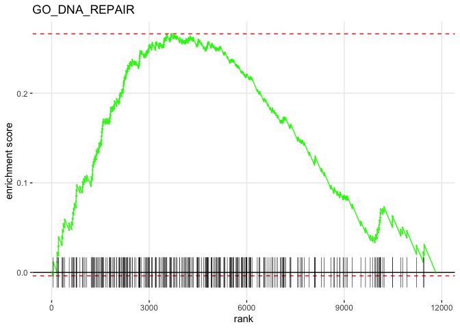
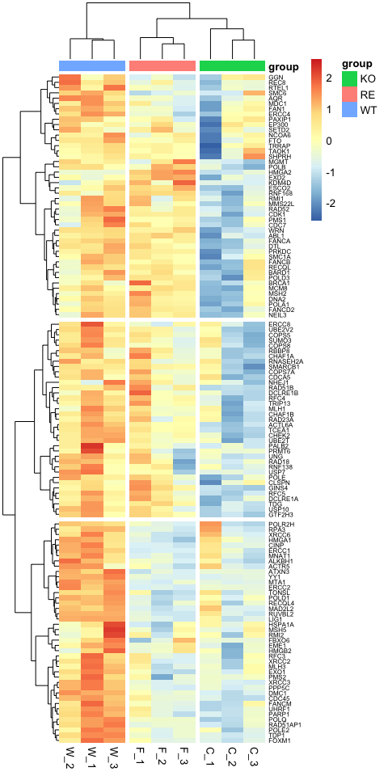

GSEA
================
Weiyan
4/1/2019

# 1\. Data preparation

**Note:**

> GSEA preranking metric:
> 1.  Select top 12000 genes based on adjusted P value
> 2.  Run genes based on logfc shrink values from DESeq2

``` r
library(tidyverse)
library(org.Hs.eg.db)
library(DT)
library(fgsea)
library(data.table)
library(ggplot2)
library(pheatmap)
library(RColorBrewer)
library(dendextend)
library(export)
library(ggpubr)
```

``` r
WT_KO_res <-read.csv("FUS_DESeq2/results/res_WTvsKO_shrunken_tb_entrez.csv",header = TRUE)
normalized_counts<- read.csv("FUS_DESeq2/results/normalized_counts.csv",header = TRUE)
ann_colors = list(
    group = c(WT = "#7570B3", KO = "#E7298A", RE = "#66A61E")
)
ann.sample<-  read.csv("FUS_DESeq2/results/ann.sample.csv") %>%
              column_to_rownames(var="X")
ann.sample_meta<- ann.sample%>%
                  rownames_to_column(var="sampleName")
```

Preranking metric

``` r
summary(WT_KO_res)
```

    ##               gene          baseMean         log2FoldChange
    ##  ENSG00000205456:    5   Min.   :     0.85   Min.   :-3.163923
    ##  ENSG00000276256:    5   1st Qu.:    23.43   1st Qu.:-0.248567
    ##  ENSG00000276700:    5   Median :   276.58   Median :-0.004078
    ##  ENSG00000204577:    4   Mean   :  1062.60   Mean   :-0.028197
    ##  ENSG00000100031:    3   3rd Qu.:   992.05   3rd Qu.: 0.213460
    ##  ENSG00000100197:    3   Max.   :270205.07   Max.   : 4.383424
    ##  (Other)        :18195
    ##      lfcSE             stat               pvalue             padj
    ##  Min.   :0.1070   Min.   :-13.86655   Min.   :0.00000   Min.   :0.0000
    ##  1st Qu.:0.1704   1st Qu.: -1.09642   1st Qu.:0.05629   1st Qu.:0.1916
    ##  Median :0.2114   Median : -0.01816   Median :0.29547   Median :0.5556
    ##  Mean   :0.2314   Mean   : -0.03838   Mean   :0.36073   Mean   :0.5136
    ##  3rd Qu.:0.2959   3rd Qu.:  0.99985   3rd Qu.:0.62361   3rd Qu.:0.8215
    ##  Max.   :0.3604   Max.   : 13.95273   Max.   :1.00000   Max.   :1.0000
    ##                                                         NA's   :1973
    ##      entrez
    ##  Min.   :        1
    ##  1st Qu.:     7942
    ##  Median :    54862
    ##  Mean   :  8647950
    ##  3rd Qu.:   143585
    ##  Max.   :110384692
    ##

Map Ensembl gene IDs to symbol. First create a mapping table

``` r
ens2symbol <- AnnotationDbi::select(org.Hs.eg.db,
                                    key=as.character(WT_KO_res$gene),
                                    columns="SYMBOL",
                                    keytype="ENSEMBL")
```

    ## 'select()' returned many:many mapping between keys and columns

``` r
ens2symbol <- as_tibble(ens2symbol)
head(ens2symbol)
```

    ## # A tibble: 6 x 2
    ##   ENSEMBL         SYMBOL
    ##   <chr>           <chr>
    ## 1 ENSG00000000003 TSPAN6
    ## 2 ENSG00000000419 DPM1
    ## 3 ENSG00000000457 SCYL3
    ## 4 ENSG00000000460 C1orf112
    ## 5 ENSG00000000971 CFH
    ## 6 ENSG00000001036 FUCA2

Now join them

``` r
WT_KO_res <- left_join(WT_KO_res, ens2symbol, by=c("gene"="ENSEMBL"))%>%
           distinct()%>%
           drop_na()
```

    ## Warning: Column `gene`/`ENSEMBL` joining factor and character vector, coercing
    ## into character vector

``` r
WT_KO_X <- WT_KO_res%>%
           drop_na() %>% #whole table wide
           distinct()%>%
           arrange(padj)%>%
           top_n(-12000,padj)

# summary(WT_KO_X)
# WT_KO_X%>%
# group_by(SYMBOL) %>% dplyr::filter(n()>1) %>% summarize(n=n())
```

``` r
# stat related to Wald statistic and stat value corelected to log2FC, so we also can use the log2FC as input
res2 <- WT_KO_X %>%
  dplyr::select(SYMBOL, log2FoldChange) %>%
  drop_na() %>%
  distinct() %>%
  group_by(SYMBOL) %>%
  summarize(log2FoldChange=mean(log2FoldChange))
head(res2)
```

    ## # A tibble: 6 x 2
    ##   SYMBOL   log2FoldChange
    ##   <chr>             <dbl>
    ## 1 A1BG             -0.241
    ## 2 A1BG-AS1          0.302
    ## 3 A2M-AS1           0.171
    ## 4 A4GALT           -0.414
    ## 5 AAAS              0.337
    ## 6 AACSP1            0.204

# 2\. GSEA by fgsea package

``` r
ranks <- deframe(res2)
head(ranks, 20)
```

    ##       A1BG   A1BG-AS1    A2M-AS1     A4GALT       AAAS     AACSP1      AADAT
    ## -0.2409977  0.3017761  0.1710860 -0.4143847  0.3368818  0.2035146  0.1501382
    ##      AAGAB       AAK1      AAMDC       AAR2       AARD       AARS      AARS2
    ## -0.2835414 -0.1876808 -0.3542040  0.2841134 -0.2258958  0.3908992  0.2883509
    ##      AASDH   AASDHPPT       AASS       AATF       AATK     ABALON
    ##  0.3156485  0.1629646  0.4042967 -0.2838443 -0.4595514  0.4453924

``` r
barplot(sort(ranks, decreasing = T))
```

<!-- --> \#\#
2.1 GO(BP) analysis

``` r
set.seed(12)
pathways.GO.BP <- gmtPathways("MSigDB/c5.bp.v6.2.symbols.gmt")
WT_KO_GSEA_BP<-fgsea(pathways=gmtPathways("MSigDB/c5.bp.v6.2.symbols.gmt"), ranks,
                           nperm=100000,
                           minSize = 15,
                           maxSize = 500
                              )%>%
                            arrange(padj)
```

    ## Warning in fgsea(pathways = gmtPathways("MSigDB/c5.bp.v6.2.symbols.gmt"), : There are ties in the preranked stats (0.71% of the list).
    ## The order of those tied genes will be arbitrary, which may produce unexpected results.

``` r
Go_BP_05<- WT_KO_GSEA_BP %>%
              dplyr::filter(padj <0.01)%>%
              mutate(nLeadingEdge=lengths(leadingEdge),GeneRatio=lengths(leadingEdge)/size, term= substring(pathway,4))%>%
              dplyr::select(-ES,-nMoreExtreme)%>%
              distinct()
```

    ## Warning: distinct() does not fully support columns of type `list`.
    ## List elements are compared by reference, see ?distinct for details.
    ## This affects the following columns:
    ## - `leadingEdge`

``` r
fwrite(Go_BP_05, file="results/Go_BP_001.txt", sep="\t", sep2=c("", " ", ""))

### NES: positive, upregulated in KO.
p<- ggplot(Go_BP_05, aes(reorder(term, -NES), -NES)) +  ## order pathway based on NES value
  geom_col(aes(fill=GeneRatio)) +
  # geom_bar(stat="identity",fill = "red")+
  coord_flip() +
  labs(x="Pathway", y="Normalized Enrichment Score",
       title="GO_BP pathways NES from GSEA") +
  theme_minimal()
# p + scale_fill_gradient(low="goldenrod2", high="firebrick3") ##scale_color_gradient for shape or scale_color_gradientn(colours = rainbow(5))
p + scale_fill_gradient( low= brewer.pal(6, "YlOrRd"),high="firebrick3")
```

<!-- -->

``` r
graph2pdf(file="figures/FUS_GSEA_BP.pdf", width=10, aspectr=sqrt(2),font = "Arial",bg = "transparent")
```

    ## Exported graph as figures/FUS_GSEA_BP.pdf

## 2.2 Heatmap of DNA\_REPLICATION pathway leading genes

``` r
plotEnrichment(pathways.GO.BP[["GO_DNA_REPLICATION"]],
               ranks) + labs(title="GO_DNA_REPLICATION")
```

<!-- -->

``` r
# graph2ppt(file="figures/DNA_REPLICATION.Enrichment.pptx", width =8,aspectr=sqrt(2),bg = "transparent",margins =0)
graph2pdf(file="figures/DNA_REPLICATION.Enrichment.pptx", width=5, aspectr=sqrt(2),font = "Arial",bg = "transparent")
```

    ## Exported graph as figures/DNA_REPLICATION.Enrichment.pdf

``` r
DNA_REPLICATION.Leading<-Go_BP_05 %>%
             dplyr::filter(pathway == "GO_DNA_REPLICATION")%>%
             dplyr::select(leadingEdge)%>%
             unnest()%>%
             dplyr::rename(symbol=leadingEdge)%>%
             inner_join(normalized_counts, by="symbol")%>%
             distinct()
```

    ## Warning: `cols` is now required.
    ## Please use `cols = c(leadingEdge)`

    ## Warning: Column `symbol` joining character vector and factor, coercing into
    ## character vector

``` r
DNA_REPLICATION.Leading.all<-DNA_REPLICATION.Leading%>%
                         column_to_rownames(var ="symbol")
### Filter genes based on padj<0.05
DNA_REPLICATION.Leading.sig <-DNA_REPLICATION.Leading %>%
                          inner_join(WT_KO_res, "symbol"="SYMBOL")%>%
                          dplyr::select(-SYMBOL,-gene,-baseMean,-lfcSE)%>%
                          distinct()%>%
                          dplyr::filter(padj< 0.05)%>%
                         column_to_rownames(var ="symbol")
```

    ## Joining, by = "gene"

    ## Warning: Column `gene` joining factor and character vector, coercing into
    ## character vector

``` r
# method for cluster:
# the agglomeration method to be used. This should be (an unambiguous abbreviation of) one of "ward.D", "ward.D2", "single", "complete", "average" (= UPGMA), "mcquitty" (= WPGMA), "median" (= WPGMC) or "centroid" (= UPGMC).

heat_colors <- brewer.pal(6, "YlOrRd")

dna.rep.out.all<- pheatmap(DNA_REPLICATION.Leading.all[2:10],
         # color = heat_colors,
         clustering_method = "ward.D2",
         cluster_rows = T,
         cluster_cols = T,
         show_rownames =T ,
         annotation = ann.sample,
         annotation_colors = ann_colors,
         border_color = NA,
         fontsize = 10,
         scale = "row",
         cutree_rows = 3,
         cutree_cols = 3,
         fontsize_row = 6,
         height = 20)
```

<!-- -->

``` r
dna.rep_col.all<- sort(cutree(dna.rep.out.all$tree_row, k=3))%>%
                 as.factor()%>%
                 data.frame()%>%
                 dplyr::rename(cluster=".")

pheatmap(DNA_REPLICATION.Leading.all[2:10],
         # color = heat_colors,
         clustering_method = "ward.D2",
         cluster_rows = T,
         cluster_cols = T,
         show_rownames =T ,
         annotation_col = ann.sample,
         annotation_row = dna.rep_col.all,
         annotation_colors = ann_colors,
         border_color = NA,
         fontsize = 10,
         scale = "row",
         cutree_rows = 3,
         cutree_cols = 3,
         fontsize_row = 6,
         height = 20)
```

<!-- -->

``` r
# graph2ppt(file="figures/DNA_REPLICATION.Leading.all.pptx", width =8,aspectr=0.5,bg = "transparent",margins =0)
graph2pdf(file="figures/DNA_REPLICATION.Leading.all.pdf", width=5, aspectr=sqrt(2),font = "Arial",bg = "transparent")
```

    ## Exported graph as figures/DNA_REPLICATION.Leading.all.pdf

``` r
## filted by padj
dna.rep.out.sig = pheatmap(DNA_REPLICATION.Leading.sig[1:9],
         # color = heat_colors,
         clustering_method = "ward.D2",
         cluster_rows = T,
         cluster_cols = T,
         show_rownames =T ,
         annotation_col = ann.sample,
         annotation_colors = ann_colors,
         border_color = NA,
         fontsize = 10,
         scale = "row",
         cutree_rows = 3,
         cutree_cols = 3,
         fontsize_row = 10,
         height = 20)
```

<!-- -->

``` r
# If you want something like gene-to-cluster assignment, you can 'cut' your row dendrogram into a pre-selected number of groups as follows:
dna.rep_col.sig<- sort(cutree(dna.rep.out.sig$tree_row, k=3))%>%
                 as.factor()%>%
                 data.frame()%>%
                 dplyr::rename(cluster=".")

pheatmap(DNA_REPLICATION.Leading.sig[1:9],
         # color = heat_colors,
         clustering_method = "ward.D2",
         cluster_rows = T,
         cluster_cols = T,
         show_rownames =T ,
         annotation_col = ann.sample,
         annotation_row = dna.rep_col.sig,
         annotation_colors = ann_colors,
         border_color = NA,
         fontsize = 10,
         scale = "row",
         # # kmeans_k = 4,
         # km=3,
         cutree_rows = 3,
         cutree_cols = 3,
         fontsize_row = 10,
         height = 20)
```

<!-- -->

``` r
# graph2ppt(file="figures/DNA_REPLICATION.Leading.sig.pptx", width =8,aspectr=0.5,bg = "transparent",margins =0)
graph2pdf(file="figures/DNA_REPLICATION.Leading.sig.pdf", width=5, aspectr=sqrt(2),font = "Arial",bg = "transparent")
```

    ## Exported graph as figures/DNA_REPLICATION.Leading.sig.pdf

## 2.3 DNA\_REPLICATION related genes expression

``` r
dna.rep_col.sig_reads<- dna.rep_col.sig%>%
                        rownames_to_column(var = "symbol")%>%
                        left_join(normalized_counts, by="symbol")%>%
                        distinct()%>%
                        dplyr::filter(cluster!=1)
```

    ## Warning: Column `symbol` joining character vector and factor, coercing into
    ## character vector

``` r
gathered.dna.rep_col.sig_reads<-dna.rep_col.sig_reads%>%
                               gather(colnames(dna.rep_col.sig_reads)[4:12], key = "sampleName", value = "normalized_counts") %>%
                               mutate(sampleName=as.factor(sampleName))%>%
                               left_join(ann.sample_meta, by="sampleName")
```

    ## Warning: Column `sampleName` joining factor and character vector, coercing into
    ## character vector

``` r
gathered.dna.rep_col.sig_reads$group<- factor(gathered.dna.rep_col.sig_reads$group, levels=c("WT","KO","RE")) ##change levles for plot
```

``` r
ggboxplot(gathered.dna.rep_col.sig_reads, x = "symbol",
          y = "normalized_counts",
          title="DNA Replication Related Genes",
          color = "group",
          add = "jitter",
          # shape="sampleName",
          # group.by= "cluster",
          merge = TRUE,
          ylab = "Normalized Counts",
          xlab = "",
          legend= "right",
          x.text.angle = 45,
          palette = "aaas")+
  yscale("log10", .format = FALSE)
```

<!-- -->

``` r
# graph2ppt(file="figures/DNA_Replication.Counts.pptx", width =8,aspectr=sqrt(2),font = "Arial",bg = "transparent",margins =0)
graph2pdf(file="figures/DNA_Replication.Counts.pdf", width=8, aspectr=sqrt(2),font = "Arial",bg = "transparent")
```

    ## Exported graph as figures/DNA_Replication.Counts.pdf

## 2.4 Heatmap of DNA\_REPAIR pathway leading genes

``` r
plotEnrichment(pathways.GO.BP[["GO_DNA_REPAIR"]],
               ranks) + labs(title="GO_DNA_REPAIR")
```

<!-- -->

``` r
# graph2ppt(file="figures/DNA_REPAIR.Enrichment.pptx", width =8,aspectr=sqrt(2),bg = "transparent",margins =0)
graph2pdf(file="figures/DNA_REPAIR.Enrichment.pdf", width=5, aspectr=sqrt(2),font = "Arial",bg = "transparent")
```

    ## Exported graph as figures/DNA_REPAIR.Enrichment.pdf

``` r
DNA_REPAIR.Leading<-Go_BP_05 %>%
             dplyr::filter(pathway == "GO_DNA_REPAIR")%>%
             dplyr::select(leadingEdge)%>%
             unnest()%>%
             dplyr::rename(symbol=leadingEdge)%>%
             inner_join(normalized_counts, by="symbol")%>%
             distinct()
```

    ## Warning: `cols` is now required.
    ## Please use `cols = c(leadingEdge)`

    ## Warning: Column `symbol` joining character vector and factor, coercing into
    ## character vector

``` r
DNA_REPAIR.Leading.all<-DNA_REPAIR.Leading%>%
                         column_to_rownames(var ="symbol")
### Filter genes based on padj<0.05
DNA_REPAIR.Leading.sig <-DNA_REPAIR.Leading %>%
                          inner_join(WT_KO_res, "symbol"="SYMBOL")%>%
                          dplyr::select(-SYMBOL,-gene,-baseMean,-lfcSE)%>%
                          distinct()%>%
                          dplyr::filter(padj< 0.05)%>%
                         column_to_rownames(var ="symbol")
```

    ## Joining, by = "gene"

    ## Warning: Column `gene` joining factor and character vector, coercing into
    ## character vector

``` r
heat_colors <- brewer.pal(6, "YlOrRd")

dna.repair.out.all<- pheatmap(DNA_REPAIR.Leading.all[2:10],
         # color = heat_colors,
         clustering_method = "ward.D2",
         cluster_rows = T,
         cluster_cols = T,
         show_rownames =T ,
         annotation = ann.sample,
         border_color = NA,
         fontsize = 10,
         scale = "row",
         # # kmeans_k = 4,
         cutree_rows = 3,
         cutree_cols = 3,
         fontsize_row = 6,
         height = 20)
```

<!-- -->

``` r
dna.repair_col.all<- sort(cutree(dna.repair.out.all$tree_row, k=4))%>%
                 as.factor()%>%
                 data.frame()%>%
                 dplyr::rename(cluster=".")

pheatmap(DNA_REPAIR.Leading.all[2:10],
         # color = heat_colors,
         clustering_method = "ward.D2",
         cluster_rows = T,
         cluster_cols = T,
         show_rownames =T ,
         annotation_col = ann.sample,
         annotation_row = dna.repair_col.all,
         annotation_colors = ann_colors,
         border_color = NA,
         fontsize = 10,
         scale = "row",
         # # kmeans_k = 4,
         cutree_rows = 4,
         cutree_cols = 3,
         fontsize_row = 6,
         height = 20)
```

<!-- -->

``` r
# graph2ppt(file="figures/DNA_REPAIR.Leading.sig.pptx", width =8,aspectr=0.5,bg = "transparent",margins =0)
graph2pdf(file="figures/DNA_REPAIR.Leading.sig.pdf", width=5, aspectr=sqrt(2),font = "Arial",bg = "transparent")
```

    ## Exported graph as figures/DNA_REPAIR.Leading.sig.pdf

``` r
dna.repair.out.sig<- pheatmap(DNA_REPAIR.Leading.sig[1:9],
         # color = heat_colors,
         clustering_method = "ward.D2",
         cluster_rows = T,
         cluster_cols = T,
         show_rownames =T ,
         annotation = ann.sample,
         annotation_colors = ann_colors,
         border_color = NA,
         fontsize = 10,
         scale = "row",
         # # kmeans_k = 4,
         cutree_rows = 2,
         cutree_cols = 3,
         fontsize_row = 10,
         height = 20)
```

<!-- -->

``` r
dna.repair_col.sig<- sort(cutree(dna.repair.out.sig$tree_row, k=2))%>%
                 as.factor()%>%
                 data.frame()%>%
                 dplyr::rename(cluster=".")

pheatmap(DNA_REPAIR.Leading.sig[1:9],
         # color = heat_colors,
         clustering_method = "ward.D2",
         cluster_rows = T,
         cluster_cols = T,
         show_rownames =T ,
         annotation_col = ann.sample,
         annotation_row = dna.repair_col.sig,
         annotation_colors = ann_colors,
         border_color = NA,
         fontsize = 10,
         scale = "row",
         # # kmeans_k = 4,
         cutree_rows = 2,
         cutree_cols = 3,
         fontsize_row = 10,
         height = 20)
```

<!-- -->

``` r
# graph2ppt(file="figures/DNA_REPAIR.Leading.sig.pptx", width =8,aspectr=0.5,bg = "transparent",margins =0)
graph2pdf(file="figures/DNA_REPAIR.Leading.sig.pdf", width=5, aspectr=sqrt(2),font = "Arial",bg = "transparent")
```

    ## Exported graph as figures/DNA_REPAIR.Leading.sig.pdf

## 2.5 DNA\_REPAIR related genes expression

``` r
dna.repair_col.sig_reads<- dna.repair_col.sig%>%
                        rownames_to_column(var = "symbol")%>%
                        left_join(normalized_counts, by="symbol")%>%
                        distinct()%>%
                        dplyr::filter(cluster!=1)
```

    ## Warning: Column `symbol` joining character vector and factor, coercing into
    ## character vector

``` r
gathered.dna.repair_col.sig_reads<-dna.repair_col.sig_reads%>%
                               gather(colnames(dna.rep_col.sig_reads)[4:12], key = "sampleName", value = "normalized_counts") %>%
                               mutate(sampleName=as.factor(sampleName))%>%
                               left_join(ann.sample_meta, by="sampleName")
```

    ## Warning: Column `sampleName` joining factor and character vector, coercing into
    ## character vector

``` r
gathered.dna.repair_col.sig_reads$group<- factor(gathered.dna.repair_col.sig_reads$group, levels=c("WT","KO","RE")) ##change levles for plot
```

``` r
ggboxplot(gathered.dna.repair_col.sig_reads, x = "symbol",
          y = "normalized_counts",
          title="DNA Repair Related Genes",
          color = "group",
          add = "jitter",
          # shape="sampleName",
          # group.by= "cluster",
          merge = TRUE,
          ylab = "Normalized Counts",
          xlab = "",
          legend= "right",
          x.text.angle = 45,
          palette = "aaas")+
  yscale("log10", .format = FALSE)
```

<!-- -->

``` r
# graph2ppt(file="figures/DNA_REPAIR.Counts.pptx", width =8,aspectr=sqrt(2),font = "Arial",bg = "transparent",margins =0)
graph2pdf(file="figures/DNA_REPAIR.Counts.pdf", width=8, aspectr=sqrt(2),font = "Arial",bg = "transparent")
```

    ## Exported graph as figures/DNA_REPAIR.Counts.pdf

## 2.6 Plot qPCR results

``` r
FUS.qPCR.all <- read.csv("/Users/weiyanjia/Desktop/RNA_Seq/FUS_qPCR_RNA_SEQ/FUS_Seq_SSIV_All.csv", header = TRUE)
FUS.qPCR.all.sub <- FUS.qPCR.all %>%
                    dplyr::select(Target, Sample, Expression,Expression.SD)%>%
                    dplyr::filter(!is.na(Expression))%>%
                    dplyr::filter(Target!="WRN",Target!="WNT11",Target!="USP13",Target!="ATF6",Target!="SLC4A10",Target!="POLD4",Target!="SLC26A7",Target!="EPHA6",Target!="SLC6A15")
FUS.qPCR.all.sub$Sample<- factor(FUS.qPCR.all.sub$Sample, levels=c("GUSU2OS","GUSClone110","FUSClone110"))

FUS.qPCR.DNA.replication<-FUS.qPCR.all.sub%>%
                    dplyr::filter(Target=="GINS4" | Target=="RFC4" | Target=="TIMELESS" | Target=="MCM4" | Target=="RFC3")

FUS.qPCR.DNA.repair<-FUS.qPCR.all.sub%>%
                    dplyr::filter(Target=="53BP1"|Target=="FANCA"|Target=="FANCD2"| Target=="GINS4"|Target=="RFC4")
```

``` r
q1<-ggplot(FUS.qPCR.all.sub, aes(Target, Expression)) +
  geom_errorbar(
    aes(ymin=Expression-Expression.SD, ymax=Expression+Expression.SD, color = Sample),
    position = position_dodge(0.8), width = 0.8
    )+
  geom_point(aes(color = Sample), position = position_dodge(0.8))


q1+labs(title="qPCR Verification OF FUS RNA-Seq", x="", y = "Realtive expression level")+
  theme_bw()+
  theme(axis.text.x = element_text(angle = 45, hjust = 1)) +
    theme(plot.title = element_text(hjust = 0.5))+
  theme(panel.grid.major = element_blank(), panel.grid.minor = element_blank(),
  panel.background = element_blank(),panel.border = element_blank(), axis.line = element_line(colour = "black"))+
  scale_color_manual(values = c("#3B4992FF","#EE0000FF","#008B45FF"))
```

<!-- -->

``` r
# graph2ppt(file="figures/FUS_qPCR.pptx", width =8,aspectr=sqrt(2),font = "Arial",bg = "transparent",margins =0)
graph2pdf(file="figures/FUS_qPCR.pdf", width=8, aspectr=sqrt(2),font = "Arial",bg = "transparent")
```

    ## Exported graph as figures/FUS_qPCR.pdf

``` r
q2<-ggplot(FUS.qPCR.DNA.replication, aes(Target, Expression)) +
  geom_errorbar(
    aes(ymin=Expression-Expression.SD, ymax=Expression+Expression.SD, color = Sample),
    position = position_dodge(0.8), width = 0.8
    )+
  geom_point(aes(color = Sample), position = position_dodge(0.8))

q2+labs(title="qPCR OF DNA Replication", x="", y = "Realtive expression level")+
  theme_bw()+
  theme(axis.text.x = element_text(angle = 45, hjust = 1)) +
    theme(plot.title = element_text(hjust = 0.5))+
  theme(panel.grid.major = element_blank(), panel.grid.minor = element_blank(),
  panel.background = element_blank(),panel.border = element_blank(), axis.line = element_line(colour = "black"))+
  scale_color_manual(values = c("#3B4992FF","#EE0000FF","#008B45FF"))
```

<!-- -->

``` r
# graph2ppt(file="figures/FUS_qPCR_DNA_Replication.pptx", width =8,aspectr=sqrt(2),font = "Arial",bg = "transparent",margins =0)
graph2pdf(file="figures/FUS_qPCR_DNA_Replication.pdf", width=8, aspectr=sqrt(2),font = "Arial",bg = "transparent")
```

    ## Exported graph as figures/FUS_qPCR_DNA_Replication.pdf

``` r
q3<-ggplot(FUS.qPCR.DNA.repair, aes(Target, Expression)) +
  geom_errorbar(
    aes(ymin=Expression-Expression.SD, ymax=Expression+Expression.SD, color = Sample),
    position = position_dodge(0.8), width = 0.8
    )+
  geom_point(aes(color = Sample), position = position_dodge(0.8))

q3+labs(title="qPCR OF DNA Repair", x="", y = "Realtive expression level")+
  theme_bw()+
  theme(axis.text.x = element_text(angle = 45, hjust = 1)) +
    theme(plot.title = element_text(hjust = 0.5))+
  theme(panel.grid.major = element_blank(), panel.grid.minor = element_blank(),
  panel.background = element_blank(),panel.border = element_blank(), axis.line = element_line(colour = "black"))+
  scale_color_manual(values = c("#3B4992FF","#EE0000FF","#008B45FF"))
```

<!-- -->

``` r
# graph2ppt(file="figures/FUS_qPCR_DNA_Repair.pptx", width =8,aspectr=sqrt(2),font = "Arial",bg = "transparent",margins =0)
graph2pdf(file="figures/FUS_qPCR_DNA_Repair.pdf", width=8, aspectr=sqrt(2),font = "Arial",bg = "transparent")
```

    ## Exported graph as figures/FUS_qPCR_DNA_Repair.pdf

``` r
sessionInfo()
```

    ## R version 3.6.3 (2020-02-29)
    ## Platform: x86_64-apple-darwin15.6.0 (64-bit)
    ## Running under: macOS Catalina 10.15.4
    ##
    ## Matrix products: default
    ## BLAS:   /Library/Frameworks/R.framework/Versions/3.6/Resources/lib/libRblas.0.dylib
    ## LAPACK: /Library/Frameworks/R.framework/Versions/3.6/Resources/lib/libRlapack.dylib
    ##
    ## locale:
    ## [1] en_US.UTF-8/en_US.UTF-8/en_US.UTF-8/C/en_US.UTF-8/en_US.UTF-8
    ##
    ## attached base packages:
    ## [1] parallel  stats4    stats     graphics  grDevices utils     datasets
    ## [8] methods   base
    ##
    ## other attached packages:
    ##  [1] ggpubr_0.2.5         magrittr_1.5         export_0.2.2.9001
    ##  [4] dendextend_1.13.4    RColorBrewer_1.1-2   pheatmap_1.0.12
    ##  [7] data.table_1.12.8    fgsea_1.10.1         Rcpp_1.0.4.6
    ## [10] DT_0.13              org.Hs.eg.db_3.8.2   AnnotationDbi_1.46.1
    ## [13] IRanges_2.18.3       S4Vectors_0.22.1     Biobase_2.44.0
    ## [16] BiocGenerics_0.30.0  forcats_0.5.0        stringr_1.4.0
    ## [19] dplyr_0.8.5          purrr_0.3.3          readr_1.3.1
    ## [22] tidyr_1.0.2          tibble_3.0.0         ggplot2_3.3.0
    ## [25] tidyverse_1.3.0
    ##
    ## loaded via a namespace (and not attached):
    ##  [1] colorspace_1.4-1        ggsignif_0.6.0          ellipsis_0.3.0
    ##  [4] flextable_0.5.9         base64enc_0.1-3         fs_1.4.1
    ##  [7] rstudioapi_0.11         farver_2.0.3            bit64_0.9-7
    ## [10] fansi_0.4.1             lubridate_1.7.8         xml2_1.3.1
    ## [13] knitr_1.28              jsonlite_1.6.1          broom_0.5.5
    ## [16] dbplyr_1.4.2            shiny_1.4.0.2           compiler_3.6.3
    ## [19] httr_1.4.1              backports_1.1.6         assertthat_0.2.1
    ## [22] Matrix_1.2-18           fastmap_1.0.1           cli_2.0.2
    ## [25] later_1.0.0             htmltools_0.4.0         tools_3.6.3
    ## [28] gtable_0.3.0            glue_1.4.0              fastmatch_1.1-0
    ## [31] cellranger_1.1.0        vctrs_0.2.4             nlme_3.1-144
    ## [34] stargazer_5.2.2         crosstalk_1.1.0.1       xfun_0.13
    ## [37] openxlsx_4.1.4          rvest_0.3.5             mime_0.9
    ## [40] miniUI_0.1.1.1          lifecycle_0.2.0         scales_1.1.0
    ## [43] hms_0.5.3               promises_1.1.0          yaml_2.2.1
    ## [46] memoise_1.1.0           gridExtra_2.3           gdtools_0.2.2
    ## [49] stringi_1.4.6           RSQLite_2.2.0           zip_2.0.4
    ## [52] BiocParallel_1.18.1     manipulateWidget_0.10.1 rlang_0.4.5
    ## [55] pkgconfig_2.0.3         systemfonts_0.1.1       rgl_0.100.54
    ## [58] evaluate_0.14           lattice_0.20-38         labeling_0.3
    ## [61] htmlwidgets_1.5.1       rvg_0.2.4               bit_1.1-15.2
    ## [64] tidyselect_1.0.0        ggsci_2.9               R6_2.4.1
    ## [67] generics_0.0.2          DBI_1.1.0               pillar_1.4.3
    ## [70] haven_2.2.0             withr_2.1.2             modelr_0.1.6
    ## [73] crayon_1.3.4            uuid_0.1-4              utf8_1.1.4
    ## [76] rmarkdown_2.1           officer_0.3.8           viridis_0.5.1
    ## [79] grid_3.6.3              readxl_1.3.1            blob_1.2.1
    ## [82] reprex_0.3.0            digest_0.6.25           webshot_0.5.2
    ## [85] xtable_1.8-4            httpuv_1.5.2            munsell_0.5.0
    ## [88] viridisLite_0.3.0
