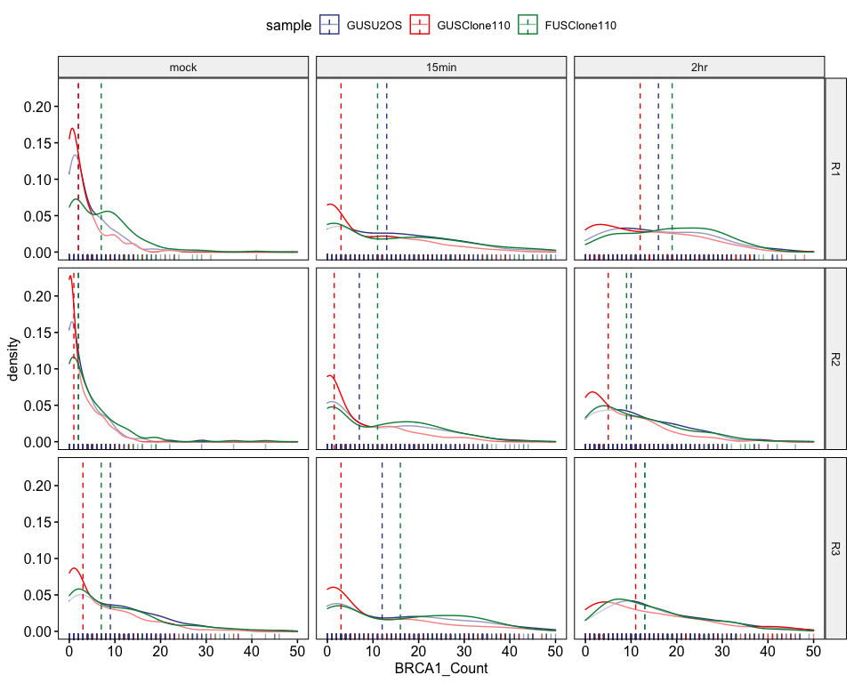
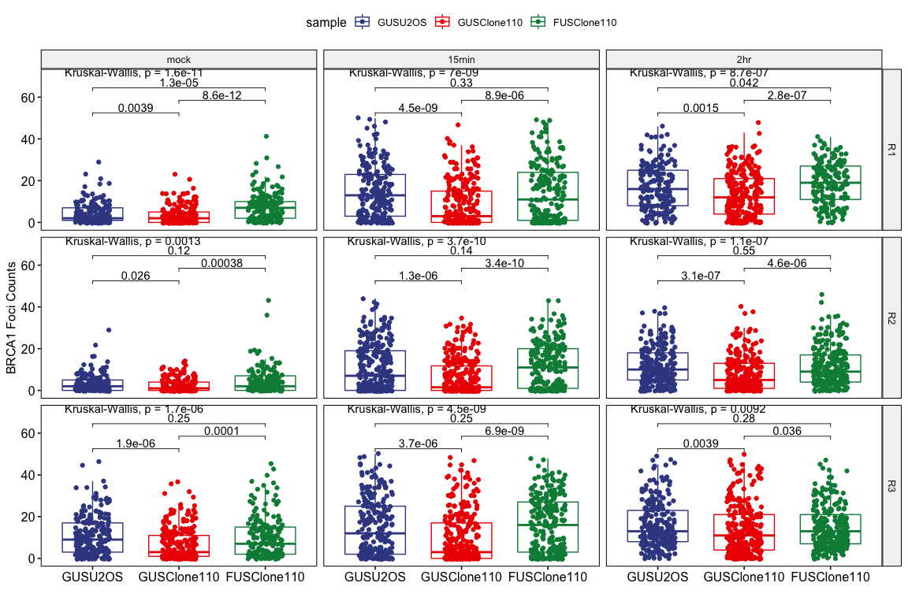
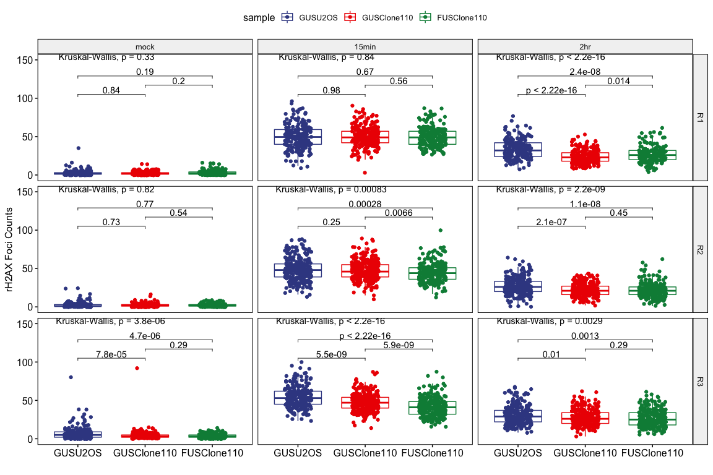

IRIF of BRCA1 foci analysis
================
Weiyan
07/20/2020

> Check the IRIF of BRCA1 in FUS KO cells

**Note**:

> 1.  Samples: WT: GUS/U2OS, KO: GUS/Clone110, RE: FUS/Clone110;
> 2.  Antibodies: BRCA1(M, SC-6954), rH2AX(R,2577S,Cell Signaling);
> 3.  Foci were ideatified by CellProfiler;
> 4.  BRCA1 and rH2AX foci identification setting is 3:6.

# 1\. packages

``` r
library(ggbeeswarm)
```

    ## Loading required package: ggplot2

``` r
library(viridis)
```

    ## Loading required package: viridisLite

``` r
library(tidyverse)
```

    ## ── Attaching packages ────────────────────────────────────────────────────────────────────────── tidyverse 1.3.0 ──

    ## ✓ tibble  3.0.3     ✓ dplyr   1.0.0
    ## ✓ tidyr   1.1.0     ✓ stringr 1.4.0
    ## ✓ readr   1.3.1     ✓ forcats 0.5.0
    ## ✓ purrr   0.3.4

    ## ── Conflicts ───────────────────────────────────────────────────────────────────────────── tidyverse_conflicts() ──
    ## x dplyr::filter() masks stats::filter()
    ## x dplyr::lag()    masks stats::lag()

``` r
library(ggpubr)
library(export)
```

# 2\. load raw data

``` r
# R1
Nuclei_R1 <- read.csv("IRIF_BRCA1_07132020/analysis/raw/BRCA1_rH2AX_2Gy_Nuclei.csv",header = TRUE)
Image_R1 <- read.csv("IRIF_BRCA1_07132020/analysis/raw/BRCA1_rH2AX_2Gy_Image.csv",header = TRUE)

# R2
Nuclei_R2 <- read.csv("IRIF_BRCA1_07152020/analysis/raw/BRCA1_rH2AX_2Gy_Nuclei.csv",header = TRUE)
Image_R2 <- read.csv("IRIF_BRCA1_07152020/analysis/raw/BRCA1_rH2AX_2Gy_Image.csv",header = TRUE)
# R3
Nuclei_R3 <- read.csv("IRIF_BRCA1_07172020/analysis/raw/BRCA1_rH2AX_2Gy_Nuclei.csv",header = TRUE)
Image_R3 <- read.csv("IRIF_BRCA1_07172020/analysis/raw/BRCA1_rH2AX_2Gy_Image.csv",header = TRUE)
```

# 3\. QC of samples

## 3.1 R1

``` r
IRIF_foci_R1 <- Nuclei_R1 %>%
             select(ImageNumber,ObjectNumber,Children_IRIF_BRCA1_Count,Children_IRIF_rH2AX_Count,Intensity_IntegratedIntensity_DAPI,Intensity_IntegratedIntensity_BRCA1,Mean_IRIF_BRCA1_Intensity_MeanIntensity_BRCA1,Mean_IRIF_rH2AX_Intensity_MeanIntensity_rH2AX)%>%
             rename(BRCA1_Count=Children_IRIF_BRCA1_Count,rH2AX_Count=Children_IRIF_rH2AX_Count,Intensity_DAPI=Intensity_IntegratedIntensity_DAPI, Intensity_BRCA1=Intensity_IntegratedIntensity_BRCA1, MeanIntensity_BRCA1_foci=Mean_IRIF_BRCA1_Intensity_MeanIntensity_BRCA1, MeanIntensity_rH2AX_foci = Mean_IRIF_rH2AX_Intensity_MeanIntensity_rH2AX)%>%
             replace(is.na(.), 0)

Image2_R1<- Image_R1%>%
        select(ImageNumber, FileName_BRCA1_Image, Count_IRIF_BRCA1,Count_IRIF_rH2AX,Count_Nuclei)%>%
        separate(FileName_BRCA1_Image,c("sample","A","B","X","treat"), sep = "-", remove = FALSE)%>%
        select(-A,-B,-X)
```

    ## Warning: Expected 5 pieces. Additional pieces discarded in 72 rows [1, 2, 3, 4,
    ## 5, 6, 7, 8, 9, 10, 11, 12, 13, 14, 15, 16, 17, 18, 19, 20, ...].

``` r
metadataR1<-Image2_R1%>%
                select(ImageNumber,sample,treat)

fociR1<- IRIF_foci_R1%>%
            left_join(metadataR1,by='ImageNumber')%>%
            mutate(BRCA1_Count=as.numeric(BRCA1_Count), rH2AX_Count=as.numeric(rH2AX_Count))
fociR1$replicate <- "R1"

fociR1$treat<- factor(fociR1$treat, levels = c("mock","15min","2hr"))
```

## 3.2 R2

``` r
IRIF_foci_R2 <- Nuclei_R2 %>%
             select(ImageNumber,ObjectNumber,Children_IRIF_BRCA1_Count,Children_IRIF_rH2AX_Count,Intensity_IntegratedIntensity_DAPI,Intensity_IntegratedIntensity_BRCA1,Mean_IRIF_BRCA1_Intensity_MeanIntensity_BRCA1,Mean_IRIF_rH2AX_Intensity_MeanIntensity_rH2AX)%>%
             rename(BRCA1_Count=Children_IRIF_BRCA1_Count,rH2AX_Count=Children_IRIF_rH2AX_Count,Intensity_DAPI=Intensity_IntegratedIntensity_DAPI, Intensity_BRCA1=Intensity_IntegratedIntensity_BRCA1, MeanIntensity_BRCA1_foci=Mean_IRIF_BRCA1_Intensity_MeanIntensity_BRCA1, MeanIntensity_rH2AX_foci = Mean_IRIF_rH2AX_Intensity_MeanIntensity_rH2AX)%>%
             replace(is.na(.), 0)

Image2_R2<- Image_R2%>%
        select(ImageNumber, FileName_BRCA1_Image, Count_IRIF_BRCA1,Count_IRIF_rH2AX,Count_Nuclei)%>%
        separate(FileName_BRCA1_Image,c("sample","A","B","X","treat"), sep = "-", remove = FALSE)%>%
        select(-A,-B,-X)
```

    ## Warning: Expected 5 pieces. Additional pieces discarded in 72 rows [1, 2, 3, 4,
    ## 5, 6, 7, 8, 9, 10, 11, 12, 13, 14, 15, 16, 17, 18, 19, 20, ...].

``` r
metadataR2<-Image2_R2%>%
                select(ImageNumber,sample,treat)

fociR2<- IRIF_foci_R2%>%
            left_join(metadataR2,by='ImageNumber')%>%
            mutate(BRCA1_Count=as.numeric(BRCA1_Count), rH2AX_Count=as.numeric(rH2AX_Count))
fociR2$replicate <- "R2"

fociR2$treat<- factor(fociR2$treat, levels = c("mock","15min","2hr"))
```

## 3.3 R3

``` r
IRIF_foci_R3 <- Nuclei_R3 %>%
             select(ImageNumber,ObjectNumber,Children_IRIF_BRCA1_Count,Children_IRIF_rH2AX_Count,Intensity_IntegratedIntensity_DAPI,Intensity_IntegratedIntensity_BRCA1,Mean_IRIF_BRCA1_Intensity_MeanIntensity_BRCA1,Mean_IRIF_rH2AX_Intensity_MeanIntensity_rH2AX)%>%
             rename(BRCA1_Count=Children_IRIF_BRCA1_Count,rH2AX_Count=Children_IRIF_rH2AX_Count,Intensity_DAPI=Intensity_IntegratedIntensity_DAPI, Intensity_BRCA1=Intensity_IntegratedIntensity_BRCA1, MeanIntensity_BRCA1_foci=Mean_IRIF_BRCA1_Intensity_MeanIntensity_BRCA1, MeanIntensity_rH2AX_foci = Mean_IRIF_rH2AX_Intensity_MeanIntensity_rH2AX)%>%
             replace(is.na(.), 0)

Image2_R3<- Image_R3%>%
        select(ImageNumber, FileName_BRCA1_Image, Count_IRIF_BRCA1,Count_IRIF_rH2AX,Count_Nuclei)%>%
        separate(FileName_BRCA1_Image,c("sample","A","B","X","treat"), sep = "-", remove = FALSE)%>%
        select(-A,-B,-X)
```

    ## Warning: Expected 5 pieces. Additional pieces discarded in 72 rows [1, 2, 3, 4,
    ## 5, 6, 7, 8, 9, 10, 11, 12, 13, 14, 15, 16, 17, 18, 19, 20, ...].

``` r
metadataR3<-Image2_R3%>%
                select(ImageNumber,sample,treat)

fociR3<- IRIF_foci_R3%>%
            left_join(metadataR3,by='ImageNumber')%>%
            mutate(BRCA1_Count=as.numeric(BRCA1_Count), rH2AX_Count=as.numeric(rH2AX_Count))
fociR3$replicate <- "R3"

fociR3$treat<- factor(fociR3$treat, levels = c("mock","15min","2hr"))
```

## 3.4 foci counts data

``` r
fociAll <-bind_rows(fociR1,fociR2,fociR3)%>%
          filter(BRCA1_Count<=50, rH2AX_Count <=100)
fociAll$treat<- factor(fociAll$treat, levels = c("mock","15min","2hr"))
fociAll$sample<- factor(fociAll$sample, levels = c("GUSU2OS","GUSClone110","FUSClone110"))

levels(fociAll$treat)
```

    ## [1] "mock"  "15min" "2hr"

``` r
RA <- fociAll%>%
      select(replicate,BRCA1_Count, treat, sample)%>%
      group_by(sample, treat, replicate)%>%
      summarise_each(list(median))
```

    ## Warning: `summarise_each_()` is deprecated as of dplyr 0.7.0.
    ## Please use `across()` instead.
    ## This warning is displayed once every 8 hours.
    ## Call `lifecycle::last_warnings()` to see where this warning was generated.

``` r
print(as.data.frame(RA)) ## case RA is a tibble.str(RA) or class(RA)
```

    ##         sample treat replicate BRCA1_Count
    ## 1      GUSU2OS  mock        R1         2.0
    ## 2      GUSU2OS  mock        R2         2.0
    ## 3      GUSU2OS  mock        R3         9.0
    ## 4      GUSU2OS 15min        R1        13.0
    ## 5      GUSU2OS 15min        R2         7.0
    ## 6      GUSU2OS 15min        R3        12.0
    ## 7      GUSU2OS   2hr        R1        16.0
    ## 8      GUSU2OS   2hr        R2        10.0
    ## 9      GUSU2OS   2hr        R3        13.0
    ## 10 GUSClone110  mock        R1         2.0
    ## 11 GUSClone110  mock        R2         1.0
    ## 12 GUSClone110  mock        R3         3.0
    ## 13 GUSClone110 15min        R1         3.0
    ## 14 GUSClone110 15min        R2         1.5
    ## 15 GUSClone110 15min        R3         3.0
    ## 16 GUSClone110   2hr        R1        12.0
    ## 17 GUSClone110   2hr        R2         5.0
    ## 18 GUSClone110   2hr        R3        11.0
    ## 19 FUSClone110  mock        R1         7.0
    ## 20 FUSClone110  mock        R2         2.0
    ## 21 FUSClone110  mock        R3         7.0
    ## 22 FUSClone110 15min        R1        11.0
    ## 23 FUSClone110 15min        R2        11.0
    ## 24 FUSClone110 15min        R3        16.0
    ## 25 FUSClone110   2hr        R1        19.0
    ## 26 FUSClone110   2hr        R2         9.0
    ## 27 FUSClone110   2hr        R3        13.0

``` r
CellCounts <- fociAll%>%
              count(sample,treat, replicate,name = "n_Cell")
CellCounts
```

    ##         sample treat replicate n_Cell
    ## 1      GUSU2OS  mock        R1    178
    ## 2      GUSU2OS  mock        R2    174
    ## 3      GUSU2OS  mock        R3    218
    ## 4      GUSU2OS 15min        R1    212
    ## 5      GUSU2OS 15min        R2    286
    ## 6      GUSU2OS 15min        R3    240
    ## 7      GUSU2OS   2hr        R1    188
    ## 8      GUSU2OS   2hr        R2    240
    ## 9      GUSU2OS   2hr        R3    231
    ## 10 GUSClone110  mock        R1    208
    ## 11 GUSClone110  mock        R2    191
    ## 12 GUSClone110  mock        R3    239
    ## 13 GUSClone110 15min        R1    253
    ## 14 GUSClone110 15min        R2    298
    ## 15 GUSClone110 15min        R3    283
    ## 16 GUSClone110   2hr        R1    248
    ## 17 GUSClone110   2hr        R2    256
    ## 18 GUSClone110   2hr        R3    280
    ## 19 FUSClone110  mock        R1    183
    ## 20 FUSClone110  mock        R2    158
    ## 21 FUSClone110  mock        R3    208
    ## 22 FUSClone110 15min        R1    211
    ## 23 FUSClone110 15min        R2    235
    ## 24 FUSClone110 15min        R3    251
    ## 25 FUSClone110   2hr        R1    169
    ## 26 FUSClone110   2hr        R2    237
    ## 27 FUSClone110   2hr        R3    253

``` r
summary(CellCounts$n_Cell)
```

    ##    Min. 1st Qu.  Median    Mean 3rd Qu.    Max.
    ##   158.0   199.5   235.0   227.0   252.0   298.0

# 4\. BRCA1 foci

## 4.1 density plot

``` r
ggdensity(fociAll,
            x = "BRCA1_Count",
           add = "median",
           rug = TRUE,
           color = "sample",
           legend = "top",
           facet.by = c("replicate","treat"),
           ncol = 3,
           palette = "aaas"
           )
```

<!-- -->

``` r
# graph2pdf(file="figures/DensityPlotBRCA1.pdf", width=12, aspectr=sqrt(2),font = "Arial",bg = "transparent")
```

## 4.2 box plot

``` r
my_comparison <- list(c("GUSClone110","GUSU2OS"), c("GUSClone110","FUSClone110"), c("FUSClone110","GUSU2OS"))
ggboxplot(fociAll,
          x="sample",
          y="BRCA1_Count",
          color = "sample",
          palette = "aaas",
          facet.by = c("replicate", "treat"),
          order = c("GUSU2OS","GUSClone110","FUSClone110"),
          add = "jitter",
          ylab = "BRCA1 Foci Counts",
          xlab = ""
          )+

  stat_compare_means(comparisons = my_comparison,
                     method = "wilcox.test",
                     label = "p.format"
                     )+
  stat_compare_means(method = "kruskal.test", # this step for mutiple groups comparison
                     label.y = 70)
```

<!-- -->

``` r
# graph2pdf(file="figures/BoxPlotBRCA1.pdf", width=12, aspectr=sqrt(2),font = "Arial",bg = "transparent")
```

# 5\. rH2AX foci

## 5.1 density plot

``` r
ggdensity(fociAll,
            x = "rH2AX_Count",
           add = "median",
           rug = TRUE,
           color = "sample",
           legend = "top",
           facet.by = c("replicate","treat"),
           ncol = 3,
           palette = "aaas"
           )
```

<!-- -->

``` r
# graph2pdf(file="figures/DensityPlotrH2AX.pdf", width=12, aspectr=sqrt(2),font = "Arial",bg = "transparent")
```

## 5.2 box plot

``` r
my_comparison <- list(c("GUSClone110","GUSU2OS"), c("GUSClone110","FUSClone110"), c("FUSClone110","GUSU2OS"))
ggboxplot(fociAll,
          x="sample",
          y="rH2AX_Count",
          color = "sample",
          palette = "aaas",
          facet.by = c("replicate", "treat"),
          order = c("GUSU2OS","GUSClone110","FUSClone110"),
          add = "jitter",
          ylab = "rH2AX Foci Counts",
          xlab = ""
          )+
  stat_compare_means(comparisons = my_comparison, # this step for group comparison
                     method = "wilcox.test",
                     label = "p.format"
                     )+
  stat_compare_means(method = "kruskal.test", # this step for mutiple groups comparison
                     label.y = 150)
```

<!-- -->

``` r
# graph2pdf(file="figures/BoxPlotrH2AX.pdf", width=12, aspectr=sqrt(2),font = "Arial",bg = "transparent")
```
``` r
sessionInfo()
```

    ## R version 3.6.3 (2020-02-29)
    ## Platform: x86_64-apple-darwin15.6.0 (64-bit)
    ## Running under: macOS Catalina 10.15.6
    ##
    ## Matrix products: default
    ## BLAS:   /Library/Frameworks/R.framework/Versions/3.6/Resources/lib/libRblas.0.dylib
    ## LAPACK: /Library/Frameworks/R.framework/Versions/3.6/Resources/lib/libRlapack.dylib
    ##
    ## locale:
    ## [1] en_US.UTF-8/en_US.UTF-8/en_US.UTF-8/C/en_US.UTF-8/en_US.UTF-8
    ##
    ## attached base packages:
    ## [1] stats     graphics  grDevices utils     datasets  methods   base
    ##
    ## other attached packages:
    ##  [1] export_0.2.2.9001 ggpubr_0.4.0      forcats_0.5.0     stringr_1.4.0
    ##  [5] dplyr_1.0.0       purrr_0.3.4       readr_1.3.1       tidyr_1.1.0
    ##  [9] tibble_3.0.3      tidyverse_1.3.0   viridis_0.5.1     viridisLite_0.3.0
    ## [13] ggbeeswarm_0.6.0  ggplot2_3.3.2
    ##
    ## loaded via a namespace (and not attached):
    ##  [1] fs_1.4.2                lubridate_1.7.9         webshot_0.5.2
    ##  [4] httr_1.4.1              ggsci_2.9               tools_3.6.3
    ##  [7] backports_1.1.8         R6_2.4.1                vipor_0.4.5
    ## [10] DBI_1.1.0               colorspace_1.4-1        manipulateWidget_0.10.1
    ## [13] withr_2.2.0             tidyselect_1.1.0        gridExtra_2.3
    ## [16] curl_4.3                compiler_3.6.3          cli_2.0.2
    ## [19] rvest_0.3.5             flextable_0.5.10        xml2_1.3.2
    ## [22] officer_0.3.12          labeling_0.3            scales_1.1.1
    ## [25] systemfonts_0.2.3       digest_0.6.25           foreign_0.8-75
    ## [28] rmarkdown_2.3           rio_0.5.16              base64enc_0.1-3
    ## [31] pkgconfig_2.0.3         htmltools_0.5.0         fastmap_1.0.1
    ## [34] dbplyr_1.4.4            rvg_0.2.5               htmlwidgets_1.5.1
    ## [37] rlang_0.4.7             readxl_1.3.1            rstudioapi_0.11
    ## [40] shiny_1.5.0             farver_2.0.3            generics_0.0.2
    ## [43] jsonlite_1.7.0          crosstalk_1.1.0.1       zip_2.0.4
    ## [46] car_3.0-8               magrittr_1.5            Rcpp_1.0.5
    ## [49] munsell_0.5.0           fansi_0.4.1             abind_1.4-5
    ## [52] gdtools_0.2.2           lifecycle_0.2.0         stringi_1.4.6
    ## [55] yaml_2.2.1              carData_3.0-4           grid_3.6.3
    ## [58] blob_1.2.1              promises_1.1.1          crayon_1.3.4
    ## [61] miniUI_0.1.1.1          haven_2.3.1             stargazer_5.2.2
    ## [64] hms_0.5.3               knitr_1.29              pillar_1.4.6
    ## [67] uuid_0.1-4              ggsignif_0.6.0          reprex_0.3.0
    ## [70] glue_1.4.1              evaluate_0.14           data.table_1.12.8
    ## [73] modelr_0.1.8            httpuv_1.5.4            vctrs_0.3.2
    ## [76] cellranger_1.1.0        gtable_0.3.0            assertthat_0.2.1
    ## [79] xfun_0.15               openxlsx_4.1.5          mime_0.9
    ## [82] xtable_1.8-4            broom_0.7.0             later_1.1.0.1
    ## [85] rstatix_0.6.0           beeswarm_0.2.3          rgl_0.100.54
    ## [88] ellipsis_0.3.1
