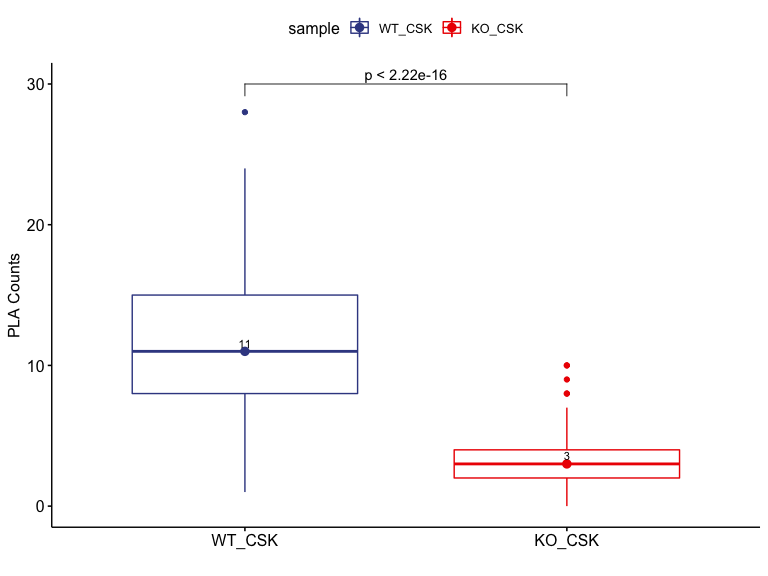
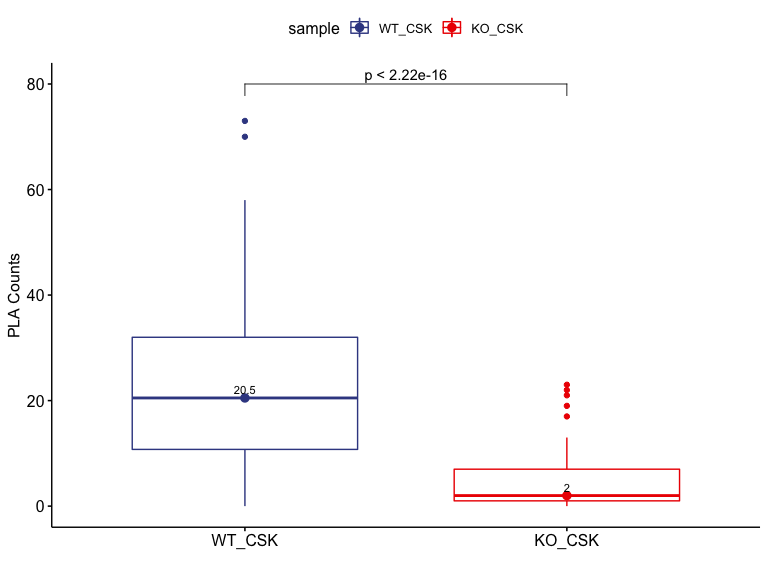
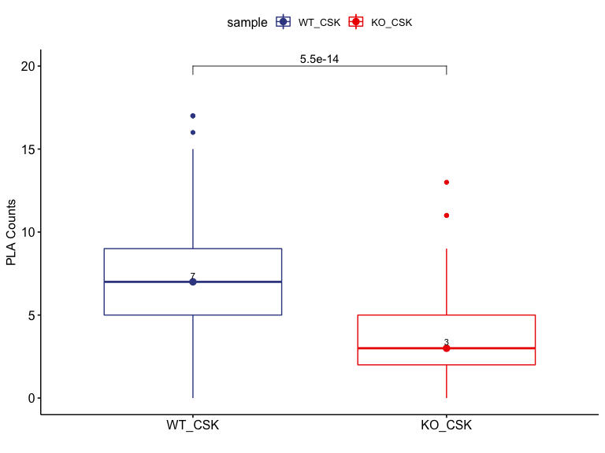

Quantification results of PLA\_FUS
================
Weiyan
4/2/2020

> Check the interaction between FUS, and POLD1,FEN1 and PCNA under with
> preextraction

**Note**:

> 1.  Samples: GUS/U2OS(FUS, WT) and GUS/Clone110(FUS,KO);
> 2.  Preextraction with CKS+0.5% Triton-X100 8min on ice with shacking
>     (speed: 4)
> 3.  Antibodies: FUS, POLD1,FEN1, PCNA;
> 4.  PLA foci was quantified by CellProfiler
> 5.  Data collected on 20190828

# Packages

``` r
library(ggpubr)
library(ggsci)
library(ggExtra)
library(export)
library(tidyverse)
```

# 1\. FEN1

## 1.1 **FEN1\_data loading**

``` r
FEN1_WT_CSK_Nuclei <- read.csv("/Users/weiyanjia/Desktop/PLA/08282019/analysis/raw/FEN1_U2OS_CSK_Nuclei.csv",header = TRUE)
FEN1_KO_CSK_Nuclei <- read.csv("/Users/weiyanjia/Desktop/PLA/08282019/analysis/raw/FEN1_Clone110_CSK_Nuclei.csv",header = TRUE)
```

## 1.2 **FEN1\_U2OS\_CSK**

``` r
FEN1_WT_CSK_Nuclei_1<- FEN1_WT_CSK_Nuclei%>%
                      dplyr::select(ImageNumber, Children_PLA_Count,Intensity_IntegratedIntensity_DAPI)%>%
                      dplyr::mutate(ImageNumber= as.factor(ImageNumber))%>%
                      dplyr::mutate(sample="WT_CSK")%>%
                      dplyr::mutate(antibody="FEN1")%>%
                      dplyr::mutate(sample= as.factor(sample),antibody= as.factor(antibody))
```

## 1.3 **FEN1\_Clone110\_KO**

``` r
FEN1_KO_CSK_Nuclei_1<- FEN1_KO_CSK_Nuclei%>%
                      dplyr::select(ImageNumber, Children_PLA_Count,Intensity_IntegratedIntensity_DAPI)%>%
                      dplyr::mutate(ImageNumber= as.factor(ImageNumber))%>%
                      dplyr::mutate(sample="KO_CSK")%>%
                      dplyr::mutate(antibody="FEN1")%>%
                      dplyr::mutate(sample= as.factor(sample),antibody= as.factor(antibody))
```

## 1.4 **FEN1 Merged data**

``` r
PLA_FEN1_Nuclei<- bind_rows(
                            FEN1_WT_CSK_Nuclei_1,
                            FEN1_KO_CSK_Nuclei_1
                            )
```

    ## Warning in bind_rows_(x, .id): Unequal factor levels: coercing to character

    ## Warning in bind_rows_(x, .id): binding character and factor vector, coercing
    ## into character vector
    
    ## Warning in bind_rows_(x, .id): binding character and factor vector, coercing
    ## into character vector

``` r
PLA_FEN1_Nuclei <- PLA_FEN1_Nuclei%>%
                   dplyr::mutate(condition="Pre-extraction")
```

``` r
PLA_FEN1_Nuclei_Median <- PLA_FEN1_Nuclei%>%
              group_by(sample,antibody,condition)%>%
              summarise(MD = median(Children_PLA_Count))
PLA_FEN1_Nuclei_Median
```

    ## # A tibble: 2 x 4
    ## # Groups:   sample, antibody [2]
    ##   sample antibody condition         MD
    ##   <chr>  <fct>    <chr>          <dbl>
    ## 1 KO_CSK FEN1     Pre-extraction     3
    ## 2 WT_CSK FEN1     Pre-extraction    11

``` r
PLA_FEN1_Tally <-PLA_FEN1_Nuclei%>%
                 group_by(sample)%>%
                 tally()
PLA_FEN1_Tally
```

    ## # A tibble: 2 x 2
    ##   sample     n
    ##   <chr>  <int>
    ## 1 KO_CSK    96
    ## 2 WT_CSK    85

``` r
FEN1_CSK <- PLA_FEN1_Nuclei%>%
             filter(condition == "Pre-extraction")
ggboxplot(FEN1_CSK, 
          x="sample",
          y="Children_PLA_Count",
          color = "sample",
          palette = "aaas",
          add = "median",
          ylab = "PLA Counts",
          xlab = ""
          )+
  stat_compare_means(comparisons = list(c("WT_CSK","KO_CSK")), method = "wilcox.test",
                     label = "p.format",
                     label.y =30)+ ## method:"wilcox.test", "anova"...
  geom_text(data = subset(PLA_FEN1_Nuclei_Median, condition == "Pre-extraction" ), aes(x=sample, y= MD, label = MD),
              position = position_dodge(width = 0.8), size = 3, vjust = -0.5,
            ) 
```

    ## Warning: `fun.y` is deprecated. Use `fun` instead.

    ## Warning: `fun.ymin` is deprecated. Use `fun.min` instead.

    ## Warning: `fun.ymax` is deprecated. Use `fun.max` instead.

<!-- -->

``` r
graph2pdf(file="/Users/weiyanjia/Desktop/PLA/08282019/analysis/results/PLAofFEN1_CSK.pdf", width=8, aspectr=sqrt(2),font = "Arial",bg = "transparent")
```

    ## Exported graph as /Users/weiyanjia/Desktop/PLA/08282019/analysis/results/PLAofFEN1_CSK.pdf

# 2\. PCNA

## 2.1 **PCNA\_data loading**

``` r
PCNA_WT_CSK_Nuclei <- read.csv("/Users/weiyanjia/Desktop/PLA/08282019/analysis/raw/PCNA_U2OS_CSK_Nuclei.csv",header = TRUE)
PCNA_KO_CSK_Nuclei <- read.csv("/Users/weiyanjia/Desktop/PLA/08282019/analysis/raw/PCNA_Clone110_CSK_Nuclei.csv",header = TRUE)
```

## 2.2 **PCNA\_U2OS\_CSK**

``` r
PCNA_WT_CSK_Nuclei_1<- PCNA_WT_CSK_Nuclei%>%
                      dplyr::select(ImageNumber, Children_PLA_Count,Intensity_IntegratedIntensity_DAPI)%>%
                      dplyr::mutate(ImageNumber= as.factor(ImageNumber))%>%
                      dplyr::mutate(sample="WT_CSK")%>%
                      dplyr::mutate(antibody="PCNA")%>%
                      dplyr::mutate(sample= as.factor(sample),antibody= as.factor(antibody))
```

## 2.3 **PCNA\_Clone110\_KO**

``` r
PCNA_KO_CSK_Nuclei_1<- PCNA_KO_CSK_Nuclei%>%
                      dplyr::select(ImageNumber, Children_PLA_Count,Intensity_IntegratedIntensity_DAPI)%>%
                      dplyr::mutate(ImageNumber= as.factor(ImageNumber))%>%
                      dplyr::mutate(sample="KO_CSK")%>%
                      dplyr::mutate(antibody="PCNA")%>%
                      dplyr::mutate(sample= as.factor(sample),antibody= as.factor(antibody))
```

## 2.4 **PCNA Merged data**

``` r
PLA_PCNA_Nuclei<- bind_rows(
                            PCNA_WT_CSK_Nuclei_1,
                            PCNA_KO_CSK_Nuclei_1
                            )
```

    ## Warning in bind_rows_(x, .id): Unequal factor levels: coercing to character

    ## Warning in bind_rows_(x, .id): binding character and factor vector, coercing
    ## into character vector
    
    ## Warning in bind_rows_(x, .id): binding character and factor vector, coercing
    ## into character vector

``` r
PLA_PCNA_Nuclei <- PLA_PCNA_Nuclei%>%
                   dplyr::mutate(condition="Pre-extraction")
```

``` r
PLA_PCNA_Nuclei_Median <- PLA_PCNA_Nuclei%>%
              group_by(sample,antibody,condition)%>%
              summarise(MD = median(Children_PLA_Count))
PLA_PCNA_Nuclei_Median
```

    ## # A tibble: 2 x 4
    ## # Groups:   sample, antibody [2]
    ##   sample antibody condition         MD
    ##   <chr>  <fct>    <chr>          <dbl>
    ## 1 KO_CSK PCNA     Pre-extraction   2  
    ## 2 WT_CSK PCNA     Pre-extraction  20.5

``` r
PLA_PCNA_Tally <-PLA_PCNA_Nuclei%>%
                 group_by(sample)%>%
                 tally()
PLA_PCNA_Tally
```

    ## # A tibble: 2 x 2
    ##   sample     n
    ##   <chr>  <int>
    ## 1 KO_CSK    87
    ## 2 WT_CSK    72

``` r
PCNA_CSK <- PLA_PCNA_Nuclei%>%
             filter(condition == "Pre-extraction")
ggboxplot(PCNA_CSK, 
          x="sample",
          y="Children_PLA_Count",
          color = "sample",
          palette = "aaas",
          add = "median",
          ylab = "PLA Counts",
          xlab = ""
          )+
  stat_compare_means(comparisons = list(c("WT_CSK","KO_CSK")), method = "wilcox.test",
                     label = "p.format",
                     label.y =80)+ ## method:"wilcox.test", "anova"...
  geom_text(data = subset(PLA_PCNA_Nuclei_Median, condition == "Pre-extraction" ), aes(x=sample, y= MD, label = MD),
              position = position_dodge(width = 0.8), size = 3, vjust = -0.5,
            ) 
```

    ## Warning: `fun.y` is deprecated. Use `fun` instead.

    ## Warning: `fun.ymin` is deprecated. Use `fun.min` instead.

    ## Warning: `fun.ymax` is deprecated. Use `fun.max` instead.

<!-- -->

``` r
graph2pdf(file="/Users/weiyanjia/Desktop/PLA/08282019/analysis/results/PLAofPCNA_CSK.pdf", width=8, aspectr=sqrt(2),font = "Arial",bg = "transparent")
```

    ## Exported graph as /Users/weiyanjia/Desktop/PLA/08282019/analysis/results/PLAofPCNA_CSK.pdf

# 3\. POLD1

## 3.1 **POLD1\_data loading**

``` r
POLD1_WT_CSK_Nuclei <- read.csv("/Users/weiyanjia/Desktop/PLA/08282019/analysis/raw/POLD1_U2OS_CSK_Nuclei.csv",header = TRUE)
POLD1_KO_CSK_Nuclei <- read.csv("/Users/weiyanjia/Desktop/PLA/08282019/analysis/raw/POLD1_Clone110_CSK_Nuclei.csv",header = TRUE)
```

## 3.2 **POLD1\_U2OS\_CSK**

``` r
POLD1_WT_CSK_Nuclei_1<- POLD1_WT_CSK_Nuclei%>%
                      dplyr::select(ImageNumber, Children_PLA_Count,Intensity_IntegratedIntensity_DAPI)%>%
                      dplyr::mutate(ImageNumber= as.factor(ImageNumber))%>%
                      dplyr::mutate(sample="WT_CSK")%>%
                      dplyr::mutate(antibody="POLD1")%>%
                      dplyr::mutate(sample= as.factor(sample),antibody= as.factor(antibody))
```

## 3.3 **POLD1\_Clone110\_KO**

``` r
POLD1_KO_CSK_Nuclei_1<- POLD1_KO_CSK_Nuclei%>%
                      dplyr::select(ImageNumber, Children_PLA_Count,Intensity_IntegratedIntensity_DAPI)%>%
                      dplyr::mutate(ImageNumber= as.factor(ImageNumber))%>%
                      dplyr::mutate(sample="KO_CSK")%>%
                      dplyr::mutate(antibody="POLD1")%>%
                      dplyr::mutate(sample= as.factor(sample),antibody= as.factor(antibody))
```

## 3.4 **POLD1 Merged data**

``` r
PLA_POLD1_Nuclei<- bind_rows(
                            POLD1_WT_CSK_Nuclei_1,
                            POLD1_KO_CSK_Nuclei_1
                            )
```

    ## Warning in bind_rows_(x, .id): Unequal factor levels: coercing to character

    ## Warning in bind_rows_(x, .id): binding character and factor vector, coercing
    ## into character vector
    
    ## Warning in bind_rows_(x, .id): binding character and factor vector, coercing
    ## into character vector

``` r
PLA_POLD1_Nuclei <- PLA_POLD1_Nuclei%>%
                   dplyr::mutate(condition="Pre-extraction")
```

``` r
PLA_POLD1_Nuclei_Median <- PLA_POLD1_Nuclei%>%
              group_by(sample,antibody,condition)%>%
              summarise(MD = median(Children_PLA_Count))
PLA_POLD1_Nuclei_Median
```

    ## # A tibble: 2 x 4
    ## # Groups:   sample, antibody [2]
    ##   sample antibody condition         MD
    ##   <chr>  <fct>    <chr>          <dbl>
    ## 1 KO_CSK POLD1    Pre-extraction     3
    ## 2 WT_CSK POLD1    Pre-extraction     7

``` r
PLA_POLD1_Tally <-PLA_POLD1_Nuclei%>%
                 group_by(sample)%>%
                 tally()
PLA_POLD1_Tally
```

    ## # A tibble: 2 x 2
    ##   sample     n
    ##   <chr>  <int>
    ## 1 KO_CSK    89
    ## 2 WT_CSK    86

``` r
POLD1_CSK <- PLA_POLD1_Nuclei%>%
             filter(condition == "Pre-extraction")
ggboxplot(POLD1_CSK, 
          x="sample",
          y="Children_PLA_Count",
          color = "sample",
          palette = "aaas",
          add = "median",
          ylab = "PLA Counts",
          xlab = ""
          )+
  stat_compare_means(comparisons = list(c("WT_CSK","KO_CSK")), method = "wilcox.test",
                     label = "p.format",
                     label.y =20)+ ## method:"wilcox.test", "anova"...
  geom_text(data = subset(PLA_POLD1_Nuclei_Median, condition == "Pre-extraction" ), aes(x=sample, y= MD, label = MD),
              position = position_dodge(width = 0.8), size = 3, vjust = -0.5,
            ) 
```

    ## Warning: `fun.y` is deprecated. Use `fun` instead.

    ## Warning: `fun.ymin` is deprecated. Use `fun.min` instead.

    ## Warning: `fun.ymax` is deprecated. Use `fun.max` instead.

<!-- -->

``` r
graph2pdf(file="/Users/weiyanjia/Desktop/PLA/08282019/analysis/results/PLAofPOLD1_CSK.pdf", width=8, aspectr=sqrt(2),font = "Arial",bg = "transparent")
```

    ## Exported graph as /Users/weiyanjia/Desktop/PLA/08282019/analysis/results/PLAofPOLD1_CSK.pdf

``` r
sessionInfo()
```

    ## R version 3.6.3 (2020-02-29)
    ## Platform: x86_64-apple-darwin15.6.0 (64-bit)
    ## Running under: macOS Catalina 10.15.4
    ## 
    ## Matrix products: default
    ## BLAS:   /Library/Frameworks/R.framework/Versions/3.6/Resources/lib/libRblas.0.dylib
    ## LAPACK: /Library/Frameworks/R.framework/Versions/3.6/Resources/lib/libRlapack.dylib
    ## 
    ## locale:
    ## [1] en_US.UTF-8/en_US.UTF-8/en_US.UTF-8/C/en_US.UTF-8/en_US.UTF-8
    ## 
    ## attached base packages:
    ## [1] stats     graphics  grDevices utils     datasets  methods   base     
    ## 
    ## other attached packages:
    ##  [1] forcats_0.5.0   stringr_1.4.0   dplyr_0.8.5     purrr_0.3.3    
    ##  [5] readr_1.3.1     tidyr_1.0.2     tibble_2.1.3    tidyverse_1.3.0
    ##  [9] export_0.2.2    ggExtra_0.9     ggsci_2.9       ggpubr_0.2.5   
    ## [13] magrittr_1.5    ggplot2_3.3.0  
    ## 
    ## loaded via a namespace (and not attached):
    ##  [1] httr_1.4.1              jsonlite_1.6.1          modelr_0.1.6           
    ##  [4] stargazer_5.2.2         shiny_1.4.0.2           assertthat_0.2.1       
    ##  [7] cellranger_1.1.0        yaml_2.2.1              gdtools_0.2.1          
    ## [10] pillar_1.4.3            backports_1.1.5         lattice_0.20-40        
    ## [13] glue_1.3.2              uuid_0.1-4              digest_0.6.25          
    ## [16] manipulateWidget_0.10.1 promises_1.1.0          ggsignif_0.6.0         
    ## [19] rvest_0.3.5             colorspace_1.4-1        htmltools_0.4.0        
    ## [22] httpuv_1.5.2            pkgconfig_2.0.3         broom_0.5.5            
    ## [25] haven_2.2.0             xtable_1.8-4            scales_1.1.0           
    ## [28] webshot_0.5.2           openxlsx_4.1.4          later_1.0.0            
    ## [31] officer_0.3.8           farver_2.0.3            generics_0.0.2         
    ## [34] withr_2.1.2             cli_2.0.2               readxl_1.3.1           
    ## [37] crayon_1.3.4            mime_0.9                evaluate_0.14          
    ## [40] fansi_0.4.1             fs_1.3.2                nlme_3.1-145           
    ## [43] xml2_1.2.5              tools_3.6.3             data.table_1.12.8      
    ## [46] hms_0.5.3               lifecycle_0.2.0         flextable_0.5.9        
    ## [49] reprex_0.3.0            munsell_0.5.0           zip_2.0.4              
    ## [52] compiler_3.6.3          systemfonts_0.1.1       rlang_0.4.5            
    ## [55] grid_3.6.3              rstudioapi_0.11         htmlwidgets_1.5.1      
    ## [58] crosstalk_1.1.0.1       miniUI_0.1.1.1          labeling_0.3           
    ## [61] base64enc_0.1-3         rmarkdown_2.1           gtable_0.3.0           
    ## [64] DBI_1.1.0               R6_2.4.1                rvg_0.2.4              
    ## [67] lubridate_1.7.4         knitr_1.28              utf8_1.1.4             
    ## [70] fastmap_1.0.1           stringi_1.4.6           Rcpp_1.0.4             
    ## [73] vctrs_0.2.4             rgl_0.100.50            dbplyr_1.4.2           
    ## [76] tidyselect_1.0.0        xfun_0.12
