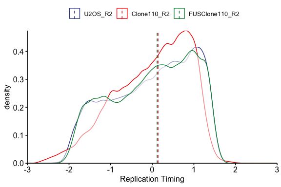
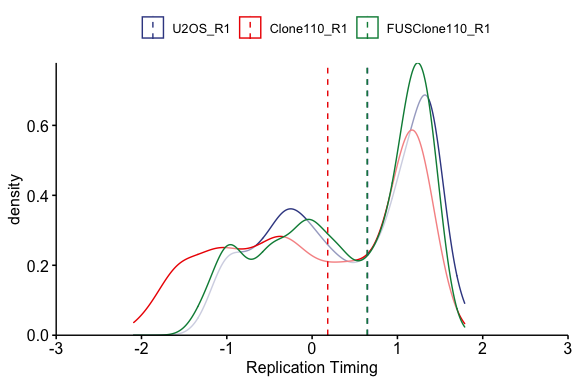
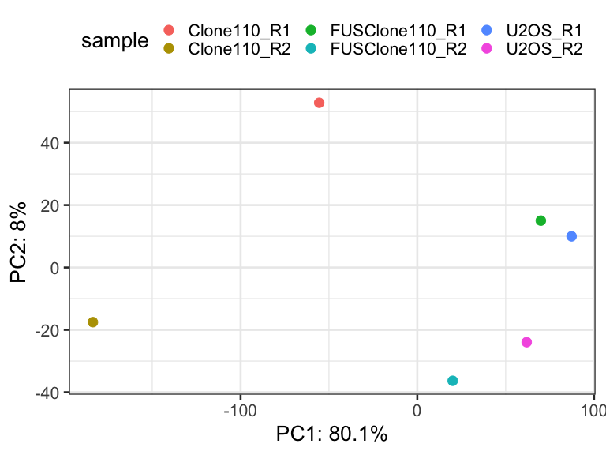

RT\_Plots\_Jia\_01022019
================
Weiyan
1/2/2019

Note: all the following data sets were generated by Lu Liu through R
anlaysis.

# 1\. Data input

``` r
setwd("/Users/weiyanjia/Desktop/Randal S. Tibbetts/FUS project/Bioinfo_analysis/FUS_Replication timing/Replication timing_08312018/01_02_normalization_smoothing/plots_Jia/01022019")
library(RColorBrewer)
RT_Loess <- read.delim("all_sample_r1_r2_smooth.txt", header = TRUE, sep ="\t", stringsAsFactors = FALSE)
RT_Loess[, c(2:3)] <- sapply(RT_Loess[, c(2:3)], as.integer)
head(RT_Loess)
```

    ##    chr  start    end Clone110_R1 FUSClone110_R1  U2OS_R1 Clone110_R2
    ## 1 chr1 800000 820000    1.003375       1.208018 1.406038   0.9013547
    ## 2 chr1 820000 840000    1.022251       1.196786 1.414605   0.9081274
    ## 3 chr1 840000 860000    1.040475       1.186075 1.422639   0.9143926
    ## 4 chr1 860000 880000    1.058048       1.175888 1.430135   0.9201442
    ## 5 chr1 880000 900000    1.074967       1.166228 1.437088   0.9253764
    ## 6 chr1 900000 920000    1.091232       1.157098 1.443494   0.9300832
    ##   FUSClone110_R2   U2OS_R2
    ## 1      0.9879291 0.9895395
    ## 2      1.0126643 1.0077907
    ## 3      1.0363650 1.0255111
    ## 4      1.0590256 1.0427003
    ## 5      1.0806404 1.0593578
    ## 6      1.1012037 1.0754831

``` r
chr_list<-c()
for (i in 1:22){
  chr_list[i] <- paste0("chr",i,sep="")
  print(chr_list)
}
```

    ## [1] "chr1"
    ## [1] "chr1" "chr2"
    ## [1] "chr1" "chr2" "chr3"
    ## [1] "chr1" "chr2" "chr3" "chr4"
    ## [1] "chr1" "chr2" "chr3" "chr4" "chr5"
    ## [1] "chr1" "chr2" "chr3" "chr4" "chr5" "chr6"
    ## [1] "chr1" "chr2" "chr3" "chr4" "chr5" "chr6" "chr7"
    ## [1] "chr1" "chr2" "chr3" "chr4" "chr5" "chr6" "chr7" "chr8"
    ## [1] "chr1" "chr2" "chr3" "chr4" "chr5" "chr6" "chr7" "chr8" "chr9"
    ##  [1] "chr1"  "chr2"  "chr3"  "chr4"  "chr5"  "chr6"  "chr7"  "chr8"  "chr9" 
    ## [10] "chr10"
    ##  [1] "chr1"  "chr2"  "chr3"  "chr4"  "chr5"  "chr6"  "chr7"  "chr8"  "chr9" 
    ## [10] "chr10" "chr11"
    ##  [1] "chr1"  "chr2"  "chr3"  "chr4"  "chr5"  "chr6"  "chr7"  "chr8"  "chr9" 
    ## [10] "chr10" "chr11" "chr12"
    ##  [1] "chr1"  "chr2"  "chr3"  "chr4"  "chr5"  "chr6"  "chr7"  "chr8"  "chr9" 
    ## [10] "chr10" "chr11" "chr12" "chr13"
    ##  [1] "chr1"  "chr2"  "chr3"  "chr4"  "chr5"  "chr6"  "chr7"  "chr8"  "chr9" 
    ## [10] "chr10" "chr11" "chr12" "chr13" "chr14"
    ##  [1] "chr1"  "chr2"  "chr3"  "chr4"  "chr5"  "chr6"  "chr7"  "chr8"  "chr9" 
    ## [10] "chr10" "chr11" "chr12" "chr13" "chr14" "chr15"
    ##  [1] "chr1"  "chr2"  "chr3"  "chr4"  "chr5"  "chr6"  "chr7"  "chr8"  "chr9" 
    ## [10] "chr10" "chr11" "chr12" "chr13" "chr14" "chr15" "chr16"
    ##  [1] "chr1"  "chr2"  "chr3"  "chr4"  "chr5"  "chr6"  "chr7"  "chr8"  "chr9" 
    ## [10] "chr10" "chr11" "chr12" "chr13" "chr14" "chr15" "chr16" "chr17"
    ##  [1] "chr1"  "chr2"  "chr3"  "chr4"  "chr5"  "chr6"  "chr7"  "chr8"  "chr9" 
    ## [10] "chr10" "chr11" "chr12" "chr13" "chr14" "chr15" "chr16" "chr17" "chr18"
    ##  [1] "chr1"  "chr2"  "chr3"  "chr4"  "chr5"  "chr6"  "chr7"  "chr8"  "chr9" 
    ## [10] "chr10" "chr11" "chr12" "chr13" "chr14" "chr15" "chr16" "chr17" "chr18"
    ## [19] "chr19"
    ##  [1] "chr1"  "chr2"  "chr3"  "chr4"  "chr5"  "chr6"  "chr7"  "chr8"  "chr9" 
    ## [10] "chr10" "chr11" "chr12" "chr13" "chr14" "chr15" "chr16" "chr17" "chr18"
    ## [19] "chr19" "chr20"
    ##  [1] "chr1"  "chr2"  "chr3"  "chr4"  "chr5"  "chr6"  "chr7"  "chr8"  "chr9" 
    ## [10] "chr10" "chr11" "chr12" "chr13" "chr14" "chr15" "chr16" "chr17" "chr18"
    ## [19] "chr19" "chr20" "chr21"
    ##  [1] "chr1"  "chr2"  "chr3"  "chr4"  "chr5"  "chr6"  "chr7"  "chr8"  "chr9" 
    ## [10] "chr10" "chr11" "chr12" "chr13" "chr14" "chr15" "chr16" "chr17" "chr18"
    ## [19] "chr19" "chr20" "chr21" "chr22"

``` r
chr_list<-c(chr_list,"chrX")

RT_Loess$chr <- factor(RT_Loess$chr, levels= chr_list)

# write.table(RT_Loess,"RT_Loess_x.txt", sep="\t", row.names=FALSE, quote=FALSE, col.names = TRUE)
```

# 2\. boxplots of timing values

``` r
library(reshape2)
dat.m <- melt(RT_Loess, id.vars='chr', measure.vars =c("U2OS_R1", "Clone110_R1","FUSClone110_R1","U2OS_R2","Clone110_R2","FUSClone110_R2") )

library(ggpubr)
```

    ## Loading required package: ggplot2

``` r
ggboxplot(dat.m, x="variable", y="value",
         ylab = "Replication Timing", 
         ylim=c(-4,4),
         xlab ="",
         legend.title ="",
         x.text.angle = 45,
         color = "variable", palette = "aaas"
         )+
  border(color ="black", size =1, linetype = NULL)
```

<!-- -->

``` r
palette = "aaas"
```

# 3\. replication timing profile

## 3.1 RT-Chr18-R1

``` r
sub_chr <- subset(RT_Loess, RT_Loess$chr == "chr18")
head(sub_chr)
```

    ##         chr  start    end Clone110_R1 FUSClone110_R1     U2OS_R1 Clone110_R2
    ## 50006 chr18  80000 100000  -0.9158458     -0.4703737 -0.20717267  -1.3131937
    ## 50007 chr18 100000 120000  -0.8365058     -0.3986828 -0.14072280  -1.2315270
    ## 50008 chr18 120000 140000  -0.7589561     -0.3293648 -0.07661734  -1.1511733
    ## 50009 chr18 140000 160000  -0.6831967     -0.2624348 -0.01486341  -1.0721301
    ## 50010 chr18 160000 180000  -0.6092274     -0.1979082  0.04453186  -0.9943948
    ## 50011 chr18 180000 200000  -0.5370481     -0.1358000  0.10156135  -0.9179649
    ##       FUSClone110_R2     U2OS_R2
    ## 50006     -0.8781096 -0.06621107
    ## 50007     -0.7956762 -0.01103857
    ## 50008     -0.7154465  0.04214985
    ## 50009     -0.6374241  0.09334109
    ## 50010     -0.5616127  0.14252203
    ## 50011     -0.4880161  0.18967957

``` r
class(sub_chr)
```

    ## [1] "data.frame"

``` r
ggline(sub_chr, x="start", y=c("U2OS_R1", "Clone110_R1","FUSClone110_R1"),
       merge = TRUE,
         ylab = "Replication Timing", 
         ylim=c(-2,2),
         xlim = c(2e+07,5e+07),
         xlab ="Coordinate",
         plot_type = "l",
          palette = "aaas") +
  geom_hline(yintercept =0, linetype =2) +
  xscale("none", .format = TRUE)+
  border(color ="black", size =1, linetype = NULL)
```

<!-- -->

\#\#3.2
RT-Chr18-R2

``` r
ggline(sub_chr, x="start", y=c("U2OS_R2", "Clone110_R2","FUSClone110_R2"),
       merge = TRUE,
         ylab = "Replication Timing", 
         ylim=c(-2,2),
         xlim = c(2e+07,5e+07),
         xlab ="Coordinate",
         plot_type = "l",
          palette = "aaas") +
  geom_hline(yintercept =0, linetype =2) +
  xscale("none", .format = TRUE)+
  border(color ="black", size =1, linetype = NULL)
```

<!-- -->

# 4\. RT Density distribution plot

## 4.1 Density distribution of R1\_all\_chr

``` r
ggdensity(RT_Loess, x = c("U2OS_R1", "Clone110_R1","FUSClone110_R1"), 
          y="..density..",
          xlim = c(-3,3),
          xlab = "Replication Timing",
          merge = TRUE,
          add = "median",                  # Add median line. 
         palette = "aaas"
         )+
  scale_x_continuous(expand = c(0, 0)) +
  scale_y_continuous(expand = c(0, 0))
```

<!-- -->

## 4.2 Density distribution of R2\_all\_chr

``` r
ggdensity(RT_Loess, x = c("U2OS_R2", "Clone110_R2","FUSClone110_R2"), 
          y="..density..",
          xlim = c(-3,3),
          xlab = "Replication Timing",
          merge = TRUE,
          add = "median",                  # Add median line. 
         palette = "aaas"
         )+
  scale_x_continuous(expand = c(0, 0)) +
  scale_y_continuous(expand = c(0, 0))
```

<!-- -->

## 4.3 Density distribution of R2\_single\_chr2

``` r
sub_chr <- subset(RT_Loess, RT_Loess$chr == "chr2")
ggdensity(sub_chr, x = c("U2OS_R2", "Clone110_R2","FUSClone110_R2"), 
          y="..density..",
          xlim = c(-3,3),
          xlab = "Replication Timing",
          merge = TRUE,
          add = "median",                  # Add median line. 
          # rug = TRUE , 
         palette = "aaas"
         )+
  scale_x_continuous(expand = c(0, 0)) +
  scale_y_continuous(expand = c(0, 0))
```

<!-- -->

## 4.4 Density distribution of R2\_single\_chr5

``` r
sub_chr <- subset(RT_Loess, RT_Loess$chr == "chr5")
ggdensity(sub_chr, x = c("U2OS_R2", "Clone110_R2","FUSClone110_R2"), 
          y="..density..",
          xlim = c(-3,3),
          xlab = "Replication Timing",
          merge = TRUE,
          add = "median",                  # Add median line. 
         palette = "aaas"
         )+
  scale_x_continuous(expand = c(0, 0)) +
  scale_y_continuous(expand = c(0, 0))
```

<!-- -->

## 4.5 Density distribution of R2\_single\_chr20

``` r
sub_chr <- subset(RT_Loess, RT_Loess$chr == "chr20")
ggdensity(sub_chr, x = c("U2OS_R2", "Clone110_R2","FUSClone110_R2"), 
          y="..density..",
          xlim = c(-3,3),
          xlab = "Replication Timing",
          merge = TRUE,
          add = "median",                  # Add median line. 
          # rug = TRUE , 
         palette = "aaas"
         )+
  scale_x_continuous(expand = c(0, 0)) +
  scale_y_continuous(expand = c(0, 0))
```

<!-- -->

## 4.3 Density distribution of R1\_single\_chr2

``` r
sub_chr <- subset(RT_Loess, RT_Loess$chr == "chr2")
ggdensity(sub_chr, x = c("U2OS_R1", "Clone110_R1","FUSClone110_R1"), 
          y="..density..",
          xlim = c(-3,3),
          xlab = "Replication Timing",
          merge = TRUE,
          add = "median",                  # Add median line. 
          # rug = TRUE , 
         palette = "aaas"
         )+
  scale_x_continuous(expand = c(0, 0)) +
  scale_y_continuous(expand = c(0, 0))
```

<!-- -->

## 4.4 Density distribution of R1\_single\_chr5

``` r
sub_chr <- subset(RT_Loess, RT_Loess$chr == "chr5")
ggdensity(sub_chr, x = c("U2OS_R1", "Clone110_R1","FUSClone110_R1"), 
          y="..density..",
          xlim = c(-3,3),
          xlab = "Replication Timing",
          merge = TRUE,
          add = "median",                  # Add median line. 
         palette = "aaas"
         )+
  scale_x_continuous(expand = c(0, 0)) +
  scale_y_continuous(expand = c(0, 0))
```

<!-- -->

## 4.5 Density distribution of R1\_single\_chr20

``` r
sub_chr <- subset(RT_Loess, RT_Loess$chr == "chr20")
ggdensity(sub_chr, x = c("U2OS_R1", "Clone110_R1","FUSClone110_R1"), 
          y="..density..",
          xlim = c(-3,3),
          xlab = "Replication Timing",
          merge = TRUE,
          add = "median",                  # Add median line. 
          # rug = TRUE , 
         palette = "aaas"
         )+
  scale_x_continuous(expand = c(0, 0)) +
  scale_y_continuous(expand = c(0, 0))
```

<!-- -->

# 5\. correlection-heatmap plot

``` r
library(ComplexHeatmap)
```

    ## Loading required package: grid

    ## ========================================
    ## ComplexHeatmap version 2.0.0
    ## Bioconductor page: http://bioconductor.org/packages/ComplexHeatmap/
    ## Github page: https://github.com/jokergoo/ComplexHeatmap
    ## Documentation: http://jokergoo.github.io/ComplexHeatmap-reference
    ## 
    ## If you use it in published research, please cite:
    ## Gu, Z. Complex heatmaps reveal patterns and correlations in multidimensional 
    ##   genomic data. Bioinformatics 2016.
    ## ========================================

``` r
library(circlize)
```

    ## ========================================
    ## circlize version 0.4.9
    ## CRAN page: https://cran.r-project.org/package=circlize
    ## Github page: https://github.com/jokergoo/circlize
    ## Documentation: https://jokergoo.github.io/circlize_book/book/
    ## 
    ## If you use it in published research, please cite:
    ## Gu, Z. circlize implements and enhances circular visualization
    ##   in R. Bioinformatics 2014.
    ## 
    ## This message can be suppressed by:
    ##   suppressPackageStartupMessages(library(circlize))
    ## ========================================

``` r
corr_data <- RT_Loess[4:ncol(RT_Loess)]
corr_matrix <- round(cor(corr_data, method = "pearson"), 2)
col_fun = colorRamp2(c(0.6, 0.8, 1), c("#4DAF4A", "#FFD92F", "#E41A1C"))

Heatmap(corr_matrix, name = "", col = col_fun,
        row_names_side = "left",
        row_order = c("U2OS_R1","U2OS_R2","FUSClone110_R1","FUSClone110_R2",
                      "Clone110_R1","Clone110_R2"),
        column_order = c("U2OS_R1","U2OS_R2","FUSClone110_R1","FUSClone110_R2",
                         "Clone110_R1","Clone110_R2"),
    # column_order = c("Clone110_S_R2","Clone110_S_R1","FUSClone110_S_R2","FUSClone110_S_R1",
                       #"U2OS_S_R2","U2OS_S_R1"),
    # column_order = rev(order(colnames(corr_matrix))),
      clustering_distance_rows = "pearson",
      clustering_distance_columns = "pearson",
      cluster_rows = FALSE,
      cluster_columns = FALSE,
      cell_fun = function(j, i, x, y, width, height, fill) {
      grid.text(sprintf("%.2f", corr_matrix[i, j]), x, y, gp = gpar(fontsize = 10))
      },
      heatmap_legend_param = list(
      at = c(0.6,0.7, 0.8,0.9, 1.0),
     legend_height = unit(4.5, "inch"),
     title_position = "topleft")
    )
```

<!-- -->

# 6 Histogram plots of RT difference

``` r
RT_Loess$diff_U2OS_Clone110_R1 <- RT_Loess$Clone110_R1 - RT_Loess$U2OS_R1
RT_Loess$diff_U2OS_FUSClone110_R1 <- RT_Loess$FUSClone110_R1 - RT_Loess$U2OS_R1
RT_Loess$diff_U2OS_Clone110_R2 <- RT_Loess$Clone110_R2 - RT_Loess$U2OS_R2
RT_Loess$diff_U2OS_FUSClone110_R2 <- RT_Loess$FUSClone110_R2 - RT_Loess$U2OS_R2

head(RT_Loess)
```

    ##    chr  start    end Clone110_R1 FUSClone110_R1  U2OS_R1 Clone110_R2
    ## 1 chr1 800000 820000    1.003375       1.208018 1.406038   0.9013547
    ## 2 chr1 820000 840000    1.022251       1.196786 1.414605   0.9081274
    ## 3 chr1 840000 860000    1.040475       1.186075 1.422639   0.9143926
    ## 4 chr1 860000 880000    1.058048       1.175888 1.430135   0.9201442
    ## 5 chr1 880000 900000    1.074967       1.166228 1.437088   0.9253764
    ## 6 chr1 900000 920000    1.091232       1.157098 1.443494   0.9300832
    ##   FUSClone110_R2   U2OS_R2 diff_U2OS_Clone110_R1 diff_U2OS_FUSClone110_R1
    ## 1      0.9879291 0.9895395            -0.4026630               -0.1980204
    ## 2      1.0126643 1.0077907            -0.3923539               -0.2178189
    ## 3      1.0363650 1.0255111            -0.3821632               -0.2365636
    ## 4      1.0590256 1.0427003            -0.3720869               -0.2542465
    ## 5      1.0806404 1.0593578            -0.3621212               -0.2708598
    ## 6      1.1012037 1.0754831            -0.3522625               -0.2863955
    ##   diff_U2OS_Clone110_R2 diff_U2OS_FUSClone110_R2
    ## 1           -0.08818479             -0.001610420
    ## 2           -0.09966328              0.004873531
    ## 3           -0.11111856              0.010853844
    ## 4           -0.12255610              0.016325284
    ## 5           -0.13398139              0.021282613
    ## 6           -0.14539989              0.025720594

## 6.1 R1

``` r
gghistogram(RT_Loess, x = c("diff_U2OS_FUSClone110_R1", "diff_U2OS_Clone110_R1"), 
          y="..count..",
          position = "dodge",
          xlim = c(-3,3),
          bins = 50,
          xlab = "Replication Timing",
          color = ".x.", 
          fill = ".x.",
          merge = TRUE,
          add = "median",                # Add median line. 
         palette = "aaas"
         )+
  scale_x_continuous(expand = c(0, 0)) +
  scale_y_continuous(expand = c(0, 0))
```

<!-- -->
\#\# 6.1
R2

``` r
gghistogram(RT_Loess, x = c("diff_U2OS_FUSClone110_R2","diff_U2OS_Clone110_R2"), 
          y="..count..",
          position = "dodge",
          xlim = c(-3,3),
          bins = 100,
          xlab = "Replication Timing",
          color = ".x.", fill = ".x.",
          merge = TRUE,
          add = "median",                  # Add median line. 
         palette = "aaas"
         )+
  scale_x_continuous(expand = c(0, 0)) +
  scale_y_continuous(expand = c(0, 0)) 
```

<!-- -->

# 7\. Plot whole chromosomes RT data

## 7.1 facet\_grid of RT

``` r
p <- ggline(RT_Loess, x="start", y=c("U2OS_R2", "Clone110_R2","FUSClone110_R2"),
       merge = TRUE,
       size= 0.5,
         ylab = "Replication Timing", 
         ylim=c(-3,3),
         xlab ="Coordinate",
         plot_type = "l",
          palette = "aaas") +
  geom_hline(yintercept =0, linetype =2) +
  xscale("none", .format = TRUE)+
  border(color ="black", size =0.5, linetype = NULL)+
  scale_x_continuous(expand = c(0, 0)) +
  scale_y_continuous(expand = c(0, 0), breaks = c(-2,-1, 0, 1, 2))

p + facet_grid(rows = vars(chr), scales = "free", space = "free", margins = FALSE, shrink = TRUE)+
theme(panel.spacing = unit(0.1, "lines"),
      panel.border = element_rect(linetype ="solid", fill = NA)) 
```

<!-- -->

## 7.2 RT plot of R2

``` r
library(ggsci)
## palette from package ggsci

palette1 <- pal_aaas("default")(10)
# palette1

palette2 <- pal_npg("nrc")(10)
# palette2

palette3 <- pal_lancet("lanonc")(9)
# palette3

big_palette <- c(palette1,palette2,palette3)
# big_palette

big_palette_clean <- big_palette[!duplicated(big_palette)]

# big_palette_clean

p <- ggline(RT_Loess, x="start", y="U2OS_R2",
       merge = TRUE,
       size = 0.5,
         ylab = "Replication Timing", 
         ylim=c(-3,3),
         #xlim = c(0.0e+00,2.6e+08),
         xlab ="Chromosome",
         plot_type = "l",
         color = "chr",
         palette = big_palette_clean) +
  geom_hline(yintercept =0, linetype =2) +
  xscale("none", .format = TRUE)+
  border(color ="black", size =0.5, linetype = NULL)+
  scale_x_continuous(expand = c(0, 0)) +
  scale_y_continuous(expand = c(0, 0), breaks = c(-2,-1, 0, 1, 2)) +
  theme (
    axis.text.x = element_blank(),
    axis.ticks.x = element_blank()
    )

p + facet_grid(cols = vars(chr), scales = "free", space = "free", drop = TRUE, margins = FALSE, shrink = TRUE, switch = "x") +
   theme(panel.spacing = unit(0, "lines")) 
```

<!-- -->

``` r
sessionInfo()
```

    ## R version 3.6.3 (2020-02-29)
    ## Platform: x86_64-apple-darwin15.6.0 (64-bit)
    ## Running under: macOS Catalina 10.15.4
    ## 
    ## Matrix products: default
    ## BLAS:   /Library/Frameworks/R.framework/Versions/3.6/Resources/lib/libRblas.0.dylib
    ## LAPACK: /Library/Frameworks/R.framework/Versions/3.6/Resources/lib/libRlapack.dylib
    ## 
    ## locale:
    ## [1] en_US.UTF-8/en_US.UTF-8/en_US.UTF-8/C/en_US.UTF-8/en_US.UTF-8
    ## 
    ## attached base packages:
    ## [1] grid      stats     graphics  grDevices utils     datasets  methods  
    ## [8] base     
    ## 
    ## other attached packages:
    ## [1] ggsci_2.9            circlize_0.4.9       ComplexHeatmap_2.0.0
    ## [4] ggpubr_0.3.0         ggplot2_3.3.0        reshape2_1.4.4      
    ## [7] RColorBrewer_1.1-2  
    ## 
    ## loaded via a namespace (and not attached):
    ##  [1] shape_1.4.4         GetoptLong_0.1.8    tidyselect_1.1.0   
    ##  [4] xfun_0.14           purrr_0.3.4         haven_2.3.0        
    ##  [7] lattice_0.20-41     carData_3.0-4       colorspace_1.4-1   
    ## [10] vctrs_0.3.0         generics_0.0.2      htmltools_0.4.0    
    ## [13] yaml_2.2.1          rlang_0.4.6         pillar_1.4.4       
    ## [16] foreign_0.8-75      glue_1.4.1          withr_2.2.0        
    ## [19] readxl_1.3.1        lifecycle_0.2.0     plyr_1.8.6         
    ## [22] stringr_1.4.0       munsell_0.5.0       ggsignif_0.6.0     
    ## [25] gtable_0.3.0        cellranger_1.1.0    zip_2.0.4          
    ## [28] GlobalOptions_0.1.1 evaluate_0.14       labeling_0.3       
    ## [31] knitr_1.28          rio_0.5.16          forcats_0.5.0      
    ## [34] parallel_3.6.3      curl_4.3            broom_0.5.6        
    ## [37] Rcpp_1.0.4.6        scales_1.1.1        backports_1.1.7    
    ## [40] abind_1.4-5         farver_2.0.3        rjson_0.2.20       
    ## [43] png_0.1-7           hms_0.5.3           digest_0.6.25      
    ## [46] stringi_1.4.6       openxlsx_4.1.5      rstatix_0.5.0      
    ## [49] dplyr_0.8.5         clue_0.3-57         tools_3.6.3        
    ## [52] magrittr_1.5        tibble_3.0.1        cluster_2.1.0      
    ## [55] crayon_1.3.4        tidyr_1.1.0         car_3.0-8          
    ## [58] pkgconfig_2.0.3     ellipsis_0.3.1      data.table_1.12.8  
    ## [61] assertthat_0.2.1    rmarkdown_2.1       R6_2.4.1           
    ## [64] nlme_3.1-148        compiler_3.6.3
