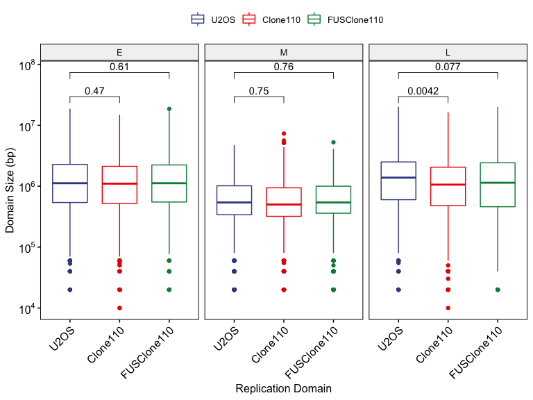
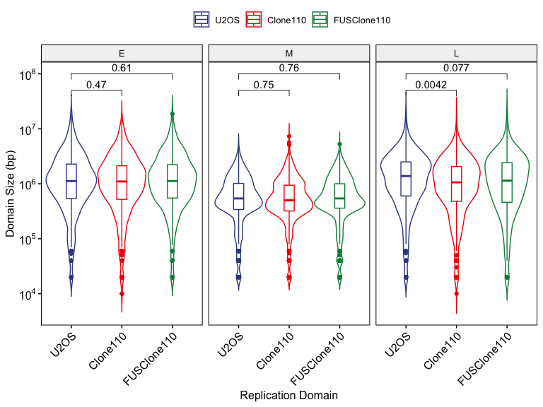
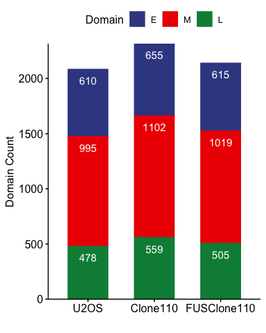
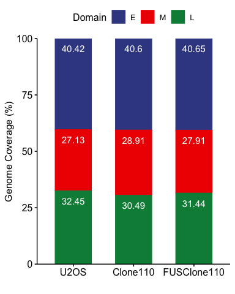

RT\_Domain\_analysis
================
Weiyan
1/8/2019

# 1\. Load data and data clean

``` r
setwd("/Users/weiyanjia/Desktop/Randal S. Tibbetts/FUS project/Bioinfo_analysis/RT_Domain_identification_analysis/Anotation_results")

library(rtracklayer)
```

    ## Loading required package: GenomicRanges

    ## Loading required package: stats4

    ## Loading required package: BiocGenerics

    ## Loading required package: parallel

    ## 
    ## Attaching package: 'BiocGenerics'

    ## The following objects are masked from 'package:parallel':
    ## 
    ##     clusterApply, clusterApplyLB, clusterCall, clusterEvalQ,
    ##     clusterExport, clusterMap, parApply, parCapply, parLapply,
    ##     parLapplyLB, parRapply, parSapply, parSapplyLB

    ## The following objects are masked from 'package:stats':
    ## 
    ##     IQR, mad, sd, var, xtabs

    ## The following objects are masked from 'package:base':
    ## 
    ##     anyDuplicated, append, as.data.frame, basename, cbind, colnames,
    ##     dirname, do.call, duplicated, eval, evalq, Filter, Find, get, grep,
    ##     grepl, intersect, is.unsorted, lapply, Map, mapply, match, mget,
    ##     order, paste, pmax, pmax.int, pmin, pmin.int, Position, rank,
    ##     rbind, Reduce, rownames, sapply, setdiff, sort, table, tapply,
    ##     union, unique, unsplit, which, which.max, which.min

    ## Loading required package: S4Vectors

    ## 
    ## Attaching package: 'S4Vectors'

    ## The following object is masked from 'package:base':
    ## 
    ##     expand.grid

    ## Loading required package: IRanges

    ## Loading required package: GenomeInfoDb

``` r
import ("U2OS_segway.bed", format = "bed")
```

    ## GRanges object with 2083 ranges and 4 metadata columns:
    ##          seqnames              ranges strand |        name     score
    ##             <Rle>           <IRanges>  <Rle> | <character> <numeric>
    ##      [1]     chr1        80001-120000      * |           2      1000
    ##      [2]     chr1      740001-2420000      * |           0      1000
    ##      [3]     chr1     2820001-4280000      * |           0      1000
    ##      [4]     chr1     4280001-4840000      * |           2      1000
    ##      [5]     chr1     4840001-5260000      * |           1      1000
    ##      ...      ...                 ...    ... .         ...       ...
    ##   [2079]     chrX 154320001-154580000      * |           0      1000
    ##   [2080]     chrX 154680001-155200000      * |           0      1000
    ##   [2081]     chrX 155200001-155300000      * |           2      1000
    ##   [2082]     chrX 155420001-155440000      * |           2      1000
    ##   [2083]     chrX 155540001-155660000      * |           2      1000
    ##              itemRgb               thick
    ##          <character>           <IRanges>
    ##      [1]     #7570B3        80001-120000
    ##      [2]     #1B9E77      740001-2420000
    ##      [3]     #1B9E77     2820001-4280000
    ##      [4]     #7570B3     4500001-4840000
    ##      [5]     #D95F02     4840001-5260000
    ##      ...         ...                 ...
    ##   [2079]     #1B9E77 154320001-154580000
    ##   [2080]     #1B9E77 154680001-155200000
    ##   [2081]     #7570B3 155200001-155300000
    ##   [2082]     #7570B3 155420001-155440000
    ##   [2083]     #7570B3 155540001-155660000
    ##   -------
    ##   seqinfo: 23 sequences from an unspecified genome; no seqlengths

``` r
U2OS_segway<- read.delim("U2OS_segway.bed", header = FALSE, sep ="\t", stringsAsFactors = FALSE)
Clone110_segway<- read.delim("Clone110_segway.bed", header = FALSE, sep ="\t", stringsAsFactors = FALSE)
FUSClone110_segway<- read.delim("FUSClone110_segway.bed", header = FALSE, sep ="\t", stringsAsFactors = FALSE)

FUSClone110_segway_backup <- FUSClone110_segway

head(FUSClone110_segway)
```

    ##                                                                                                                                                                                      V1
    ## 1 track autoScale=off description=segway 3-label segmentation of FUSClone110_R2, FUSClone110_R1 viewLimits=0:1 visibility=dense name=segway.c4a84130c57b11e8be16efba7d9d1804 itemRgb=on
    ## 2                                                                                                                                                                                  chr1
    ## 3                                                                                                                                                                                  chr1
    ## 4                                                                                                                                                                                  chr1
    ## 5                                                                                                                                                                                  chr1
    ## 6                                                                                                                                                                                  chr1
    ##        V2      V3 V4   V5 V6      V7      V8          V9
    ## 1      NA      NA NA   NA         NA      NA            
    ## 2  740000 2420000  1 1000  .  740000 2420000    217,95,2
    ## 3 2820000 4200000  1 1000  . 2820000 4200000    217,95,2
    ## 4 4200000 4760000  0 1000  . 4500000 4760000  27,158,119
    ## 5 4760000 5300000  2 1000  . 4760000 5300000 117,112,179
    ## 6 5300000 5720000  0 1000  . 5300000 5720000  27,158,119

``` r
FUSClone110_segway$domain[FUSClone110_segway$V4 == 1 ]<- 0
FUSClone110_segway$domain[FUSClone110_segway$V4 == 0 ]<- 2
FUSClone110_segway$domain[FUSClone110_segway$V4 == 2 ]<- 1

FUSClone110_segway$color[FUSClone110_segway$domain == 1 ]<- "217,95,2"
FUSClone110_segway$color[FUSClone110_segway$domain == 0 ]<- "27,158,119"
FUSClone110_segway$color[FUSClone110_segway$domain == 2 ]<- "117,112,179"

FUSClone110_segway$V4 <- FUSClone110_segway$domain
FUSClone110_segway$V9 <- FUSClone110_segway$color
FUSClone110_segway$domain <- NULL 
FUSClone110_segway$color <- NULL 

# write.table(FUSClone110_segway,"FUSClone110_segway_x.bed", sep="\t", row.names=FALSE, quote=FALSE, col.names = FALSE)

# _v2 with label

U2OS_segway_v2 <- U2OS_segway
Clone110_segway_v2 <- Clone110_segway
FUSClone110_segway_v2 <- FUSClone110_segway

U2OS_segway_v2$domain[U2OS_segway_v2$V4 == 0 ]<- "E"
U2OS_segway_v2$domain[U2OS_segway_v2$V4 == 1 ]<- "L"
U2OS_segway_v2$domain[U2OS_segway_v2$V4 == 2 ]<- "M"

Clone110_segway_v2$domain[Clone110_segway_v2$V4 == 0 ]<- "E"
Clone110_segway_v2$domain[Clone110_segway_v2$V4 == 1 ]<- "L"
Clone110_segway_v2$domain[Clone110_segway_v2$V4 == 2 ]<- "M"

FUSClone110_segway_v2$domain[FUSClone110_segway_v2$V4 == 0 ]<- "E"
FUSClone110_segway_v2$domain[FUSClone110_segway_v2$V4 == 1 ]<- "L"
FUSClone110_segway_v2$domain[FUSClone110_segway_v2$V4 == 2 ]<- "M"

# rename columns
library(plyr) 
```

    ## 
    ## Attaching package: 'plyr'

    ## The following object is masked from 'package:IRanges':
    ## 
    ##     desc

    ## The following object is masked from 'package:S4Vectors':
    ## 
    ##     rename

``` r
U2OS_segway_v2 <- rename(U2OS_segway_v2,c('V1'='chr', 'V2'='star','V3'='end'))
U2OS_segway_v2$domain_size <- U2OS_segway_v2$end -  U2OS_segway_v2$star
U2OS_segway_v2$sample <- "U2OS"

Clone110_segway_v2 <- rename(Clone110_segway_v2,c('V1'='chr', 'V2'='star','V3'='end'))
Clone110_segway_v2$domain_size <- Clone110_segway_v2$end -  Clone110_segway_v2$star
Clone110_segway_v2$sample <- "Clone110"

FUSClone110_segway_v2 <- rename(FUSClone110_segway_v2,c('V1'='chr', 'V2'='star','V3'='end'))
FUSClone110_segway_v2$domain_size <- FUSClone110_segway_v2$end - FUSClone110_segway_v2$star
FUSClone110_segway_v2$sample <- "FUSClone110"

sub_U2OS_segway_v2 <- subset(U2OS_segway_v2, select=c("domain", "domain_size","sample"))
sub_Clone110_segway_v2 <- subset(Clone110_segway_v2, select=c("domain", "domain_size","sample"))
sub_FUSClone110_segway_v2 <- subset(FUSClone110_segway_v2, select=c("domain", "domain_size","sample"))

all_sample_segway_v2 = rbind(sub_U2OS_segway_v2, sub_Clone110_segway_v2,sub_FUSClone110_segway_v2)

all_sample_segway_v2$domain <- factor(all_sample_segway_v2$domain, levels= c("E","M","L"))
all_sample_segway_v2$sample <- factor(all_sample_segway_v2$sample, levels= c("U2OS","Clone110","FUSClone110"))

all_sample_segway_v2$domain_size <- sapply(all_sample_segway_v2$domain_size, as.numeric)
U2OS_segway_v2$domain_size <- sapply(U2OS_segway_v2$domain_size, as.numeric)
Clone110_segway_v2$domain_size <- sapply(Clone110_segway_v2$domain_size, as.numeric)
FUSClone110_segway_v2$domain_size <- sapply(FUSClone110_segway_v2$domain_size, as.numeric)

# write.table(U2OS_segway_v2,"U2OS_segway_v2.txt", sep="\t", row.names=FALSE, quote=FALSE, col.names = TRUE)
# write.table(Clone110_segway_v2,"Clone110_segway_v2.txt", sep="\t", row.names=FALSE, quote=FALSE, col.names = TRUE)
# write.table(FUSClone110_segway_v2,"FUSClone110_segway_v2.txt", sep="\t", row.names=FALSE, quote=FALSE, col.names = TRUE)
# write.table(all_sample_segway_v2,"all_sample_segway_v2.txt", sep="\t", row.names=FALSE, quote=FALSE, col.names = TRUE)
# U2OS_segway_v2
# Clone110_segway_v2
# FUSClone110_segway_v2
# all_sample_segway_v2
```

# 2\. Domain size distribution

## 2.1 boxplot of domain size

``` r
library(ggpubr)
```

    ## Loading required package: ggplot2

    ## 
    ## Attaching package: 'ggpubr'

    ## The following object is masked from 'package:plyr':
    ## 
    ##     mutate

``` r
all_sample_segway_v2 <- all_sample_segway_v2%>%
                        tidyr::drop_na()
  
  
my_comparisons <- list(c("U2OS", "Clone110"), c("U2OS", "FUSClone110"))

ggboxplot(all_sample_segway_v2, x = "sample",
          y = "domain_size",
          facet.by = "domain",
          short.panel.labs = TRUE,
          legend.title ="",
          x.text.angle = 45,
          #repel = TRUE,
          #combine = TRUE,
          #merge = TRUE,
          xlab ="Replication Domain",
          ylab = "Domain Size (bp)", 
          color = "sample",
          palette = "aaas"
         )+
  yscale("log10", .format = TRUE)+
  
stat_compare_means(comparisons = my_comparisons, aes(label = paste0("p = ", ..p.format..)),
                  method = "t.test")
```

    ## Warning: Using `as.character()` on a quosure is deprecated as of rlang 0.3.0.
    ## Please use `as_label()` or `as_name()` instead.
    ## This warning is displayed once per session.

<!-- -->

## 2.2 violinplot of domain size(with boxplot)

``` r
library(ggpubr)

my_comparisons <- list(c("U2OS", "Clone110"), c("U2OS", "FUSClone110"))
p<- ggviolin(all_sample_segway_v2, x = "sample",
          y = "domain_size",
          facet.by = "domain",
          short.panel.labs = TRUE,
          legend.title ="",
          x.text.angle = 45,
          xlab ="Replication Domain",
          ylab = "Domain Size (bp)", 
          color = "sample",
          palette = "aaas",
          add = "boxplot"
         # add = "median_iqr"
         )+
  yscale("log10", .format = TRUE)+
stat_compare_means(comparisons = my_comparisons, aes(label = paste0("p = ", ..p.format..)),
                  method = "t.test", label.y = c(7.7, 8))
p
```

<!-- -->

# 3.Summary of Replication timing domain

## 3.1 table of RT domain count

``` r
RT_sum <- count(all_sample_segway_v2, vars = c("sample","domain"))
RT_sum
```

    ##        sample domain freq
    ## 1        U2OS      E  610
    ## 2        U2OS      M  995
    ## 3        U2OS      L  478
    ## 4    Clone110      E  655
    ## 5    Clone110      M 1102
    ## 6    Clone110      L  559
    ## 7 FUSClone110      E  615
    ## 8 FUSClone110      M 1019
    ## 9 FUSClone110      L  505

``` r
# get median value of each domain in each sample

U2OS_E <- subset(U2OS_segway_v2, grepl('E', domain))
Clone110_E <- subset(Clone110_segway_v2, grepl('E', domain))
FUSClone110_E <- subset(FUSClone110_segway_v2, grepl('E', domain))

summary(U2OS_E$domain_size)
```

    ##     Min.  1st Qu.   Median     Mean  3rd Qu.     Max. 
    ##    20000   540000  1120000  1825913  2280000 18740000

``` r
summary(Clone110_E$domain_size)
```

    ##     Min.  1st Qu.   Median     Mean  3rd Qu.     Max. 
    ##    10000   520000  1100000  1709389  2120000 14780000

``` r
summary(FUSClone110_E$domain_size)
```

    ##     Min.  1st Qu.   Median     Mean  3rd Qu.     Max. 
    ##    20000   550000  1120000  1823078  2230000 18600000

``` r
sum(U2OS_E$domain_size)
```

    ## [1] 1113806667

``` r
# cat(paste("Median:", median(FUSClone110_E$domain_size)))
```

## 3.2 barplot of RT domain count

``` r
ggbarplot(RT_sum, x="sample", 
          y= "freq",
          ylab = "Domain Count",
          xlab = "",
          legend.title ="Domain",
          color = "domain",
          fill = "domain",
          palette = "aaas",
          label = TRUE,
          lab.pos = "in",
          width = 0.6,
          #add = "median",
          lab.col = "white"
          #position = position_dodge(0.9)
          #order = c()
          #orientation = "horiz"
          )+   
  scale_y_continuous(expand = c(0, 0))
```

<!-- -->

## 3.3 barplot of RT domain coverage

``` r
library(dplyr)
```

    ## 
    ## Attaching package: 'dplyr'

    ## The following objects are masked from 'package:plyr':
    ## 
    ##     arrange, count, desc, failwith, id, mutate, rename, summarise,
    ##     summarize

    ## The following objects are masked from 'package:GenomicRanges':
    ## 
    ##     intersect, setdiff, union

    ## The following object is masked from 'package:GenomeInfoDb':
    ## 
    ##     intersect

    ## The following objects are masked from 'package:IRanges':
    ## 
    ##     collapse, desc, intersect, setdiff, slice, union

    ## The following objects are masked from 'package:S4Vectors':
    ## 
    ##     first, intersect, rename, setdiff, setequal, union

    ## The following objects are masked from 'package:BiocGenerics':
    ## 
    ##     combine, intersect, setdiff, union

    ## The following objects are masked from 'package:stats':
    ## 
    ##     filter, lag

    ## The following objects are masked from 'package:base':
    ## 
    ##     intersect, setdiff, setequal, union

``` r
Domain_sum <- all_sample_segway_v2 %>%
              tidyr::drop_na()%>%
              dplyr::group_by(sample, domain)%>%
              dplyr::summarise(domain_size_sum= sum(domain_size))

Domain_sum<- Domain_sum%>%
       dplyr::mutate(Percentage=round(100*domain_size_sum/sum(domain_size_sum), 2))
Domain_sum
```

    ## # A tibble: 9 x 4
    ## # Groups:   sample [3]
    ##   sample      domain domain_size_sum Percentage
    ##   <fct>       <fct>            <dbl>      <dbl>
    ## 1 U2OS        E           1113806667       40.4
    ## 2 U2OS        M            747683813       27.1
    ## 3 U2OS        L            894318080       32.4
    ## 4 Clone110    E           1119649525       40.6
    ## 5 Clone110    M            797163504       28.9
    ## 6 Clone110    L            840645741       30.5
    ## 7 FUSClone110 E           1121193138       40.6
    ## 8 FUSClone110 M            769698504       27.9
    ## 9 FUSClone110 L            867003389       31.4

``` r
ggbarplot(Domain_sum, x="sample", 
          y= "Percentage",
          ylab = "Genome Coverage (%)",
          xlab = "",
          legend.title ="Domain",
          color = "domain",
          fill = "domain",
          palette = "aaas",
          label = TRUE,
          lab.pos = "in",
          width = 0.6,
          lab.col = "white"
          )+   
  scale_y_continuous(expand = c(0, 0))
```

<!-- -->

``` r
sessionInfo()
```

    ## R version 3.6.3 (2020-02-29)
    ## Platform: x86_64-apple-darwin15.6.0 (64-bit)
    ## Running under: macOS Catalina 10.15.4
    ## 
    ## Matrix products: default
    ## BLAS:   /Library/Frameworks/R.framework/Versions/3.6/Resources/lib/libRblas.0.dylib
    ## LAPACK: /Library/Frameworks/R.framework/Versions/3.6/Resources/lib/libRlapack.dylib
    ## 
    ## locale:
    ## [1] en_US.UTF-8/en_US.UTF-8/en_US.UTF-8/C/en_US.UTF-8/en_US.UTF-8
    ## 
    ## attached base packages:
    ## [1] parallel  stats4    stats     graphics  grDevices utils     datasets 
    ## [8] methods   base     
    ## 
    ## other attached packages:
    ##  [1] dplyr_0.8.5          ggpubr_0.3.0         ggplot2_3.3.0       
    ##  [4] plyr_1.8.6           rtracklayer_1.44.4   GenomicRanges_1.36.1
    ##  [7] GenomeInfoDb_1.20.0  IRanges_2.18.3       S4Vectors_0.22.1    
    ## [10] BiocGenerics_0.30.0 
    ## 
    ## loaded via a namespace (and not attached):
    ##  [1] Biobase_2.44.0              tidyr_1.1.0                
    ##  [3] carData_3.0-4               assertthat_0.2.1           
    ##  [5] GenomeInfoDbData_1.2.1      cellranger_1.1.0           
    ##  [7] Rsamtools_2.0.3             yaml_2.2.1                 
    ##  [9] pillar_1.4.4                backports_1.1.7            
    ## [11] lattice_0.20-41             glue_1.4.1                 
    ## [13] digest_0.6.25               ggsignif_0.6.0             
    ## [15] XVector_0.24.0              colorspace_1.4-1           
    ## [17] htmltools_0.4.0             Matrix_1.2-18              
    ## [19] XML_3.99-0.3                pkgconfig_2.0.3            
    ## [21] broom_0.5.6                 haven_2.3.0                
    ## [23] zlibbioc_1.30.0             purrr_0.3.4                
    ## [25] scales_1.1.1                openxlsx_4.1.5             
    ## [27] rio_0.5.16                  BiocParallel_1.18.1        
    ## [29] tibble_3.0.1                farver_2.0.3               
    ## [31] generics_0.0.2              car_3.0-8                  
    ## [33] ellipsis_0.3.1              withr_2.2.0                
    ## [35] SummarizedExperiment_1.14.1 cli_2.0.2                  
    ## [37] magrittr_1.5                crayon_1.3.4               
    ## [39] readxl_1.3.1                evaluate_0.14              
    ## [41] fansi_0.4.1                 nlme_3.1-148               
    ## [43] rstatix_0.5.0               forcats_0.5.0              
    ## [45] foreign_0.8-75              tools_3.6.3                
    ## [47] data.table_1.12.8           hms_0.5.3                  
    ## [49] lifecycle_0.2.0             matrixStats_0.56.0         
    ## [51] stringr_1.4.0               munsell_0.5.0              
    ## [53] ggsci_2.9                   zip_2.0.4                  
    ## [55] DelayedArray_0.10.0         Biostrings_2.52.0          
    ## [57] compiler_3.6.3              rlang_0.4.6                
    ## [59] grid_3.6.3                  RCurl_1.98-1.2             
    ## [61] labeling_0.3                bitops_1.0-6               
    ## [63] rmarkdown_2.1               gtable_0.3.0               
    ## [65] abind_1.4-5                 curl_4.3                   
    ## [67] R6_2.4.1                    GenomicAlignments_1.20.1   
    ## [69] knitr_1.28                  utf8_1.1.4                 
    ## [71] stringi_1.4.6               Rcpp_1.0.4.6               
    ## [73] vctrs_0.3.0                 tidyselect_1.1.0           
    ## [75] xfun_0.14
