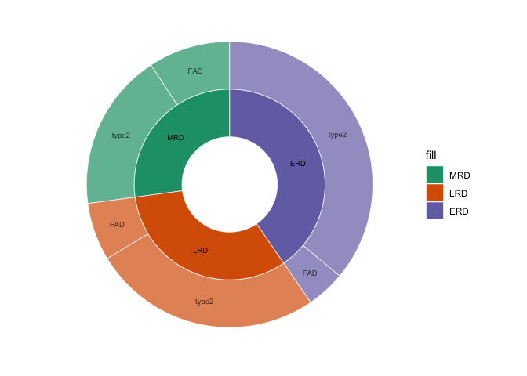

Doughnut pie chart of FADs coverage
================
Weiyan
4/2/2020

\#Doughnut chart for
    FADs

``` r
library(tidyverse)
```

    ## ── Attaching packages ───────────────────────────────────────────────────────────────────────────────────────────────────────────── tidyverse 1.3.0 ──

    ## ✓ ggplot2 3.3.0     ✓ purrr   0.3.3
    ## ✓ tibble  2.1.3     ✓ dplyr   0.8.5
    ## ✓ tidyr   1.0.2     ✓ stringr 1.4.0
    ## ✓ readr   1.3.1     ✓ forcats 0.5.0

    ## ── Conflicts ──────────────────────────────────────────────────────────────────────────────────────────────────────────────── tidyverse_conflicts() ──
    ## x dplyr::filter() masks stats::filter()
    ## x dplyr::lag()    masks stats::lag()

``` r
library(export)
df <- "name  type    value
ERD   all     40.42
ERD   FAD   4.37
ERD   type2   36.05
MRD   all     27.13
MRD   FAD   9.26
MRD   type2   17.87
LRD   all     32.45
LRD   FAD   6.53
LRD   type2   25.92" %>% read_table2() %>%
    filter(type != "all") %>%
    mutate(name = as.factor(name) %>% fct_reorder(value, sum)) %>%
    arrange(name, value) %>%
    mutate(type = as.factor(type) %>% fct_reorder2(name, value))
write.csv(df, file="clean/FADs_coverage.csv")
lvl0 <- tibble(name = "Parent", value = 0, level = 0, fill = NA)

lvl1 <- df %>%
    group_by(name) %>%
    summarise(value = sum(value)) %>%
    ungroup() %>%
    mutate(level = 1) %>%
    mutate(fill = name)

lvl2 <- df %>%
    select(name = type, value, fill = name) %>%
    mutate(level = 2)

 bind_rows(lvl0, lvl1, lvl2) %>%
    mutate(name = as.factor(name) %>% fct_reorder2(fill, value)) %>%
    arrange(fill, name) %>%
    mutate(level = as.factor(level)) %>%
    ggplot(aes(x = level, y = value, fill = fill, alpha = level)) +
        geom_col(width = 1, color = "white", size = 0.25, position = position_stack()) +
        geom_text(aes(label = name), size = 2.5, position = position_stack(vjust = 0.5)) +
        coord_polar(theta = "y") +
        scale_alpha_manual(values = c("0" = 0, "1" = 1, "2" = 0.7), guide = F) +
        scale_x_discrete(breaks = NULL) +
        scale_y_continuous(breaks = NULL) +
        scale_fill_brewer(palette = "Dark2", na.translate = F) +
        labs(x = NULL, y = NULL) +
        theme_minimal()+
        theme(panel.grid=element_blank())
```

    ## Warning in bind_rows_(x, .id): binding character and factor vector, coercing
    ## into character vector
    
    ## Warning in bind_rows_(x, .id): binding character and factor vector, coercing
    ## into character vector

<!-- -->

``` r
graph2pdf(file="plots/FAD_doughnut.pdf", width=6, aspectr=sqrt(2),font = "Arial",bg = "transparent")
```

    ## Exported graph as plots/FAD_doughnut.pdf
