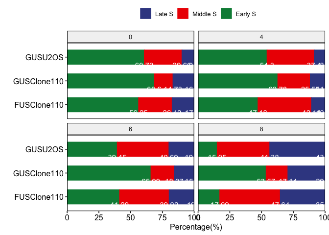
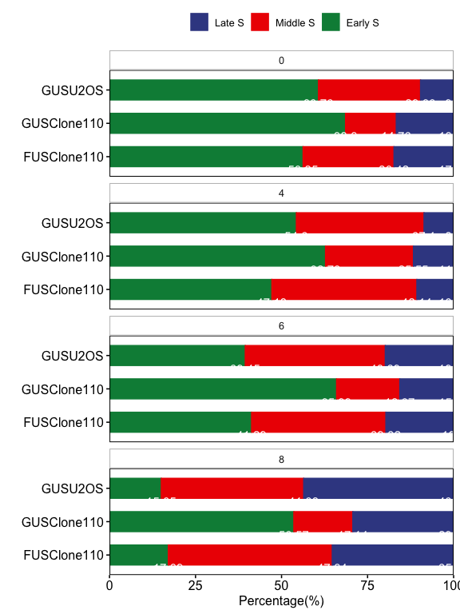

FUS regulates DNA replication timing in U-2 OS cells
================
Weiyan
4/2/2020

**Note**:

> Asynchronous U-2 OS cells and three FUS deletion clones (Clone46,
> Clone65 and Clone110) were pulse-labeled with EdU and then the S phase
> cells were divided to three stages based on EdU foci pattern as shown
> in U-2
OS.

``` r
getwd()
```

    ## [1] "/Users/weiyanjia/Desktop/FUS_paper_Figures/FUS_Paper"

# 1.Barplot of RT in FUS knock out cells

## 1.1 data organization

``` r
RT_1 <- read.delim("clean/RT_1.txt", header = TRUE, sep ="\t", stringsAsFactors = FALSE)
```

    ## Warning in read.table(file = file, header = header, sep = sep, quote = quote, :
    ## incomplete final line found by readTableHeader on 'clean/RT_1.txt'

``` r
RT_1
```

    ##         RT U2OS Clone110 Clone65 Clone46
    ## 1  Early S  145      190     135     147
    ## 2 Middle S  106       53      32      24
    ## 3   Late S   44       31      28      22

``` r
library(tidyr)
RT_1_sum <- RT_1 %>%
  gather(key = sample, value = cell_count, -RT)
RT_1_sum
```

    ##          RT   sample cell_count
    ## 1   Early S     U2OS        145
    ## 2  Middle S     U2OS        106
    ## 3    Late S     U2OS         44
    ## 4   Early S Clone110        190
    ## 5  Middle S Clone110         53
    ## 6    Late S Clone110         31
    ## 7   Early S  Clone65        135
    ## 8  Middle S  Clone65         32
    ## 9    Late S  Clone65         28
    ## 10  Early S  Clone46        147
    ## 11 Middle S  Clone46         24
    ## 12   Late S  Clone46         22

``` r
library(dplyr)
```

    ## 
    ## Attaching package: 'dplyr'

    ## The following objects are masked from 'package:stats':
    ## 
    ##     filter, lag

    ## The following objects are masked from 'package:base':
    ## 
    ##     intersect, setdiff, setequal, union

``` r
RT_1_sum <- RT_1_sum %>%
  group_by(sample, RT) %>%
  summarise(cell_count= sum(cell_count))
RT_1_sum
```

    ## # A tibble: 12 x 3
    ## # Groups:   sample [4]
    ##    sample   RT       cell_count
    ##    <chr>    <chr>         <int>
    ##  1 Clone110 Early S         190
    ##  2 Clone110 Late S           31
    ##  3 Clone110 Middle S         53
    ##  4 Clone46  Early S         147
    ##  5 Clone46  Late S           22
    ##  6 Clone46  Middle S         24
    ##  7 Clone65  Early S         135
    ##  8 Clone65  Late S           28
    ##  9 Clone65  Middle S         32
    ## 10 U2OS     Early S         145
    ## 11 U2OS     Late S           44
    ## 12 U2OS     Middle S        106

``` r
library(data.table)
```

    ## 
    ## Attaching package: 'data.table'

    ## The following objects are masked from 'package:dplyr':
    ## 
    ##     between, first, last

``` r
setDT(RT_1_sum)[, Percentage := round(100*cell_count/sum(cell_count), 2),
                   by =  sample]
str(RT_1_sum)
```

    ## Classes 'data.table' and 'data.frame':   12 obs. of  4 variables:
    ##  $ sample    : chr  "Clone110" "Clone110" "Clone110" "Clone46" ...
    ##  $ RT        : chr  "Early S" "Late S" "Middle S" "Early S" ...
    ##  $ cell_count: int  190 31 53 147 22 24 135 28 32 145 ...
    ##  $ Percentage: num  69.3 11.3 19.3 76.2 11.4 ...
    ##  - attr(*, "groups")=Classes 'tbl_df', 'tbl' and 'data.frame':   4 obs. of  2 variables:
    ##   ..$ sample: chr  "Clone110" "Clone46" "Clone65" "U2OS"
    ##   ..$ .rows :List of 4
    ##   .. ..$ : int  1 2 3
    ##   .. ..$ : int  4 5 6
    ##   .. ..$ : int  7 8 9
    ##   .. ..$ : int  10 11 12
    ##   ..- attr(*, ".drop")= logi TRUE
    ##  - attr(*, ".internal.selfref")=<externalptr>

``` r
RT_1_sum$RT <- factor(RT_1_sum$RT, levels= c("Late S","Middle S","Early S"))
RT_1_sum$sample <- factor(RT_1_sum$sample, levels= c("Clone110","Clone65","Clone46","U2OS"))

RT_1_sum
```

    ##       sample       RT cell_count Percentage
    ##  1: Clone110  Early S        190      69.34
    ##  2: Clone110   Late S         31      11.31
    ##  3: Clone110 Middle S         53      19.34
    ##  4:  Clone46  Early S        147      76.17
    ##  5:  Clone46   Late S         22      11.40
    ##  6:  Clone46 Middle S         24      12.44
    ##  7:  Clone65  Early S        135      69.23
    ##  8:  Clone65   Late S         28      14.36
    ##  9:  Clone65 Middle S         32      16.41
    ## 10:     U2OS  Early S        145      49.15
    ## 11:     U2OS   Late S         44      14.92
    ## 12:     U2OS Middle S        106      35.93

## 1.2 barplot of RT\_1

``` r
library(dplyr)
library(tidyverse)
```

    ## ── Attaching packages ───────────────────────────────────────────────────────────────────────────────────────────────────────────── tidyverse 1.3.0 ──

    ## ✓ ggplot2 3.3.0     ✓ purrr   0.3.3
    ## ✓ tibble  2.1.3     ✓ stringr 1.4.0
    ## ✓ readr   1.3.1     ✓ forcats 0.5.0

    ## ── Conflicts ──────────────────────────────────────────────────────────────────────────────────────────────────────────────── tidyverse_conflicts() ──
    ## x data.table::between() masks dplyr::between()
    ## x dplyr::filter()       masks stats::filter()
    ## x data.table::first()   masks dplyr::first()
    ## x dplyr::lag()          masks stats::lag()
    ## x data.table::last()    masks dplyr::last()
    ## x purrr::transpose()    masks data.table::transpose()

``` r
RT_2 <- read.delim("clean/RT_2.txt", header = TRUE, sep ="\t", stringsAsFactors = FALSE)
```

    ## Warning in read.table(file = file, header = header, sep = sep, quote = quote, :
    ## incomplete final line found by readTableHeader on 'clean/RT_2.txt'

``` r
RT_2
```

    ##         RT GUSU2OS FUSU2OS GUSClone110 FUSClone110
    ## 1  Early S     118     107         207         135
    ## 2 Middle S      83      43          54          70
    ## 3   Late S      23      16          22          23

``` r
RT_2_sum <- RT_2 %>%
  gather(key = sample, value = cell_count, -RT) # for simple : gather(sample, cell_count, -RT)

RT_2_sum
```

    ##          RT      sample cell_count
    ## 1   Early S     GUSU2OS        118
    ## 2  Middle S     GUSU2OS         83
    ## 3    Late S     GUSU2OS         23
    ## 4   Early S     FUSU2OS        107
    ## 5  Middle S     FUSU2OS         43
    ## 6    Late S     FUSU2OS         16
    ## 7   Early S GUSClone110        207
    ## 8  Middle S GUSClone110         54
    ## 9    Late S GUSClone110         22
    ## 10  Early S FUSClone110        135
    ## 11 Middle S FUSClone110         70
    ## 12   Late S FUSClone110         23

``` r
RT_2_sum <- RT_2_sum %>%
  group_by(sample) %>%
  mutate(Percentage= round(100*cell_count/sum(cell_count),2))
RT_2_sum 
```

    ## # A tibble: 12 x 4
    ## # Groups:   sample [4]
    ##    RT       sample      cell_count Percentage
    ##    <chr>    <chr>            <int>      <dbl>
    ##  1 Early S  GUSU2OS            118      52.7 
    ##  2 Middle S GUSU2OS             83      37.0 
    ##  3 Late S   GUSU2OS             23      10.3 
    ##  4 Early S  FUSU2OS            107      64.5 
    ##  5 Middle S FUSU2OS             43      25.9 
    ##  6 Late S   FUSU2OS             16       9.64
    ##  7 Early S  GUSClone110        207      73.1 
    ##  8 Middle S GUSClone110         54      19.1 
    ##  9 Late S   GUSClone110         22       7.77
    ## 10 Early S  FUSClone110        135      59.2 
    ## 11 Middle S FUSClone110         70      30.7 
    ## 12 Late S   FUSClone110         23      10.1

``` r
RT_2_sum$RT <- factor(RT_2_sum$RT, levels= c("Late S","Middle S","Early S"))
RT_2_sum$sample <- factor(RT_2_sum$sample, levels= c("FUSClone110","GUSClone110","FUSU2OS","GUSU2OS"))
RT_2_sum
```

    ## # A tibble: 12 x 4
    ## # Groups:   sample [4]
    ##    RT       sample      cell_count Percentage
    ##    <fct>    <fct>            <int>      <dbl>
    ##  1 Early S  GUSU2OS            118      52.7 
    ##  2 Middle S GUSU2OS             83      37.0 
    ##  3 Late S   GUSU2OS             23      10.3 
    ##  4 Early S  FUSU2OS            107      64.5 
    ##  5 Middle S FUSU2OS             43      25.9 
    ##  6 Late S   FUSU2OS             16       9.64
    ##  7 Early S  GUSClone110        207      73.1 
    ##  8 Middle S GUSClone110         54      19.1 
    ##  9 Late S   GUSClone110         22       7.77
    ## 10 Early S  FUSClone110        135      59.2 
    ## 11 Middle S FUSClone110         70      30.7 
    ## 12 Late S   FUSClone110         23      10.1

``` r
write.csv(RT_2_sum, file="clean/RT_EdU_FUS-KO.csv")
library(ggpubr)
```

    ## Loading required package: magrittr

    ## 
    ## Attaching package: 'magrittr'

    ## The following object is masked from 'package:purrr':
    ## 
    ##     set_names

    ## The following object is masked from 'package:tidyr':
    ## 
    ##     extract

``` r
ggbarplot(RT_2_sum, x="sample", 
          y= "Percentage",
          ylab = "Percentage(%)",
          xlab = "",
          legend.title ="",
          color = "RT",
          fill = "RT",
          palette = "aaas",
          label = TRUE,
          lab.pos = "in",
          width = 0.6,
          orientation = "horiz",
          lab.col = "white"
          )+   
  scale_y_continuous(expand = c(0, 0))
```

<!-- -->

# 2\. Barplot of RT using Double thymidine treated samples

## 2.1 data loading

note: 1. Asychronized sample named by “0” in time column. 2. time was
relase from doublt thymidine treatement
(hours)

``` r
RT_dt <- read.delim("clean/RT_DT_assay.txt", header = TRUE, sep ="\t", stringsAsFactors = FALSE)
RT_dt
```

    ##         Sample time       RT cell_count
    ## 1      GUSU2OS    0  Early S        215
    ## 2      GUSU2OS    0 Middle S        105
    ## 3      GUSU2OS    0   Late S         34
    ## 4      GUSU2OS    4  Early S        221
    ## 5      GUSU2OS    4 Middle S        151
    ## 6      GUSU2OS    4   Late S         35
    ## 7      GUSU2OS    6  Early S        159
    ## 8      GUSU2OS    6 Middle S        164
    ## 9      GUSU2OS    6   Late S         80
    ## 10     GUSU2OS    8  Early S         48
    ## 11     GUSU2OS    8 Middle S        132
    ## 12     GUSU2OS    8   Late S        139
    ## 13 GUSClone110    0  Early S        177
    ## 14 GUSClone110    0 Middle S         38
    ## 15 GUSClone110    0   Late S         43
    ## 16 GUSClone110    4  Early S        199
    ## 17 GUSClone110    4 Middle S         81
    ## 18 GUSClone110    4   Late S         37
    ## 19 GUSClone110    6  Early S        194
    ## 20 GUSClone110    6 Middle S         54
    ## 21 GUSClone110    6   Late S         46
    ## 22 GUSClone110    8  Early S        150
    ## 23 GUSClone110    8 Middle S         48
    ## 24 GUSClone110    8   Late S         82
    ## 25 FUSClone110    0  Early S        198
    ## 26 FUSClone110    0 Middle S         93
    ## 27 FUSClone110    0   Late S         61
    ## 28 FUSClone110    4  Early S        159
    ## 29 FUSClone110    4 Middle S        142
    ## 30 FUSClone110    4   Late S         36
    ## 31 FUSClone110    6  Early S        109
    ## 32 FUSClone110    6 Middle S        103
    ## 33 FUSClone110    6   Late S         52
    ## 34 FUSClone110    8  Early S         47
    ## 35 FUSClone110    8 Middle S        131
    ## 36 FUSClone110    8   Late S         97

``` r
RT_dt <- RT_dt %>%
  group_by(Sample, time) %>%
  mutate(Percentage= round(100*cell_count/sum(cell_count),2))
RT_dt 
```

    ## # A tibble: 36 x 5
    ## # Groups:   Sample, time [12]
    ##    Sample   time RT       cell_count Percentage
    ##    <chr>   <int> <chr>         <int>      <dbl>
    ##  1 GUSU2OS     0 Early S         215       60.7
    ##  2 GUSU2OS     0 Middle S        105       29.7
    ##  3 GUSU2OS     0 Late S           34        9.6
    ##  4 GUSU2OS     4 Early S         221       54.3
    ##  5 GUSU2OS     4 Middle S        151       37.1
    ##  6 GUSU2OS     4 Late S           35        8.6
    ##  7 GUSU2OS     6 Early S         159       39.4
    ##  8 GUSU2OS     6 Middle S        164       40.7
    ##  9 GUSU2OS     6 Late S           80       19.8
    ## 10 GUSU2OS     8 Early S          48       15.0
    ## # … with 26 more rows

``` r
RT_dt$RT <- factor(RT_dt$RT, levels= c("Late S","Middle S","Early S"))
RT_dt$sample_order <- factor(RT_dt$Sample, levels= c("FUSClone110","GUSClone110","GUSU2OS"))
RT_dt
```

    ## # A tibble: 36 x 6
    ## # Groups:   Sample, time [12]
    ##    Sample   time RT       cell_count Percentage sample_order
    ##    <chr>   <int> <fct>         <int>      <dbl> <fct>       
    ##  1 GUSU2OS     0 Early S         215       60.7 GUSU2OS     
    ##  2 GUSU2OS     0 Middle S        105       29.7 GUSU2OS     
    ##  3 GUSU2OS     0 Late S           34        9.6 GUSU2OS     
    ##  4 GUSU2OS     4 Early S         221       54.3 GUSU2OS     
    ##  5 GUSU2OS     4 Middle S        151       37.1 GUSU2OS     
    ##  6 GUSU2OS     4 Late S           35        8.6 GUSU2OS     
    ##  7 GUSU2OS     6 Early S         159       39.4 GUSU2OS     
    ##  8 GUSU2OS     6 Middle S        164       40.7 GUSU2OS     
    ##  9 GUSU2OS     6 Late S           80       19.8 GUSU2OS     
    ## 10 GUSU2OS     8 Early S          48       15.0 GUSU2OS     
    ## # … with 26 more rows

``` r
write.csv(RT_dt, file="clean/RT_BrdU_DoubleThymidine_FUS.csv")
```

## 2.2 barplot

### 2.2.1 barplot of Double thymidine data

``` r
library(ggpubr)
dt<- ggbarplot(RT_dt, x="sample_order", 
          y= "Percentage",
          facet.by = "time",
          ylab = "Percentage(%)",
          xlab = "",
          legend.title ="",
          color = "RT",
          fill = "RT",
          palette = "aaas",
          label = TRUE,
          lab.pos = "in",
          width = 0.6,
          orientation = "horiz",
          lab.col = "white"
          )+   
  scale_y_continuous(expand = c(0, 0))
dt
```

<!-- -->

### 2.2.2 barplot of Double thymidine data (facet by time)

``` r
facet(dt, facet.by="time", ncol= 1,
      panel.labs.background = list(fill = "white", color = "grey")
     )
```

<!-- -->
