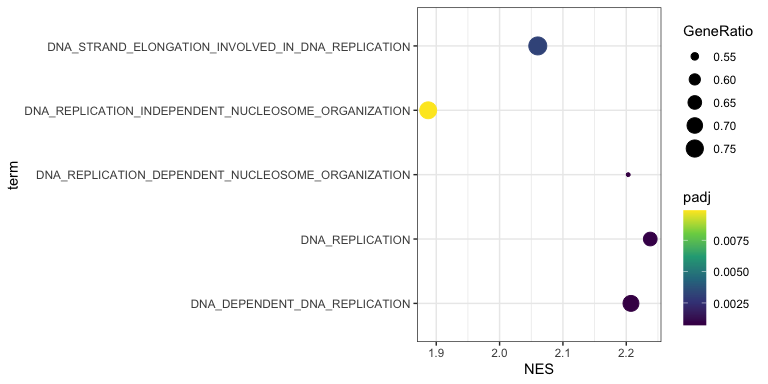
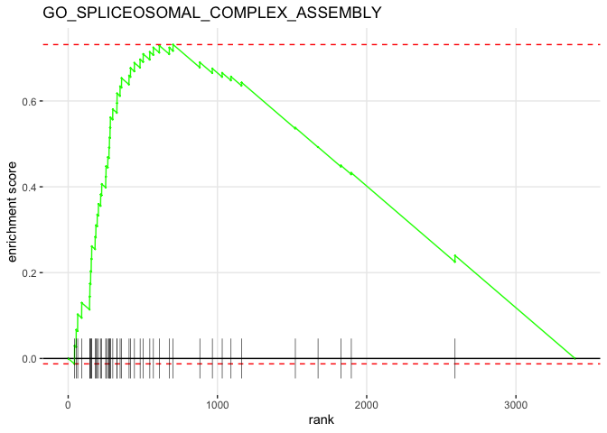

Analysis of FUS MS/MS data
================
Weiyan
4/3/2020

## 1\. Load packages

``` r
library("tidyverse")
```

    ## ── Attaching packages ──────────────────────────────────────────────────────────────────────────────────────────────────────────────────────────────── tidyverse 1.3.0 ──

    ## ✓ ggplot2 3.3.0     ✓ purrr   0.3.3
    ## ✓ tibble  2.1.3     ✓ dplyr   0.8.5
    ## ✓ tidyr   1.0.2     ✓ stringr 1.4.0
    ## ✓ readr   1.3.1     ✓ forcats 0.5.0

    ## ── Conflicts ─────────────────────────────────────────────────────────────────────────────────────────────────────────────────────────────────── tidyverse_conflicts() ──
    ## x dplyr::filter() masks stats::filter()
    ## x dplyr::lag()    masks stats::lag()

``` r
library("tibble")
library("ggpubr")
```

    ## Loading required package: magrittr

    ## 
    ## Attaching package: 'magrittr'

    ## The following object is masked from 'package:purrr':
    ## 
    ##     set_names

    ## The following object is masked from 'package:tidyr':
    ## 
    ##     extract

``` r
library(pheatmap)
library(fgsea)
```

    ## Loading required package: Rcpp

``` r
library(viridis)
```

    ## Loading required package: viridisLite

``` r
library(export)
library(data.table)
```

    ## 
    ## Attaching package: 'data.table'

    ## The following objects are masked from 'package:dplyr':
    ## 
    ##     between, first, last

    ## The following object is masked from 'package:purrr':
    ## 
    ##     transpose

``` r
library(DT)
library(org.Hs.eg.db)
```

    ## Loading required package: AnnotationDbi

    ## Loading required package: stats4

    ## Loading required package: BiocGenerics

    ## Loading required package: parallel

    ## 
    ## Attaching package: 'BiocGenerics'

    ## The following objects are masked from 'package:parallel':
    ## 
    ##     clusterApply, clusterApplyLB, clusterCall, clusterEvalQ,
    ##     clusterExport, clusterMap, parApply, parCapply, parLapply,
    ##     parLapplyLB, parRapply, parSapply, parSapplyLB

    ## The following objects are masked from 'package:dplyr':
    ## 
    ##     combine, intersect, setdiff, union

    ## The following objects are masked from 'package:stats':
    ## 
    ##     IQR, mad, sd, var, xtabs

    ## The following objects are masked from 'package:base':
    ## 
    ##     anyDuplicated, append, as.data.frame, basename, cbind, colnames,
    ##     dirname, do.call, duplicated, eval, evalq, Filter, Find, get, grep,
    ##     grepl, intersect, is.unsorted, lapply, Map, mapply, match, mget,
    ##     order, paste, pmax, pmax.int, pmin, pmin.int, Position, rank,
    ##     rbind, Reduce, rownames, sapply, setdiff, sort, table, tapply,
    ##     union, unique, unsplit, which, which.max, which.min

    ## Loading required package: Biobase

    ## Welcome to Bioconductor
    ## 
    ##     Vignettes contain introductory material; view with
    ##     'browseVignettes()'. To cite Bioconductor, see
    ##     'citation("Biobase")', and for packages 'citation("pkgname")'.

    ## Loading required package: IRanges

    ## Loading required package: S4Vectors

    ## 
    ## Attaching package: 'S4Vectors'

    ## The following objects are masked from 'package:data.table':
    ## 
    ##     first, second

    ## The following objects are masked from 'package:dplyr':
    ## 
    ##     first, rename

    ## The following object is masked from 'package:tidyr':
    ## 
    ##     expand

    ## The following object is masked from 'package:base':
    ## 
    ##     expand.grid

    ## 
    ## Attaching package: 'IRanges'

    ## The following object is masked from 'package:data.table':
    ## 
    ##     shift

    ## The following objects are masked from 'package:dplyr':
    ## 
    ##     collapse, desc, slice

    ## The following object is masked from 'package:purrr':
    ## 
    ##     reduce

    ## 
    ## Attaching package: 'AnnotationDbi'

    ## The following object is masked from 'package:dplyr':
    ## 
    ##     select

    ## 

## 2\. Data processing

``` r
FUS_norm_raw <- read.csv("AllResultsOfQuantification_FUS.csv", header = TRUE)

FUS_PSMs_raw <- read.csv("PSMs_FUS.csv", header = TRUE)

FUS_PSMs_raw <-FUS_PSMs_raw%>%
               dplyr::mutate(PSMs_ave =rowMeans(dplyr::select(FUS_PSMs_raw,contains("PSMs")),na.rm = FALSE) )%>%
               dplyr::mutate(Unique_ave =rowMeans(dplyr::select(FUS_PSMs_raw,contains("Unique")),na.rm = FALSE))

FUS_norm <- FUS_norm_raw %>% 
            mutate(WT_Mean = rowMeans(dplyr::select(FUS_norm_raw,contains("U2OS")),na.rm = TRUE)) %>%
            mutate(KO_Mean = rowMeans(dplyr::select(FUS_norm_raw,contains("clone110")),na.rm = TRUE))%>%
            mutate(fc_log2 = WT_Mean-KO_Mean)%>%
            dplyr::rename(pvalue_log=X.LOG.P.value.,clone110_bio1_r1=Intensity_03.14.18_clone110_bio1_rep1.calib,clone110_bio1_r2=Intensity_03.14.18_clone110_bio1_rep2.calib,
                          clone110_bio2_r1=Intensity_03.14.18_clone110_bio2_rep1.calib,clone110_bio2_r2=Intensity_03.14.18_clone110_bio2_rep2.calib,
                          clone110_bio3_r1=Intensity_04.02.18_clone110_bio3_rep1.calib,clone110_bio3_r2=Intensity_04.02.18_clone110_bio3_rep2.calib,
                          U2OS_bio1_r1=Intensity_03.14.18_U2OS_bio1_rep1.calib, U2OS_bio1_r2=Intensity_03.14.18_U2OS_bio1_rep2.calib,
                          U2OS_bio2_r1=Intensity_03.14.18_U2OS_bio2_rep1.calib, U2OS_bio2_r2=Intensity_03.14.18_U2OS_bio2_rep2.calib,
                          U2OS_bio3_r1=Intensity_04.02.18_U2OS_bio3_rep1.calib,U2OS_bio3_r2=Intensity_04.02.18_U2OS_bio3_rep2.calib)%>%
            dplyr::select(Protein.Accession,U2OS_bio1_r1,U2OS_bio1_r2,U2OS_bio2_r1,U2OS_bio2_r2,U2OS_bio3_r1,U2OS_bio3_r2, clone110_bio1_r1,
                          clone110_bio1_r2,clone110_bio2_r1,clone110_bio2_r2, clone110_bio3_r1, clone110_bio3_r2,WT_Mean, KO_Mean,fc_log2, Fold.Change, pvalue_log)

FUS_norm_1 <- FUS_norm %>%
           mutate(U2OS_bio1 = rowMeans(dplyr::select(FUS_norm,contains("U2OS_bio1")),na.rm = TRUE),
                  U2OS_bio2 = rowMeans(dplyr::select(FUS_norm,contains("U2OS_bio2")),na.rm = TRUE),
                  U2OS_bio3 = rowMeans(dplyr::select(FUS_norm,contains("U2OS_bio3")),na.rm = TRUE),
                  clone110_bio1 = rowMeans(dplyr::select(FUS_norm,contains("clone110_bio1")),na.rm = TRUE),
                  clone110_bio2 = rowMeans(dplyr::select(FUS_norm,contains("clone110_bio2")),na.rm = TRUE),
                  clone110_bio3 = rowMeans(dplyr::select(FUS_norm,contains("clone110_bio3")),na.rm = TRUE)) %>%
           dplyr::select(Protein.Accession,U2OS_bio1,U2OS_bio2,U2OS_bio3,clone110_bio1,clone110_bio2, clone110_bio3,
                         U2OS_bio1_r1,U2OS_bio1_r2,U2OS_bio2_r1,U2OS_bio2_r2,U2OS_bio3_r1,U2OS_bio3_r2, clone110_bio1_r1,
                         clone110_bio1_r2,clone110_bio2_r1,clone110_bio2_r2, clone110_bio3_r1, clone110_bio3_r2,WT_Mean, KO_Mean,fc_log2, Fold.Change, pvalue_log)%>%
            distinct()
```

## 3\. GSEA analysis

### 3.1 Annotation info

``` r
keytypes(org.Hs.eg.db)
```

    ##  [1] "ACCNUM"       "ALIAS"        "ENSEMBL"      "ENSEMBLPROT"  "ENSEMBLTRANS"
    ##  [6] "ENTREZID"     "ENZYME"       "EVIDENCE"     "EVIDENCEALL"  "GENENAME"    
    ## [11] "GO"           "GOALL"        "IPI"          "MAP"          "OMIM"        
    ## [16] "ONTOLOGY"     "ONTOLOGYALL"  "PATH"         "PFAM"         "PMID"        
    ## [21] "PROSITE"      "REFSEQ"       "SYMBOL"       "UCSCKG"       "UNIGENE"     
    ## [26] "UNIPROT"

``` r
UNIPORT2symbol <- AnnotationDbi::select(org.Hs.eg.db,
                                    key=as.character(FUS_norm_1$Protein.Accession),
                                    columns="SYMBOL",
                                    keytype="UNIPROT")
```

    ## 'select()' returned 1:many mapping between keys and columns

``` r
UNIPORT2symbol <- as.tibble(UNIPORT2symbol)
```

    ## Warning: `as.tibble()` is deprecated, use `as_tibble()` (but mind the new semantics).
    ## This warning is displayed once per session.

``` r
head(UNIPORT2symbol)
```

    ## # A tibble: 6 x 2
    ##   UNIPROT SYMBOL
    ##   <chr>   <chr> 
    ## 1 P35637  FUS   
    ## 2 P21695  GPD1  
    ## 3 Q9UNE7  STUB1 
    ## 4 O75190  DNAJB6
    ## 5 P22307  SCP2  
    ## 6 P79522  PRR3

``` r
FUS_norm_2 <-dplyr::left_join(FUS_norm_1,UNIPORT2symbol, by =c("Protein.Accession"="UNIPROT") )%>%
              distinct()%>%
              drop_na()
```

    ## Warning: Column `Protein.Accession`/`UNIPROT` joining factor and character
    ## vector, coercing into character vector

``` r
FUS_norm_3<- dplyr::rename(FUS_norm_2,UNIPROT=Protein.Accession)%>%
             arrange(-fc_log2)
FUS_norm_x <-dplyr::left_join(FUS_norm_3,FUS_PSMs_raw, by =c("UNIPROT"="UNIPROT") )%>%
              distinct()
```

    ## Warning: Column `UNIPROT` joining character vector and factor, coercing into
    ## character vector

``` r
head(FUS_norm_x)
```

    ##   UNIPROT U2OS_bio1 U2OS_bio2 U2OS_bio3 clone110_bio1 clone110_bio2
    ## 1  P35637  29.74965  27.48805  29.69695      26.07085      23.75670
    ## 2  P21695  21.54020  26.29075  20.63860      22.10670      22.00370
    ## 3  Q9UNE7  21.24710  22.63160  22.92830      18.22540      20.79270
    ## 4  O75190  19.51480  20.19670  20.29265      17.38645      15.92305
    ## 5  P22307  21.42170  20.29275  21.34495      17.45670      19.56995
    ## 6  P79522  18.70005  15.19845  19.49775      15.78210      13.57910
    ##   clone110_bio3 U2OS_bio1_r1 U2OS_bio1_r2 U2OS_bio2_r1 U2OS_bio2_r2
    ## 1      25.29080      29.7519      29.7474      27.5277      27.4484
    ## 2      16.60970      16.6569      26.4235      25.8362      26.7453
    ## 3      20.41325      25.9666      16.5276      20.9405      24.3227
    ## 4      19.35090      20.5323      18.4973      20.4094      19.9840
    ## 5      18.84445      21.2390      21.6044      20.3556      20.2299
    ## 6      17.42285      18.6407      18.7594      13.4979      16.8990
    ##   U2OS_bio3_r1 U2OS_bio3_r2 clone110_bio1_r1 clone110_bio1_r2 clone110_bio2_r1
    ## 1      29.5324      29.8615          25.3294          26.8123          23.7861
    ## 2      25.1951      16.0821          22.0244          22.1890          27.0480
    ## 3      19.5059      26.3507          16.9629          19.4879          20.6540
    ## 4      20.2828      20.3025          17.0662          17.7067          16.7439
    ## 5      21.4416      21.2483          16.1087          18.8047          19.5359
    ## 6      19.6205      19.3750          15.4503          16.1139          13.4524
    ##   clone110_bio2_r2 clone110_bio3_r1 clone110_bio3_r2  WT_Mean  KO_Mean  fc_log2
    ## 1          23.7273          25.4082          25.1734 28.97822 25.03945 3.938767
    ## 2          16.9594          15.8078          17.4116 22.82318 20.24003 2.583150
    ## 3          20.9314          20.7026          20.1239 22.26900 19.81045 2.458550
    ## 4          15.1022          19.5247          19.1771 20.00138 17.55347 2.447917
    ## 5          19.6040          18.8780          18.8109 21.01980 18.62370 2.396100
    ## 6          13.7058          17.6572          17.1885 17.79875 15.59468 2.204067
    ##   Fold.Change pvalue_log SYMBOL   Gene PSMs_bio3 Peptides_bio3
    ## 1     15.3350     3.8176    FUS    FUS       111            18
    ## 2      5.9924     0.4427   GPD1   GPD1        NA            NA
    ## 3      5.4966     0.7408  STUB1  STUB1        NA            NA
    ## 4      5.4563     2.1095 DNAJB6 DNAJB6        NA            NA
    ## 5      5.2638     2.7127   SCP2   SCP2        NA            NA
    ## 6      4.6077     1.0360   PRR3   PRR3        NA            NA
    ##   Unique.Peptides_bio3 PSMs_bio2 Peptides_bio2 Unique.Peptides_bio2 PSMs_bio1
    ## 1                   16        51            14                   10       106
    ## 2                   NA        NA            NA                   NA        NA
    ## 3                   NA        NA            NA                   NA        NA
    ## 4                   NA        NA            NA                   NA        NA
    ## 5                   NA        NA            NA                   NA        NA
    ## 6                   NA        NA            NA                   NA        NA
    ##   Peptides_bio1 Unique.Peptides_bio1 PSMs_ave Unique_ave
    ## 1            15                   13 89.33333         13
    ## 2            NA                   NA       NA         NA
    ## 3            NA                   NA       NA         NA
    ## 4            NA                   NA       NA         NA
    ## 5            NA                   NA       NA         NA
    ## 6            NA                   NA       NA         NA

``` r
# write.csv(FUS_norm_x,file = "results/FUS_norm_x.csv")
```

``` r
FUS_norm_x%>%
group_by(UNIPROT) %>% dplyr::filter(n()>1) %>% summarize(n=n())
```

    ## # A tibble: 28 x 2
    ##    UNIPROT     n
    ##    <chr>   <int>
    ##  1 P0C0L4      2
    ##  2 P0C0L5      2
    ##  3 P22392      2
    ##  4 P31941      2
    ##  5 P35226      2
    ##  6 P47929      2
    ##  7 P49674      2
    ##  8 P62805     14
    ##  9 P63162      2
    ## 10 P68431     10
    ## # … with 18 more rows

``` r
res2 <- FUS_norm_x %>% 
  dplyr::select(SYMBOL, fc_log2) %>% 
  drop_na() %>% 
  distinct() %>% 
  group_by(SYMBOL) %>% 
  summarize(fc_log2=mean(fc_log2))
head(res2)
```

    ## # A tibble: 6 x 2
    ##   SYMBOL fc_log2
    ##   <chr>    <dbl>
    ## 1 AAAS    -0.552
    ## 2 AACS    -0.790
    ## 3 AAK1    -2.08 
    ## 4 AAMP    -0.782
    ## 5 AAR2     1.68 
    ## 6 AARS    -0.514

### 3.2 Analysis by fgsea

``` r
ranks <- deframe(res2)
head(ranks, 20)
```

    ##       AAAS       AACS       AAK1       AAMP       AAR2       AARS     AARSD1 
    ## -0.5518333 -0.7899000 -2.0754000 -0.7820333  1.6765167 -0.5141000 -0.5699833 
    ##   AASDHPPT       AATF     ABCA13      ABCE1      ABCF1      ABCF2      ABCF3 
    ##  0.2305167  0.1565833 -0.0794500 -0.4435667 -0.1688000  0.1522333 -0.7264667 
    ##    ABHD14B       ABI1     ABLIM1   ABRAXAS2       ABT1      ACAA2 
    ## -0.7919333 -0.8162167 -1.4589333  0.4161000  0.9545833 -1.4528167

``` r
barplot(sort(ranks, decreasing = T))
```

<!-- -->

``` r
set.seed(12)
pathways.GO.BP <- gmtPathways("MSigDB/c5.bp.v6.2.symbols.gmt")
FUS_GSEA_BP<-fgsea(pathways=gmtPathways("MSigDB/c5.bp.v6.2.symbols.gmt"), ranks, 
                           nperm=100000,
                           minSize = 15,
                           maxSize = 200
                              )%>% 
                            arrange(padj)
```

    ## Warning in fgsea(pathways = gmtPathways("MSigDB/c5.bp.v6.2.symbols.gmt"), : There are ties in the preranked stats (1.89% of the list).
    ## The order of those tied genes will be arbitrary, which may produce unexpected results.

``` r
FUS_GSEA_BP_tab<-FUS_GSEA_BP%>%
               as_tibble() %>%
               arrange(desc(NES))%>%
               dplyr::select(-ES,pval,-nMoreExtreme)%>%
               dplyr::filter(NES >0)
               as_tibble() %>%
              arrange(padj)
```

    ## # A tibble: 0 x 0

``` r
Go_BP_01<- FUS_GSEA_BP_tab %>%
              dplyr::filter(padj <0.01)%>%
              mutate(nLeadingEdge=lengths(leadingEdge),GeneRatio=lengths(leadingEdge)/size, term= substring(pathway,4))%>%
              distinct()%>%
              arrange(-NES)
```

    ## Warning: distinct() does not fully support columns of type `list`.
    ## List elements are compared by reference, see ?distinct for details.
    ## This affects the following columns:
    ## - `leadingEdge`

``` r
# fwrite(Go_BP_01, file="results/Go_BP_01.txt", sep="\t", sep2=c("", " ", ""))
```

``` r
Go_BP_01$log10_padj <- -log10(Go_BP_01$padj)
```

``` r
go_dot<- ggplot(Go_BP_01, aes(NES,term))
go_dot+
  geom_point(aes(color=padj, size=GeneRatio))+
  scale_color_viridis()+
  theme_bw()
```

<!-- -->

``` r
graph2pdf(file="results/GSEA_GO_BP_All.pdf", width=10, aspectr=sqrt(2),font = "Arial",bg = "transparent")
```

    ## Exported graph as results/GSEA_GO_BP_All.pdf

### 3.3 Dot plots

``` r
FUS_replication <- Go_BP_01 %>%
                   dplyr::filter(str_detect(term,"REPLICATION"))
```

``` r
FUS_repair <- Go_BP_01 %>%
                   dplyr::filter(str_detect(term,"REPAIR"))
```

``` r
library(export)
go_dot_replication<- ggplot(FUS_replication, aes(NES,term))

go_dot_replication+
  geom_point(aes(color=padj, size=GeneRatio))+
  scale_color_viridis_c()+#option="plasma","magma", "cividis","inferno","viridis"
  theme_bw()
```

<!-- -->

``` r
graph2pdf(file="results/DNA_replication.pdf", width=8, aspectr=sqrt(2),font = "Arial",bg = "transparent")
```

    ## Exported graph as results/DNA_replication.pdf

``` r
go_dot_repair<- ggplot(FUS_repair, aes(NES,term))

go_dot_repair+
  geom_point(aes(color=padj, size=GeneRatio))+
  scale_color_viridis_c()+#option="plasma","magma", "cividis","inferno","viridis"
  theme_bw()
```

<!-- -->

``` r
graph2pdf(file="results/DNA_repair.pdf", width=8, aspectr=sqrt(2),font = "Arial",bg = "transparent")
```

    ## Exported graph as results/DNA_repair.pdf

### 3.4 Heatmap plots

``` r
DNA_REPLICATION.Leading<-Go_BP_01 %>% 
             dplyr::filter(pathway == "GO_DNA_REPLICATION")%>%
             dplyr::select(leadingEdge)%>%
             unnest()%>% 
             dplyr::rename(SYMBOL=leadingEdge)%>%
             inner_join(FUS_norm_x, by="SYMBOL")%>% 
             distinct()
```

    ## Warning: `cols` is now required.
    ## Please use `cols = c(leadingEdge)`

``` r
DNA_REPLICATION.Leading.all<-DNA_REPLICATION.Leading%>%
                        dplyr::mutate(GO_Terms="DNA_REPLICATION")%>%
                         column_to_rownames(var ="SYMBOL")
### Filter genes based on padj<0.05
DNA_REPLICATION.Leading.sig <-DNA_REPLICATION.Leading %>%
                        dplyr::mutate(GO_Terms="DNA_REPLICATION")%>%
                          dplyr::filter(fc_log2>= 0.42)%>%
                          # dplyr::filter(WT_Mean >= 23.5)%>% ##(WT_Mean: 23.5 cutoff based on PCNA)
                          dplyr::filter(PSMs_ave >= 5)%>%
                         column_to_rownames(var ="SYMBOL")
```

``` r
dna.replication.out.all<- pheatmap(DNA_REPLICATION.Leading.all[2:7], 
         color = inferno(12),
         clustering_method = "ward.D2",
         cluster_rows = T,
         cluster_cols = F,
         show_rownames =T ,
         border_color = NA, 
         fontsize = 10, 
         scale = "row", 
         cutree_rows = 3,
         cutree_cols = 3,
         fontsize_row = 6, 
         height = 20)
```

<!-- -->

``` r
mat<- DNA_REPLICATION.Leading.sig[2:7]
dna.replication.out.sig<- pheatmap(mat,
         color = inferno(12), ## use color from viridis package: the value 10 represents 10 different colors; options: viridis, magma, plasma, inferno, cividis.
         clustering_method = "ward.D2",
         # mat = log2(mat),
         cluster_rows = T,
         cluster_cols = F,
         show_rownames =T ,
         border_color = NA, 
         fontsize = 10,
         scale = "row",
         cutree_cols = 3,
         fontsize_row = 6, 
         main = "DNA Replication Related Proteins",
         height = 20)
```

<!-- -->

``` r
graph2pdf(file="results/DNA_replication_heatmap_sig.pdf", width=8, aspectr=sqrt(2),font = "Arial",bg = "transparent")
```

    ## Exported graph as results/DNA_replication_heatmap_sig.pdf

``` r
DNA_REPAIR.Leading<-Go_BP_01 %>% 
             dplyr::filter(pathway == "GO_DNA_REPAIR")%>%
             dplyr::select(leadingEdge)%>%
             unnest()%>% 
             dplyr::rename(SYMBOL=leadingEdge)%>%
             inner_join(FUS_norm_x, by="SYMBOL")%>% 
             distinct()
```

    ## Warning: `cols` is now required.
    ## Please use `cols = c(leadingEdge)`

``` r
DNA_REPAIR.Leading.all<-DNA_REPAIR.Leading%>%
                        dplyr::mutate(GO_Terms="DNA_REPAIR")%>%
                         column_to_rownames(var ="SYMBOL")
### Filter genes based on padj<0.05
DNA_REPAIR.Leading.sig <-DNA_REPAIR.Leading %>%
                          dplyr::mutate(GO_Terms="DNA_REPAIR")%>%
                          dplyr::filter(fc_log2>= 0.42)%>%
                          dplyr::filter(PSMs_ave >= 5)%>% ##(WT_Mean: 23.5 cutoff based on PCNA)
                         column_to_rownames(var ="SYMBOL")
```

``` r
dna.repair.out.sig<- pheatmap(DNA_REPAIR.Leading.sig[2:7], 
         color = inferno(12), ## use color from viridis package: the value 10 represents 10 different colors; options: viridis, magma, plasma, inferno, cividis.
         clustering_method = "ward.D2",
         cluster_rows = T,
         cluster_cols = F,
         show_rownames =T ,
         border_color = NA, 
         fontsize = 10,
         scale = "row",
         cutree_cols = 3,
         fontsize_row = 6, 
         main = "DNA Repair Related Proteins",
         height = 20)
```

<!-- -->

``` r
graph2pdf(file="results/DNA_repair_heatmap_sig.pdf", width=8, aspectr=sqrt(2),font = "Arial",bg = "transparent")
```

    ## Exported graph as results/DNA_repair_heatmap_sig.pdf

### 3.5 GSEA plots

``` r
plotEnrichment(pathways.GO.BP[["GO_DNA_REPLICATION"]],
               ranks) + labs(title="GO_DNA_REPLICATION")
```

<!-- -->

``` r
graph2pdf(file="results/GSEA_DNA_Replication.pdf", width=6, aspectr=sqrt(2),font = "Arial",bg = "transparent")
```

    ## Exported graph as results/GSEA_DNA_Replication.pdf

``` r
plotEnrichment(pathways.GO.BP[["GO_DNA_REPAIR"]],
               ranks) + labs(title="GO_DNA_REPAIR")
```

<!-- -->

``` r
graph2pdf(file="results/GSEA_DNA_Repair.pdf", width=6, aspectr=sqrt(2),font = "Arial",bg = "transparent")
```

    ## Exported graph as results/GSEA_DNA_Repair.pdf

``` r
plotEnrichment(pathways.GO.BP[["GO_SPLICEOSOMAL_COMPLEX_ASSEMBLY"]],
               ranks) + labs(title="GO_SPLICEOSOMAL_COMPLEX_ASSEMBLY")
```

<!-- -->

``` r
graph2pdf(file="results/GSEA_SPLICEOSOMAL_COMPLEX_ASSEMBLY.pdf", width=6, aspectr=sqrt(2),font = "Arial",bg = "transparent")
```

    ## Exported graph as results/GSEA_SPLICEOSOMAL_COMPLEX_ASSEMBLY.pdf

### 3.6 Scatter plot

``` r
DNA_Replication_Repair_sig <- bind_rows(DNA_REPLICATION.Leading.sig,DNA_REPAIR.Leading.sig)

DNA_Replication_Repair_sig<-dplyr::left_join(DNA_Replication_Repair_sig,UNIPORT2symbol, by =c("UNIPROT"="UNIPROT") )

ggscatter(DNA_Replication_Repair_sig, y ="pvalue_log", x= "Fold.Change",
          color = "GO_Terms",
          palette="npg",
          # shape="GO_Terms",
          # ellipse = TRUE,
          # ellipse.type = "convex",
          label = "SYMBOL",
          repel = TRUE,
          size = "Unique_ave",
          alpha = 0.5,
          xlab = "Fold Change(WT vs KO)",
          ylab = "-Log10(p value)"
          ) +
  xlim(1, 2.5)+
  geom_vline(xintercept = 1.3, linetype="dotted", 
                color = "grey", size=1)+
  geom_hline(yintercept=1.30103, linetype="dotted", 
                color = "grey", size=1)
```

<!-- -->

``` r
graph2pdf(file="results/GSEA_Scatterplot.pdf", width=8, aspectr=sqrt(2),font = "Arial",bg = "transparent")
```

    ## Exported graph as results/GSEA_Scatterplot.pdf

``` r
DNA_Replication_Repair_comb <- bind_rows(DNA_REPLICATION.Leading.sig,DNA_REPAIR.Leading.sig)%>%
                               dplyr::select(-GO_Terms)
                              

DNA_Replication_Repair_comb<-dplyr::left_join(DNA_Replication_Repair_comb,UNIPORT2symbol, by =c("UNIPROT"="UNIPROT") )%>%
                             distinct()

ggscatter(DNA_Replication_Repair_comb, y ="pvalue_log", x= "Fold.Change",
          palette="npg",
          label = "SYMBOL",
          repel = TRUE,
          size = "Unique_ave",
          alpha = 0.5,
          xlab = "Fold Change(WT vs KO)",
          ylab = "-Log10(p value)"
          ) +
  xlim(1, 2.5)+
  geom_vline(xintercept = 1.3, linetype="dotted", 
                color = "grey", size=1)+
  geom_hline(yintercept=1.30103, linetype="dotted", 
                color = "grey", size=1)
```

<!-- -->

``` r
graph2pdf(file="results/GSEA_Scatterplot.pdf", width=8, aspectr=sqrt(2),font = "Arial",bg = "transparent")
```

    ## Exported graph as results/GSEA_Scatterplot.pdf

``` r
sessionInfo()
```

    ## R version 3.6.3 (2020-02-29)
    ## Platform: x86_64-apple-darwin15.6.0 (64-bit)
    ## Running under: macOS Catalina 10.15.4
    ## 
    ## Matrix products: default
    ## BLAS:   /Library/Frameworks/R.framework/Versions/3.6/Resources/lib/libRblas.0.dylib
    ## LAPACK: /Library/Frameworks/R.framework/Versions/3.6/Resources/lib/libRlapack.dylib
    ## 
    ## locale:
    ## [1] en_US.UTF-8/en_US.UTF-8/en_US.UTF-8/C/en_US.UTF-8/en_US.UTF-8
    ## 
    ## attached base packages:
    ## [1] parallel  stats4    stats     graphics  grDevices utils     datasets 
    ## [8] methods   base     
    ## 
    ## other attached packages:
    ##  [1] org.Hs.eg.db_3.8.2   AnnotationDbi_1.46.1 IRanges_2.18.3      
    ##  [4] S4Vectors_0.22.1     Biobase_2.44.0       BiocGenerics_0.30.0 
    ##  [7] DT_0.12              data.table_1.12.8    export_0.2.2        
    ## [10] viridis_0.5.1        viridisLite_0.3.0    fgsea_1.10.1        
    ## [13] Rcpp_1.0.4           pheatmap_1.0.12      ggpubr_0.2.5        
    ## [16] magrittr_1.5         forcats_0.5.0        stringr_1.4.0       
    ## [19] dplyr_0.8.5          purrr_0.3.3          readr_1.3.1         
    ## [22] tidyr_1.0.2          tibble_2.1.3         ggplot2_3.3.0       
    ## [25] tidyverse_1.3.0     
    ## 
    ## loaded via a namespace (and not attached):
    ##  [1] colorspace_1.4-1        ggsignif_0.6.0          ellipsis_0.3.0         
    ##  [4] flextable_0.5.9         base64enc_0.1-3         fs_1.3.2               
    ##  [7] rstudioapi_0.11         farver_2.0.3            ggrepel_0.8.2          
    ## [10] bit64_0.9-7             fansi_0.4.1             lubridate_1.7.4        
    ## [13] xml2_1.2.5              knitr_1.28              jsonlite_1.6.1         
    ## [16] broom_0.5.5             dbplyr_1.4.2            shiny_1.4.0.2          
    ## [19] compiler_3.6.3          httr_1.4.1              backports_1.1.5        
    ## [22] assertthat_0.2.1        Matrix_1.2-18           fastmap_1.0.1          
    ## [25] cli_2.0.2               later_1.0.0             htmltools_0.4.0        
    ## [28] tools_3.6.3             gtable_0.3.0            glue_1.3.2             
    ## [31] fastmatch_1.1-0         cellranger_1.1.0        vctrs_0.2.4            
    ## [34] nlme_3.1-145            stargazer_5.2.2         crosstalk_1.1.0.1      
    ## [37] xfun_0.12               openxlsx_4.1.4          rvest_0.3.5            
    ## [40] mime_0.9                miniUI_0.1.1.1          lifecycle_0.2.0        
    ## [43] scales_1.1.0            hms_0.5.3               promises_1.1.0         
    ## [46] RColorBrewer_1.1-2      yaml_2.2.1              memoise_1.1.0          
    ## [49] gridExtra_2.3           gdtools_0.2.1           stringi_1.4.6          
    ## [52] RSQLite_2.2.0           zip_2.0.4               BiocParallel_1.18.1    
    ## [55] manipulateWidget_0.10.1 rlang_0.4.5             pkgconfig_2.0.3        
    ## [58] systemfonts_0.1.1       rgl_0.100.50            evaluate_0.14          
    ## [61] lattice_0.20-40         labeling_0.3            htmlwidgets_1.5.1      
    ## [64] rvg_0.2.4               bit_1.1-15.2            tidyselect_1.0.0       
    ## [67] ggsci_2.9               R6_2.4.1                generics_0.0.2         
    ## [70] DBI_1.1.0               pillar_1.4.3            haven_2.2.0            
    ## [73] withr_2.1.2             modelr_0.1.6            crayon_1.3.4           
    ## [76] uuid_0.1-4              utf8_1.1.4              rmarkdown_2.1          
    ## [79] officer_0.3.8           grid_3.6.3              readxl_1.3.1           
    ## [82] blob_1.2.1              reprex_0.3.0            digest_0.6.25          
    ## [85] webshot_0.5.2           xtable_1.8-4            httpuv_1.5.2           
    ## [88] munsell_0.5.0
