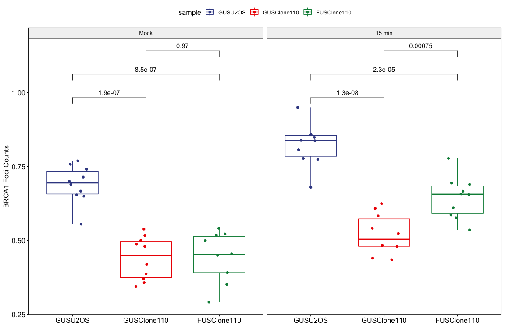

IRIF of BRCA1 with CyclinA Fig
================
Weiyan
4/1/2020

> Check IRIF of BRCA1 in FUS knockout cells

**Note**:

> 1.  Samples: U2OS,Clone46 and Clone110;
> 2.  2Gy IR;
> 3.  Antibodies: BRCA1(m,), CyclinA;
> 4.  IRIF foci was quantified by CellProfiler;
> 5.  Image collected on 12222015

# Packages

``` r
library(ggpubr)
library(ggsci)
library(dplyr)
library(ggExtra)
library(export)
library(tidyverse)
```

``` r
getwd()
```

    ## [1] "/Users/weiyanjia/Desktop/FUS_paper_Figures/FUS_Paper"

``` r
IRIF_BRCA1_CyclinA_raw <- read.csv("Raw_data/IRIF_BRCA1/20151222/IRIF_BRCA1_CyclinA.csv",header = TRUE)
```

    ## Warning in read.table(file = file, header = header, sep = sep, quote = quote, :
    ## incomplete final line found by readTableHeader on 'Raw_data/IRIF_BRCA1/20151222/
    ## IRIF_BRCA1_CyclinA.csv'

``` r
IRIF_BRCA1_CyclinA_sum <- IRIF_BRCA1_CyclinA_raw %>%
  gather(key = sample, value = percentage, -IR)

IRIF_BRCA1_CyclinA_sum$sample<- gsub("\\..*","",IRIF_BRCA1_CyclinA_sum$sample)
IRIF_BRCA1_CyclinA_sum$sample<- factor(IRIF_BRCA1_CyclinA_sum$sample, levels = c("GUSU2OS","GUSClone110","FUSClone110"))
IRIF_BRCA1_CyclinA_sum$IR<- factor(IRIF_BRCA1_CyclinA_sum$IR, levels = c("Mock","15 min"))
```
``` r
graph2pdf(file="plots/IRIF_BRCA1/IRIF_BRCA1_CyclinA_all.pdf", width=6, aspectr=sqrt(2),font = "Arial",bg = "transparent")
```
``` r

p<-ggboxplot(IRIF_BRCA1_CyclinA_sum, 
          x="sample",
          y="percentage",
          # merge = TRUE,
          color = "sample",
          palette = "aaas",
          facet.by = "IR",
          # order = c("U2OS","Clone46","Clone110"),
          # add = "median",
          add = "jitter",
          ylab = "BRCA1 Foci Counts",
          xlab = ""
          )
p
```
``` r
p+stat_compare_means(comparisons = list(c("GUSU2OS","GUSClone110"),c("GUSU2OS","FUSClone110"),c("GUSClone110","FUSClone110")), method = "t.test",
                     label = "p.format")
```

<!-- -->

``` r
graph2pdf(file="plots/IRIF_BRCA1/IRIF_BRCA1_CyclinA_test.pdf", width=8, aspectr=sqrt(2),font = "Arial",bg = "transparent")
```

    ## Exported graph as plots/IRIF_BRCA1/IRIF_BRCA1_CyclinA_test.pdf

