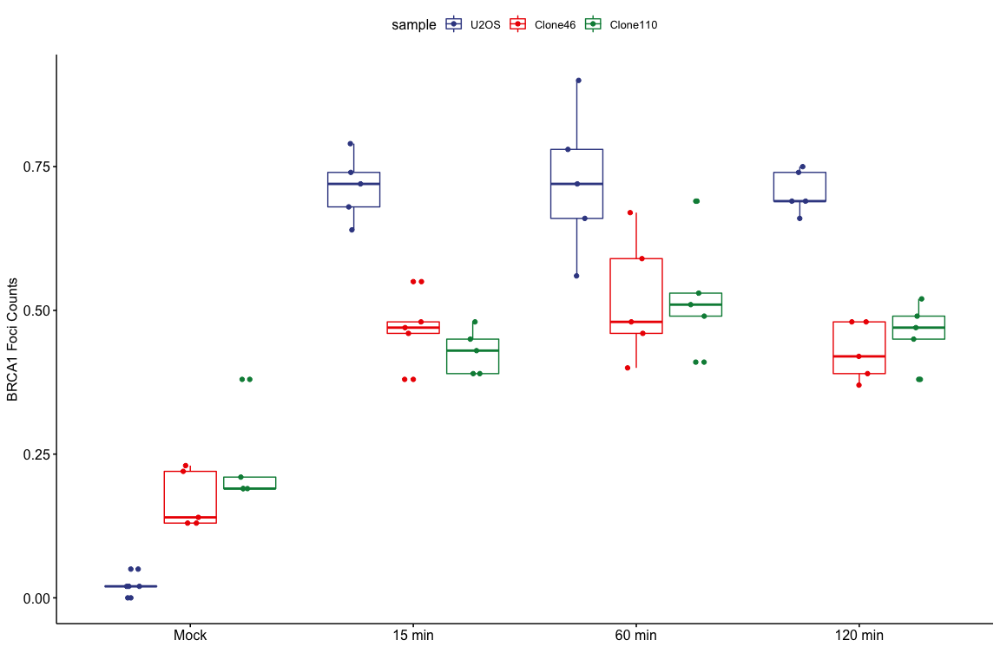
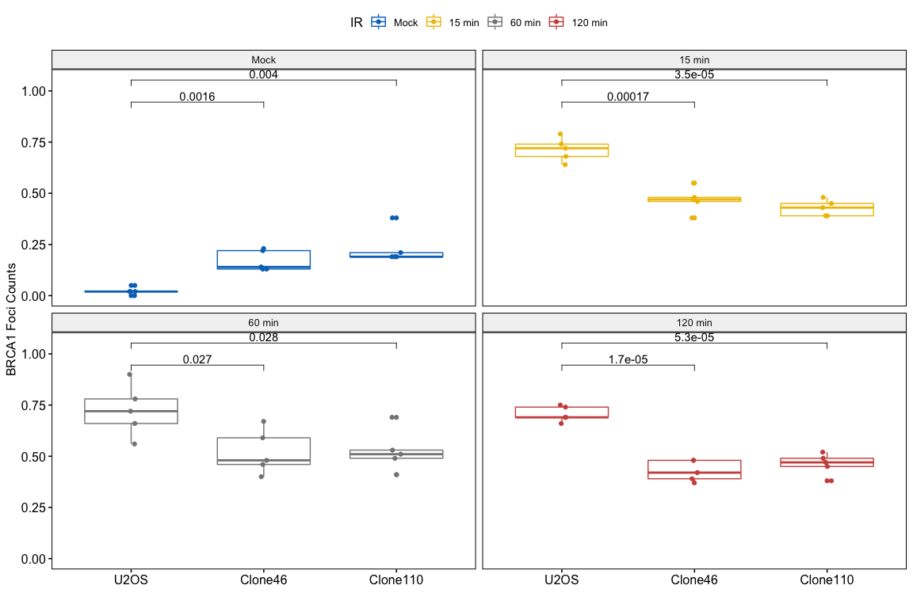
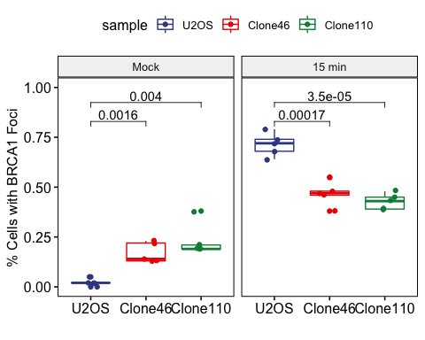

IRIF of BRCA1 foci in FUS KO cells
================
Weiyan
4/2/2020

> Check IRIF of BRCA1 in FUS knockout cells

**Note**:

> 1.  Samples: U2OS,Clone46 and Clone110;
> 2.  2Gy IR, 15min, 60min, 120min;
> 3.  Antibodies: BRCA1(m,);
> 4.  IRIF foci was quantified by CellProfiler;
> 5.  Image collected on 10022015

# Packages

``` r
library(ggpubr)
library(ggsci)
library(dplyr)
library(ggExtra)
library(export)
library(tidyverse)
```

``` r
getwd()
```

    ## [1] "/Users/weiyanjia/Desktop/FUS_paper_Figures/FUS_Paper"

``` r
IRIF_BRCA1_raw <- read.csv("Raw_data/IRIF_BRCA1/20151002/IRIF_BRCA1_percentage.csv",header = TRUE)
```

    ## Warning in read.table(file = file, header = header, sep = sep, quote = quote, :
    ## incomplete final line found by readTableHeader on 'Raw_data/IRIF_BRCA1/20151002/
    ## IRIF_BRCA1_percentage.csv'

``` r
IRIF_BRCA1_sum <- IRIF_BRCA1_raw %>%
  gather(key = sample, value = percentage, -IR)

IRIF_BRCA1_sum$sample<- gsub("\\..*","",IRIF_BRCA1_sum$sample)
IRIF_BRCA1_sum$sample<- factor(IRIF_BRCA1_sum$sample, levels = c("U2OS","Clone46","Clone110"))
IRIF_BRCA1_sum$IR<- factor(IRIF_BRCA1_sum$IR, levels = c("Mock","15 min","60 min","120 min"))
```

``` r
po<-ggboxplot(IRIF_BRCA1_sum, 
          x="IR",
          y="percentage",
          color = "sample",
          palette = "aaas",
          add = "jitter",
          ylab = "BRCA1 Foci Counts",
          xlab = ""
          )
po
```

<!-- -->

``` r
graph2pdf(file="plots/IRIF_BRCA1/IRIF_BRCA1_all.pdf", width=6, aspectr=sqrt(2),font = "Arial",bg = "transparent")
```

    ## Exported graph as plots/IRIF_BRCA1/IRIF_BRCA1_all.pdf

``` r
p<-ggboxplot(IRIF_BRCA1_sum, 
          x="sample",
          y="percentage",
          # merge = TRUE,
          color = "IR",
          palette = "jco",
          facet.by = "IR",
          add = "jitter",
          ylab = "BRCA1 Foci Counts",
          xlab = ""
          )
```
``` r
p+stat_compare_means(comparisons = list(c("U2OS","Clone46"),c("U2OS","Clone110")), method = "t.test",
                     label = "p.format")
```

<!-- -->

``` r
IRIF_BRCA1_sum_15min<- IRIF_BRCA1_sum%>%
                       filter(IR %in% c("Mock","15 min"))
write.csv(IRIF_BRCA1_sum_15min,file="clean/IRIF_BRCA1/IRIF_BRCA1_mock_15min.csv")
```

``` r
p15<- ggboxplot(IRIF_BRCA1_sum_15min, 
          x="IR",
          y="percentage",
          color = "sample",
          palette = "aaas",
          add = "jitter",
          ylab = "% Cells with BRCA1 Foci",
          xlab = ""
          )

p15
```

<!-- -->

``` r
graph2pdf(file="plots/IRIF_BRCA1/IRIF_BRCA1_15min.pdf", width=6, aspectr=sqrt(2),font = "Arial",bg = "transparent")
```

    ## Exported graph as plots/IRIF_BRCA1/IRIF_BRCA1_15min.pdf

``` r
p15t<- ggboxplot(IRIF_BRCA1_sum_15min, 
          x="sample",
          y="percentage",
          color = "sample",
          palette = "aaas",
          facet.by = "IR",
          add = "jitter",
          ylab = "% Cells with BRCA1 Foci",
          xlab = "",
          ylim=c(0,1)
          )

p15t+stat_compare_means(comparisons = list(c("U2OS","Clone46"),c("U2OS","Clone110")), method = "t.test",
                     label = "p.format")
```

<!-- -->

``` r
graph2pdf(file="plots/IRIF_BRCA1/IRIF_BRCA1_15min_test.pdf", width=6, aspectr=sqrt(2),font = "Arial",bg = "transparent")
```

    ## Exported graph as plots/IRIF_BRCA1/IRIF_BRCA1_15min_test.pdf
